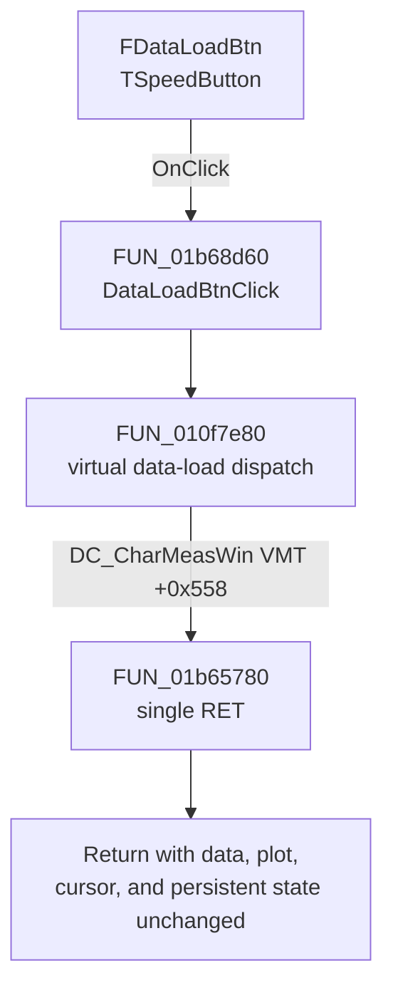

# FDataLoadBtn

> Analysis status: Complete. The recovered click path is a no-op for this form class.

## Control

| Property | Recovered value |
| --- | --- |
| Form | DC_CharMeasWin |
| Component path | DC_CharMeasWin.DataBox.FDataLoadBtn |
| Control class | TSpeedButton |
| Parent caption | Data |
| Caption | Not present in the recovered resource. |
| Hint | Not present in the recovered resource. |
| Handler name | DataLoadBtnClick |
| Handler address | 01b68d60 |
| Graph node | `resource:dfm:DC_CharMeasWin/DC_CharMeasWin.DataBox.FDataLoadBtn` |
| Handler node | `function:01b68d60` |
| Graph layer | UI |

## What happens when clicked

The button does not load data in the recovered executable. `DataLoadBtnClick` at `01b68d60` calls the common data-load dispatcher `FUN_010f7e80`. That dispatcher invokes virtual-method slot `+0x558` on the form. The recovered `DC_CharMeasWin` VMT maps this slot to `FUN_01b65780`.

`FUN_01b65780` contains one `RET` instruction. It does not read an input, call another function, or write state. Therefore, the click returns to the VCL event loop with no application-level effect.

## File-operation boundaries

| Question | Evidence-backed result |
| --- | --- |
| Dialog defaults and ownership | No file dialog is created or executed. There is no dialog owner, initial file name, directory, title, or filter on this path. |
| Accepted format, encoding, and parser | No file is opened and no parser or decoder is called. The executable path does not establish a supported format or encoding. |
| Replace or merge | Neither operation occurs because no data is read or changed. |
| Plot and cursor refresh | No plot, channel, cursor, or repaint function is called. Existing display state stays unchanged. |
| Cancellation | There is no dialog to accept or cancel. Every click follows the same immediate return path. |
| Validation, errors, and rollback | No validation or error path runs. There can be no partial load, so no rollback or cleanup is necessary. |
| Persistence | The handler does not write a file, preference, project object, or persistent field. |

## Click flow

## Resource and glyph evidence

The control has no caption, hint, action, or image-list reference. Its embedded 32-by-16 bitmap contains two 16-by-16 frames. The first frame shows a small document or chart with a red arrow, and the second frame is a gray disabled-state variant. This looks like a load or import affordance, but the glyph does not override the no-op source evidence.

- Extracted glyph: [`0076_DC_CharMeasWin_DC_CharMeasWin_DataBox_FDataLoadBtn_Glyph_Data.png`](../../../glyph/0076_DC_CharMeasWin_DC_CharMeasWin_DataBox_FDataLoadBtn_Glyph_Data.png)
- Glyph manifest: [`glyph/manifest.json`](../../../glyph/manifest.json)

## Recovered evidence

- [`FUN_01b68d60`](../../../DecompiledSources/Tina16/functions/0000000001B68D60__FUN_01b68d60.c) is the DFM-bound `DataLoadBtnClick` handler and calls `FUN_010f7e80`.
- [`FUN_010f7e80`](../../../DecompiledSources/Tina16/functions/00000000010F7E80__FUN_010f7e80.c) invokes the form virtual method at offset `+0x558`.
- The recovered class VMT is based at `01b5ecd8`. Its `+0x558` entry at `01b5f230` contains `01b65780`.
- [`FUN_01b65780`](../../../DecompiledSources/Tina16/functions/0000000001B65780__FUN_01b65780.c) decompiles to an immediate return. The recovered machine bytes start with `C3`, followed by alignment bytes.
- The generated graph records the direct `function:01b68d60` to `function:010f7e80` call. It does not represent the indirect VMT edge, so the executable VMT supplies that final dispatch target.

## Analysis limits

- This result describes the recovered TINA 16 executable and this form class. Other analyzer forms can map the shared dispatcher to different virtual methods.
- A name for the `+0x558` virtual method was not recovered. Its data-load responsibility comes from the bound load-button handler, the shared dispatcher, and the paired save dispatch at `+0x560`.
- A live UI test was not performed. The handler, VMT entry, target source, and target machine bytes agree on the no-op result.
