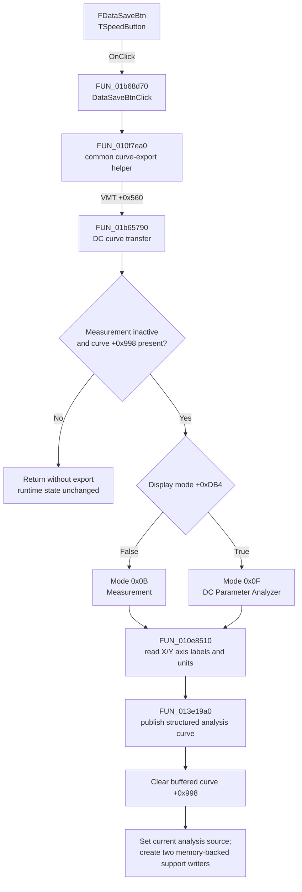

# FDataSaveBtn

> Analysis status: Complete. This command exports the completed DC measurement as an in-memory analysis curve. It does not save a file.

## Control

| Property | Recovered value |
| --- | --- |
| Form | DC_CharMeasWin |
| Component path | DC_CharMeasWin.DataBox.FDataSaveBtn |
| Control class | TSpeedButton |
| Parent caption | Data |
| Caption | Not present in the recovered resource. |
| Hint | Not present in the recovered resource. |
| Handler name | DataSaveBtnClick |
| Handler address | 01b68d70 |
| Graph node | `resource:dfm:DC_CharMeasWin/DC_CharMeasWin.DataBox.FDataSaveBtn` |
| Handler node | `function:01b68d70` |
| Graph layer | UI |

## What happens when clicked

`DataSaveBtnClick` at `01b68d70` delegates to the common curve-export helper `FUN_010f7ea0`. The helper calls the form virtual method at offset `+0x560`. The recovered `DC_CharMeasWin` VMT maps this slot to `FUN_01b65790`.

`FUN_01b65790` exports only when a measurement is not active (`form + 0x7ED == 0`) and the form has a completed curve at `form + 0x998`. It sends that `TCurveWriter` to the graph manager. The selected presentation mode is `0x0B` when `form + 0xDB4` is false and `0x0F` when it is true. The related mode handlers identify these display states with `Time/Div` and `Volts/Div`. The graph manager gives mode `0x0B` the default label `Measurement` and mode `0x0F` the label `DC Parameter Analyzer` for this analyzer data.

The graph manager reads the first X-axis and first Y-axis objects. It passes each axis label, unit text, and recovered unit/type metadata with the existing curve samples to the analysis-curve publisher. The click does not flatten these values into text columns. The published data remains a structured `TCurveWriter` curve with X and Y axis metadata.

After the graph-manager call returns, `FUN_01b65790` returns the curve to the common helper and clears `form + 0x998`. `FUN_010f7ea0` then makes the curve the current application analysis source, clears the previous nested current-curve slot, and creates two new `TCurveWriter` support objects. Both constructor calls force memory-backed storage and pass no temporary-file location.

## Save and state boundaries

| Question | Evidence-backed result |
| --- | --- |
| Dialog defaults | No save dialog is created or executed. There is no owner, initial directory, file name, title, extension, or filter. |
| Exported dataset | The currently buffered completed DC measurement curve at `form + 0x998`, including its existing samples and the current graph's first X-axis and first Y-axis descriptors and unit metadata. The exact electrical quantity names depend on those current axis objects and are not fixed in this handler. |
| Columns and units | The data stays in a curve object. It is not converted to rows or delimited columns. X and Y labels and units come from the current graph axes. |
| Format and encoding | The recovered path uses in-memory `TCurveWriter` objects. It writes no disk format and applies no character encoding, delimiter, numeric format, or line ending. |
| Overwrite | There is no file overwrite. The routine replaces application-owned current-curve and support-writer pointers without a confirmation prompt. |
| Cancel | There is no dialog and no cancel branch. A valid buffered curve is published immediately. |
| Form state | A successful export consumes the form's buffered curve by clearing `form + 0x998`. A second click is therefore a no-op until another completed measurement supplies a curve. |
| Active measurement | If `form + 0x7ED` says that a measurement is active, the DC virtual method returns no curve. The command does not stop the measurement and does not publish partial samples. |
| Missing data | If `form + 0x998` is null, the command returns without changing the current analysis source or creating support writers. |
| Form-type gate | The common helper skips its final installation block when `form + 0x7FA` equals `5`. The DC constructor sets this byte to `0x10`, so the normal DC form passes this gate. |
| I/O errors and partial files | No file I/O occurs, so this path cannot leave a partial output file. The recovered functions have no local exception handler or rollback. An exception from a called graph or allocation method propagates after any earlier in-memory state changes. |
| Persistence | The click changes runtime curve objects and analysis-view state only. It does not write a project setting, registry value, or file. |

## Click flow

## Resource and glyph evidence

The control has no caption, hint, action, or image-list reference. Its embedded 32-by-16 bitmap contains two 16-by-16 frames. The colored frame shows a small graph with a red outward arrow; the second frame is a gray disabled-state variant. This supports an export action, but it does not identify a file format or destination.

A parallel `ScopeWin.DataBox.FDataSaveBtn` resource has the explicit hint `Export curves`, and its click handler calls the same common helper. This cross-form evidence agrees with the DC handler and state trace. It does not turn the DC path into a disk-save operation.

- Extracted glyph: [`0075_DC_CharMeasWin_DC_CharMeasWin_DataBox_FDataSaveBtn_Glyph_Data.png`](../../../glyph/0075_DC_CharMeasWin_DC_CharMeasWin_DataBox_FDataSaveBtn_Glyph_Data.png)
- Glyph manifest: [`glyph/manifest.json`](../../../glyph/manifest.json)
- UI resource evidence: [`ui-evidence.json`](../../../DecompiledSources/Tina16/resources/dfm/ui-evidence.json)

## Recovered evidence

- [`FUN_01b68d70`](../../../DecompiledSources/Tina16/functions/0000000001B68D70__FUN_01b68d70.c) is the DFM-bound handler and calls `FUN_010f7ea0`.
- [`FUN_010f7ea0`](../../../DecompiledSources/Tina16/functions/00000000010F7EA0__FUN_010f7ea0.c) dispatches through VMT slot `+0x560`, installs a returned curve as the current analysis source, and creates two support writers with memory storage forced and no temporary-file path.
- The recovered `DC_CharMeasWin` VMT is based at `01B5ECD8`; its `+0x560` entry resolves to `01b65790`.
- [`FUN_01b65790`](../../../DecompiledSources/Tina16/functions/0000000001B65790__FUN_01b65790.c) checks the active-measurement byte and buffered-curve pointer, selects mode `0x0B` or `0x0F`, transfers the curve, decrements its form-owned reference, and clears the form field.
- [`FUN_010e8510`](../../../DecompiledSources/Tina16/functions/00000000010E8510__FUN_010e8510.c) selects an analysis-curve representation, reads the first X and Y axes, combines each axis label and unit text, obtains their unit/type metadata, and calls the analysis-curve publisher.
- [`FUN_013e19a0`](../../../DecompiledSources/Tina16/functions/00000000013E19A0__FUN_013e19a0.c) adds the configured curve to the application analysis subsystem and refreshes its runtime view state.
- [`FUN_01cc3870`](../../../DecompiledSources/Tina16/functions/0000000001CC3870__FUN_01cc3870.c) constructs `TCurveWriter`; the fourth argument controls memory versus file-backed storage, and this click path passes `1` with a null location.
- [`FUN_01b674b0`](../../../DecompiledSources/Tina16/functions/0000000001B674B0__FUN_01b674b0.c) is the measurement-completion path that retains the completed writer in `form + 0x998` for later export.
- [`FUN_01b6b720`](../../../DecompiledSources/Tina16/functions/0000000001B6B720__FUN_01b6b720.c) initializes the DC form's type byte at `+0x7FA` to `0x10`, which passes the common helper's `!= 5` gate.
- [`FUN_01b694b0`](../../../DecompiledSources/Tina16/functions/0000000001B694B0__FUN_01b694b0.c) and [`FUN_01b69630`](../../../DecompiledSources/Tina16/functions/0000000001B69630__FUN_01b69630.c) set the two display modes and the `Time/Div` and `Volts/Div` captions.

## Analysis limits

- The recovered click path proves an application-level curve export, not a file save. A later, separate command can potentially serialize the published curve, but that behavior is outside this handler and its direct state path.
- The field names are not present in the decompiled source. Offsets are used where the VMT and data flow establish the role.
- The internal sample-record layout and exact electrical quantity names are not decoded here. The click reuses the existing curve samples and current axis descriptors instead of defining a text table.
- A live UI test was not performed. The DFM binding, handler, VMT target, constructor arguments, resource evidence, and recovered data flow agree on the in-memory export behavior.
