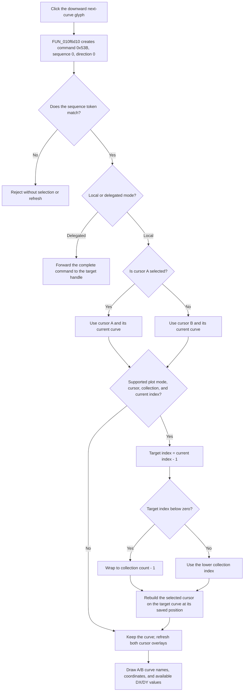

# Select the next cursor curve

> Analysis status: Reviewed from recovered handler, shared curve command, cursor collection traversal, cursor reconstruction, overlay refresh, paired-control, graph, resource, and glyph evidence.

## Control

| Property | Recovered value |
| --- | --- |
| Form | DC_CharMeasWin |
| Form caption | DC Parameter Analyzer |
| Component path | DC_CharMeasWin.CursorBox.FNextCurveBtn |
| Parent caption | Cursor |
| Control class | TSpeedButton |
| Caption | Not present in the recovered resource. |
| Hint | Not present in the recovered resource. |
| Handler name | NextCurveBtnClick |
| Handler address | 01b687f0 |
| Graph node | `resource:dfm:DC_CharMeasWin/DC_CharMeasWin.CursorBox.FNextCurveBtn` |
| Handler node | `function:01b687f0` |
| Graph layer | UI |

## What happens when clicked

`NextCurveBtnClick` delegates to the common next-curve command. That wrapper creates command `0x53B` with a zero sequence field and direction byte `0`. The shared dispatcher assigns a fresh sequence value before it performs the command.

For local execution, the dispatcher reads `FCursorASelectBtn.Down`. A true value selects cursor A; a false value selects cursor B. The click does not change the A/B selector or the shared cursor `On` button.

## Exact curve order and wrap

The cursor-cycle routine works on the active plot's curve collection. It first requires:

- a supported plot mode code: `0`, `5`, or `6`;
- an existing object for the selected A or B cursor;
- a curve collection with at least one item;
- the selected cursor's current curve to be present in that collection.

For this Next command, the routine finds the current curve's zero-based collection index and subtracts one. If the result is below zero, it selects `count - 1`. Therefore “next” uses descending collection order and wraps from index `0` to the last item.

There is no recovered visibility, enabled-state, curve-type, or name filter inside this traversal. Every item returned by the collection accessor is eligible. The supported plot-mode gate is separate from the collection order.

## Cursor and readout updates

When the target item is valid, the cycle routine:

1. reads the selected cursor's stored screen-position data;
2. removes and reconstructs that A or B cursor for the target curve;
3. applies the saved position to the reconstructed cursor;
4. copies the cursor's resulting coordinates back to the cursor controller.

The dispatcher then runs the common cursor-overlay refresh even when the collection traversal did not change the curve. The refresh queries both A and B cursors. For each existing cursor, it rounds the horizontal coordinate to the plot sample step when that step is nonzero, clamps it to that cursor's current horizontal range, and applies the adjusted coordinate.

The refresh draws the current curve names and values at the recovered `A:`, `B:`, `XA:`, `YA:`, `XB:`, and `YB:` label anchors. When both cursors have data, it also draws `DX:` and `DY:` values. Thus a successful next-curve click can change the selected cursor's curve name and its X/Y readout. It can also change the deltas against the other cursor.

## Repeated clicks and no-data behavior

- With multiple curves, repeated clicks continue toward lower collection indexes and wrap after index `0`.
- With one curve, the target resolves to the same item. The code can still reconstruct the cursor and refresh all overlay values.
- With no curve items, no selected cursor object, an unsupported plot-mode code, or a current curve that is not in the collection, the curve selection remains unchanged. The local dispatcher still runs the overlay refresh.
- If the command sequence does not match the dispatcher's current sequence token, the dispatcher rejects it before selection or refresh.
- When form byte `+0x9C0` selects the delegated branch, the dispatcher forwards the full command to the form's target handle with fixed argument `100`. It does not run the local cycle or local overlay refresh in that branch. The recipient's later behavior is outside this recovered call path.

## Click flow

## Handler and call-path evidence

- Primary handler: [FUN_01b687f0](../../../DecompiledSources/Tina16/functions/0000000001B687F0__FUN_01b687f0.c) contains only a call to the common next-curve wrapper.
- Next-command wrapper: [FUN_010f6d10](../../../DecompiledSources/Tina16/functions/00000000010F6D10__FUN_010f6d10.c) creates command `0x53B`, clears its sequence field, sets direction `0`, and calls the dispatcher. NextCurve handlers in the Scope, Signal Analyzer, XY Recorder, and DC Parameter Analyzer windows share this wrapper.
- Sequenced dispatcher: [FUN_010f6d70](../../../DecompiledSources/Tina16/functions/00000000010F6D70__FUN_010f6d70.c) validates the command token, reads the A-selection button, selects local or delegated execution, calls the cursor cycle, and starts the readout refresh.
- Sequence guard: [FUN_00f83630](../../../DecompiledSources/Tina16/functions/0000000000F83630__FUN_00f83630.c) assigns a fresh token to a new command and rejects a nonzero token that does not equal the form's current token.
- Cursor-cycle route: [FUN_010e7ef0](../../../DecompiledSources/Tina16/functions/00000000010E7EF0__FUN_010e7ef0.c) checks the plot mode, selects A or B, resolves a target curve, preserves cursor position, reconstructs the cursor, and stores the resulting coordinates.
- Descending-index selector: [FUN_010e7ae0](../../../DecompiledSources/Tina16/functions/00000000010E7AE0__FUN_010e7ae0.c) finds the current item, decrements its index, wraps below zero to the last item, and returns the target collection item.
- Position snapshot: [FUN_010e7c20](../../../DecompiledSources/Tina16/functions/00000000010E7C20__FUN_010e7c20.c) reads the selected cursor's saved position fields.
- Cursor reconstruction: [FUN_01ae1eb0](../../../DecompiledSources/Tina16/functions/0000000001AE1EB0__FUN_01ae1eb0.c) replaces the selected cursor object and binds it to the supplied curve and saved position.
- Overlay refresh: [FUN_010f6ef0](../../../DecompiledSources/Tina16/functions/00000000010F6EF0__FUN_010f6ef0.c) aligns and clamps cursor coordinates, then draws names, X/Y values, deltas, and the available message overlay.
- Complexity: simple; the form-specific handler has one distinct outgoing call.

## Resource and glyph evidence

- The form caption is `DC Parameter Analyzer`. The control is in the initially hidden `Cursor` group with the A, B, On, cursor-move, and previous-curve controls.
- This control has no caption or hint. Its extracted 9 by 8 pixel glyph is a downward arrow: [`0073_DC_CharMeasWin_DC_CharMeasWin_CursorBox_FNextCurveBtn_Glyph_Data.png`](../../../glyph/0073_DC_CharMeasWin_DC_CharMeasWin_CursorBox_FNextCurveBtn_Glyph_Data.png).
- The adjacent Previous control has the opposite upward arrow. The glyph pair corroborates the descending and ascending curve-navigation commands. The source establishes the exact collection-index change.
- The recovered screen frame contains hidden label anchors for `A:`, `B:`, `XA:`, `YA:`, `XB:`, `YB:`, `DX:`, and `DY:`. The overlay refresh draws the corresponding runtime values at those positions.

## Error and persistence boundaries

- The handler and local call path contain no confirmation, message box, local exception handler, or rollback.
- A failure after cursor removal but before reconstruction or overlay completion can leave partial live cursor state. No local recovery branch is present.
- This path mutates the live cursor objects, their controller positions, and screen overlay. It does not write a data file, application setting, measurement trace, or persistent curve order.
- The separate Data Save control is not called. Reopening or reconstructing the window must recover cursor state from its normal initialization path; this click does not create a persistence record.

## Analysis limits

- The recovered code exposes only numeric plot-mode codes `0`, `5`, and `6`. It does not provide stable friendly names for those modes.
- The collection accessor establishes the order used by this command. It does not expose how the application originally ordered the curves in the collection.
- The delegated recipient is not executed in this local branch, so its selection, refresh, and error behavior cannot be attributed to this handler.
