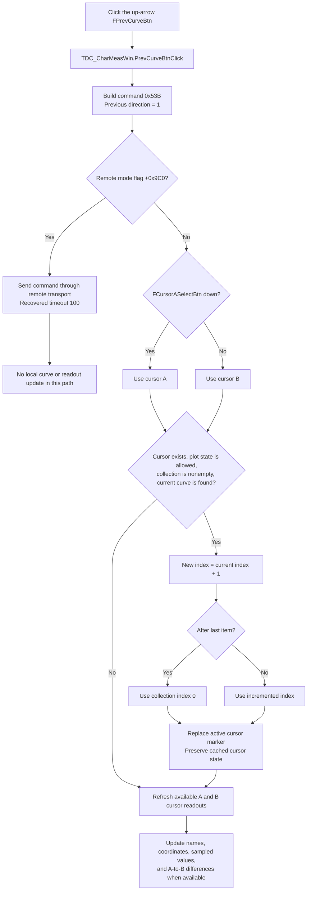

# Previous cursor curve

> Analysis status: Recovered resource, glyph pair, click handler, command wrapper, shared dispatcher, ordered curve-list traversal, cursor replacement, readout refresh, remote path, and sibling Next command reviewed.

## Control

| Property | Recovered value |
| --- | --- |
| Form | DC_CharMeasWin |
| Form caption | DC Parameter Analyzer |
| Component path | DC_CharMeasWin.CursorBox.FPrevCurveBtn |
| Control class | TSpeedButton |
| Caption | Not present in the recovered resource. |
| Hint | Not present in the recovered resource. |
| Handler name | PrevCurveBtnClick |
| Handler address | 01b687e0 |
| Graph node | `resource:dfm:DC_CharMeasWin/DC_CharMeasWin.CursorBox.FPrevCurveBtn` |
| Handler node | `function:01b687e0` |
| Graph layer | UI |

## What happens when clicked

`TDC_CharMeasWin.PrevCurveBtnClick` delegates the click to
`FUN_010f6d40`. The wrapper builds command `0x53B` with its direction field
set to `1`, then calls the shared cursor-curve dispatcher. The sibling Next
wrapper builds the same command with direction `0`. This difference and the
opposite glyphs establish that `1` is the Previous command in this UI.

In local mode, the dispatcher selects which cursor the command applies to. It
reads the `Down` state of `FCursorASelectBtn`. A down A button selects cursor
A. Any false value selects the cursor B path. The dispatcher then asks
the plot cursor model to replace that cursor's current curve with the Previous
item and refreshes the cursor display.

In remote mode, selected by form flag `+0x9C0`, the dispatcher does not change
the local curve or readouts. It sends command `0x53B`, including direction
value `1`, through the existing remote command transport with the recovered
timeout value `100`. The remote receiver and its final display update are not
present in this call path.

## Exact collection order and wrap rule

The local selection routine uses the ordered collection at offset `+0x80` of
the active plot data object. It performs these operations:

1. It requires at least one collection item and an existing cursor object.
2. It finds the current curve object by identity in that collection.
3. For this Previous command, it adds one to the current collection index.
4. If the new index is after the last item, it changes the index to zero.
5. It fetches the curve at that index and gives it to the cursor replacement
   routine.

Thus, the recovered Previous order is `i -> i + 1`, with `last -> 0`. The
paired Next command uses `i -> i - 1`, with `0 -> last`. The names Previous
and Next describe the UI's curve order; the underlying collection index runs
in the opposite direction for Next.

The click path does not sort the collection and does not test curve name,
visibility, measurement type, or another eligibility flag. Its eligible set is
exactly the items already in this plot collection. It cannot select an object
that is outside the collection. The recovered source does not establish how an
earlier operation built or ordered that collection.

## Cursor and readout updates

When the collection traversal returns a curve, the cursor replacement routine
removes the old A or B cursor marker and creates a new marker associated with
the selected curve. It reads the cursor's cached state, supplies the saved
position values to the new marker, then stores the new marker's state back in
the cursor controller.
The selection is therefore a cursor-to-curve change, not a change to the curve
data itself.

After the selection attempt, the shared dispatcher always calls the local
cursor-display refresh. That refresh handles both cursor A and cursor B. For
each available cursor it reads the curve name, cursor coordinates, and sampled
value. It normalizes a coordinate to the plot step when a nonzero step exists,
clamps it to the plot bounds, updates the cursor model, and updates the dynamic
name and numeric readouts. It also updates the A-to-B difference readouts when
both cursors are available. Missing cursor values clear the corresponding
readout text.

The handler does not start a DC sweep, modify curve samples, change sweep
inputs, or move to a different measurement definition. Its state change is the
selected curve association for the active cursor and the related display
refresh.

## No-data, repeated-click, error, and persistence boundaries

- If there is no cursor object, the selection routine does not choose a curve.
- If the ordered collection is empty, it returns no curve.
- If the current cursor curve is not a member of the collection, it returns no
  curve. It does not fall back to the first or last item.
- A plot-state guard permits only the recovered state values `0`, `5`, and `6`.
  Other values skip cursor replacement. The dispatcher still runs the display
  refresh in local mode.
- With one collection item, each click selects that same item after the
  `last -> 0` wrap. The visible curve choice does not change, although the
  cursor replacement and display-refresh path still runs.
- With two or more items, repeated clicks continue through increasing
  collection indexes and wrap to zero.
- The handler has no message box, validation text, error return, or local
  exception recovery. Normal no-data cases are silent no-selection paths. The
  recovered path does not define behavior for an invalid object outside these
  guards.
- The local path changes only live cursor and display objects. It has no file,
  registry, settings, document-dirty, or save call. Closing and reopening the
  window is outside this handler's persistence boundary.
- The remote path submits a command but does not inspect a returned selection
  or show an error in this recovered function.

## Click flow

## Handler and call-path evidence

- Click handler: [FUN_01b687e0](../../../DecompiledSources/Tina16/functions/0000000001B687E0__FUN_01b687e0.c)
- Previous command wrapper: [FUN_010f6d40](../../../DecompiledSources/Tina16/functions/00000000010F6D40__FUN_010f6d40.c)
- Shared local-or-remote dispatcher: [FUN_010f6d70](../../../DecompiledSources/Tina16/functions/00000000010F6D70__FUN_010f6d70.c)
- Increment-and-wrap collection traversal: [FUN_010e7a30](../../../DecompiledSources/Tina16/functions/00000000010E7A30__FUN_010e7a30.c)
- Decrement-and-wrap sibling traversal: [FUN_010e7ae0](../../../DecompiledSources/Tina16/functions/00000000010E7AE0__FUN_010e7ae0.c)
- Cursor curve replacement: [FUN_010e7ef0](../../../DecompiledSources/Tina16/functions/00000000010E7EF0__FUN_010e7ef0.c)
- Cursor marker construction and replacement: [FUN_01ae1eb0](../../../DecompiledSources/Tina16/functions/0000000001AE1EB0__FUN_01ae1eb0.c)
- Cursor-display refresh: [FUN_010f6ef0](../../../DecompiledSources/Tina16/functions/00000000010F6EF0__FUN_010f6ef0.c)
- Cursor-state reader: [FUN_010e8310](../../../DecompiledSources/Tina16/functions/00000000010E8310__FUN_010e8310.c)
- Remote command adapter: [FUN_00f83670](../../../DecompiledSources/Tina16/functions/0000000000F83670__FUN_00f83670.c)
- Recovered form evidence: [ui-evidence.json](../../../DecompiledSources/Tina16/resources/dfm/ui-evidence.json)

## Direct call

- `FUN_010f6d40` - Builds the Previous form of the shared cursor-curve command.

## Resource and glyph evidence

- The DFM places this 23-by-21 `TSpeedButton` in the `Cursor` group beside
  `FNextCurveBtn`, the A and B selector buttons, the cursor On button, and the
  left and right cursor-move buttons.
- It has no caption, hint, action, image-list reference, or built-in button
  kind. Its embedded `Glyph.Data` is the only recovered direct visual label.
- The extracted [9-by-8 glyph](../../../glyph/0072_DC_CharMeasWin_DC_CharMeasWin_CursorBox_FPrevCurveBtn_Glyph_Data.png)
  is an upward arrow. The adjacent Next control has the corresponding downward
  arrow. This pair supports the Previous and Next direction, while the handler
  data flow proves the collection operation.
- No same-parent text label is available. The `Cursor` group caption provides
  context but does not establish the order rule by itself.

## Analysis limits

- Recovered class names are not available for the plot data object, its
  ordered collection, and the cursor marker. This article names them by their
  proven use in the call path.
- The collection construction and its visual ordering are outside the click
  path. This article reports the exact index operation but does not invent a
  legend, visibility, or measurement eligibility rule.
- Shared dispatcher and cursor/readout helpers are evidence for this control,
  but their canonical graph annotations belong to the coordinated Next-button
  analysis.
