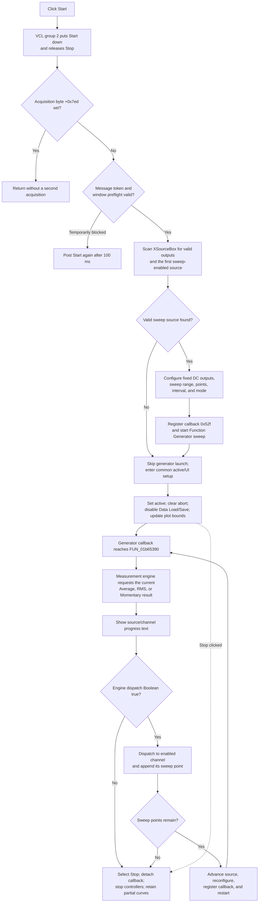

# Start DC parameter acquisition

> Analysis status: Evidence-backed source review complete.

## Control

| Property | Recovered value |
| --- | --- |
| Form | DC_CharMeasWin (`DC Parameter Analyzer`) |
| Component path | DC_CharMeasWin.StorageGroupBox.FStartBtn |
| Parent group | Measurement |
| Control class | TSpeedButton |
| Caption | Start |
| Group index | 2, shared with Stop |
| Hint | Not present in the recovered resource. |
| Handler name | StartBtnClick |
| Handler address | 01b65d90 |
| Graph node | `resource:dfm:DC_CharMeasWin/DC_CharMeasWin.StorageGroupBox.FStartBtn` |
| Handler node | `function:01b65d90` |
| Graph layer | UI |

## What happens when clicked

The click starts an asynchronous DC sweep and measurement cycle. The Start and Stop speed buttons share `GroupIndex = 2`, so the normal VCL click puts Start down and releases Stop before `StartBtnClick` runs. The handler does not start another cycle when the form's acquisition-active byte at `+0x7ed` is already set.

`FUN_01b65d90` creates serialized message `0x538` and delegates to `FUN_01b65dd0`. The worker rejects a stale message token. It also calls the common measurement-window arbitration helper before it changes the source or graph. If this preflight does not permit the work on that pass, the event is posted again with a 100 ms delay. No acquisition state is committed on that branch.

## Source and sweep preparation

When preflight succeeds, the worker gets or creates the shared Function Generator for the current analyzer channel. It then scans the `XSourceBox` descriptor list:

- A descriptor must have a valid output identifier at `+0x2e`; `-1` is ignored.
- The first valid descriptor whose `+0x158` flag is set becomes the sweep source and is selected in `XSourceBox`.
- Other valid descriptors whose `+0x158` flag is clear are prepared as fixed DC sources when the Function Generator is idle.

For a fixed source, the worker selects its generator output, reads the current source and sweep configuration, calculates the first value, last value, point count, and linear step, and applies a DC waveform with the initial value. For the selected sweep source, it preserves the generator's recovered start and stop values, sets the total sweep time to the parsed measurement interval at form `+0xd70` multiplied by the point count, applies the linear/log flag from the source descriptor, and selects the source in the generator.

The raw `IntervalTimeEdit.Text` is not parsed by Start. Its Enter, exit, and error handlers validate and store the interval in the measurement model before this click. Start uses that stored value. It also does not change the `RecordingModeBox` selection. The combo's `Average`, `RMS`, or `Momentary` index is applied to the measurement engine by `RecordingModeBoxChange`; the later result callback asks that already-configured engine for each value.

The worker registers the analyzer window and message `0x52f` as the Function Generator callback target, then invokes the same generator start worker used by the generator's own Start command. These are indirect Delphi controller calls. The recovered Start path contains no direct device DLL or Win32 I/O call.

## Running state and UI changes

After source preparation, the worker:

- sets acquisition-active byte `+0x7ed` to one and clears abort byte `+0x7ec`;
- clears the current transient graph-data pointer;
- disables the common Data Load and Data Save controls through their base-form aliases at `+0x980` and `+0x988`;
- asks the graph controller for a non-destructive update;
- copies the current analyzer mode bytes at `+0xdb2` and `+0xdb3` to their shared runtime fields;
- derives the sweep-axis scale code, applies the sweep bounds, and requests a plot redraw through `FUN_01b655a0`;
- conditionally puts `FStopBtn` down and invokes the Stop handler when the measurement model's Boolean query at virtual slot `+0xc0` is false.

That Stop route detaches the callback, stops the controllers, clears the active state, and re-enables Data Load and Data Save. Start does not erase existing curves. Erase is a separate command.

## Measurement callbacks, progress, and plot output

The Function Generator posts its registered callback while the sweep runs. `FUN_01b65390` accepts the notification only for the expected measurement-engine class, ready state, and current serialized token. It then calls `FUN_01b64fa0`.

The result processor sets a short-lived busy byte at `+0x9c3`, calls the selected recording-mode engine for one result, passes the one-shot reset flag, and clears that reset flag after the engine consumes it. It builds status text from the current sweep source and measurement-channel names and values, then shows that text in the form's message label. This is the recovered progress display; there is no separate progress-bar update in the call path.

When the engine returns its dispatch Boolean, a false value selects Stop and invokes the Stop handler. A true value reaches `FUN_01b65490`, which dispatches the result only if the current measurement-channel descriptor is enabled. The DC-specific continuation `FUN_01b66c10` creates or extends the graph series, appends the next sweep value with its unit, advances the source value, decrements the remaining-point count, applies the next generator configuration, registers callback `0x52f` again, and starts the next point. When no point remains, it also selects Stop and invokes the Stop handler. The recovered completion path does not call the separate Auto-range handler.

## No-op, missing-source, abort, and error behavior

- A repeated click while `+0x7ed` is one is a no-op. A stale queued message is also ignored.
- A temporarily blocked measurement-window preflight reposts Start after 100 ms instead of showing an error.
- An empty `XSourceBox`, or a list with no valid sweep-enabled descriptor, does not produce an explicit error in `FUN_01b65dd0`. The generator launch is skipped, but the worker still enters its common active/UI setup. The source does not prove a later recovery from that abnormal state.
- A Function Generator creation failure or busy generator also has no local message or rollback branch in this worker. Normal form setup is expected to provide valid controller objects.
- Stop unregisters the analyzer callback, requests Function Generator and measurement-engine stop operations, clears `+0x7ed`, sets `+0x7ec`, refreshes the status, and re-enables Data Load and Data Save. It does not call the all-curve erase path, so plot points collected before Stop remain available as partial results.
- The start worker has no local exception handler or transaction. An exception after source configuration can leave a partially changed Function Generator or graph setup. An exception after the active-state writes can also leave the UI in an active-looking state until Stop or other cleanup runs.
- No file, settings, or registry write occurs. Acquired curves and live controller state remain in the form/model; persistence requires the separate Data Save command.

## Acquisition flow

## Glyph and resource evidence

The DFM supplies the text caption `Start` and the shared group index with Stop. It supplies no hint, image reference, or embedded glyph for Start, and the extracted glyph directory has no Start image. Therefore, the pressed state and caption are the only recovered visual cues for this control. The nearby Time Base spin button has extracted up/down glyphs, but those glyphs belong to interval adjustment and do not show Start behavior.

## Source evidence

- Click wrapper: [FUN_01b65d90](../../../DecompiledSources/Tina16/functions/0000000001B65D90__FUN_01b65d90.c)
- Start preparation and commit worker: [FUN_01b65dd0](../../../DecompiledSources/Tina16/functions/0000000001B65DD0__FUN_01b65dd0.c)
- Measurement-window arbitration: [FUN_010e2d90](../../../DecompiledSources/Tina16/functions/00000000010E2D90__FUN_010e2d90.c)
- Function Generator lookup/create: [FUN_010e1a60](../../../DecompiledSources/Tina16/functions/00000000010E1A60__FUN_010e1a60.c)
- Function Generator callback registration: [FUN_01139080](../../../DecompiledSources/Tina16/functions/0000000001139080__FUN_01139080.c)
- Function Generator start worker: [FUN_011393f0](../../../DecompiledSources/Tina16/functions/00000000011393F0__FUN_011393f0.c)
- Callback receiver: [FUN_01b65390](../../../DecompiledSources/Tina16/functions/0000000001B65390__FUN_01b65390.c)
- Measurement-result and progress processor: [FUN_01b64fa0](../../../DecompiledSources/Tina16/functions/0000000001B64FA0__FUN_01b64fa0.c)
- Enabled-channel dispatcher: [FUN_01b65490](../../../DecompiledSources/Tina16/functions/0000000001B65490__FUN_01b65490.c)
- Next-point and graph-series continuation: [FUN_01b66c10](../../../DecompiledSources/Tina16/functions/0000000001B66C10__FUN_01b66c10.c)
- Sweep-axis range and redraw helper: [FUN_01b655a0](../../../DecompiledSources/Tina16/functions/0000000001B655A0__FUN_01b655a0.c)
- Recording-mode configuration: [FUN_01b69150](../../../DecompiledSources/Tina16/functions/0000000001B69150__FUN_01b69150.c)
- Stop and partial-result boundary: [FUN_01b674b0](../../../DecompiledSources/Tina16/functions/0000000001B674B0__FUN_01b674b0.c)
- Recovered DFM control tree: [ui-evidence.json](../../../DecompiledSources/Tina16/resources/dfm/ui-evidence.json)

## Evidence limits

- Several measurement and Function Generator operations are virtual calls. Their effects above are limited to state that is confirmed by their paired UI handlers, call sites, and downstream field use.
- The normal DFM items provide valid recording modes and setup builds source descriptors. The malformed or externally modified descriptor branches have no user-facing recovery in the recovered Start worker.
