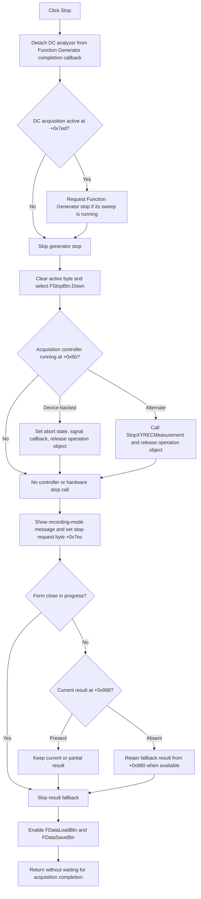

# Stop DC parameter acquisition

> Analysis status: Complete. The recovered handler, shared measurement flags, controller VMT implementations, Function Generator stop path, result-reference handling, component RTTI, and form resources agree on this behavior.

## Control

| Property | Recovered value |
| --- | --- |
| Form | DC_CharMeasWin (`DC Parameter Analyzer`) |
| Component path | DC_CharMeasWin.StorageGroupBox.FStopBtn |
| Control class | TSpeedButton |
| Parent caption | `Measurement` |
| Caption | `Stop` |
| Group index | `2`, shared with `FStartBtn` |
| Hint or glyph | Not present in the recovered resource. |
| Handler name | StopBtnClick |
| Handler address | 01b674b0 |
| Graph node | `resource:dfm:DC_CharMeasWin/DC_CharMeasWin.StorageGroupBox.FStopBtn` |
| Handler node | `function:01b674b0` |
| Graph layer | UI |

## What happens when clicked

`Stop` requests the end of the current DC parameter acquisition. It also stops the Function Generator sweep that the acquisition can own, selects the Stop speed button, updates the analyzer status text, preserves available result data, and re-enables data load and save.

The handler first gets the shared Function Generator for the analyzer's current instrument channel. `FUN_011390a0` removes this DC analyzer as the generator's completion owner when the owner matches, and clears the generator callback-active byte at `+0xa8a`. If the DC analyzer active byte at `+0x7ed` is set, the handler then calls the Function Generator's recovered stop path. That path selects the generator Stop button and invokes `FUN_01139900`. The generator stops its live controller and clears its running byte because the DC callback was detached first. If the DC analyzer is already idle, this Function Generator stop branch is skipped.

The handler then clears the analyzer active byte at `+0x7ed` and sets `FStopBtn.Down` through `FUN_0082a6c0`. Recovered published-field RTTI maps `TDC_CharMeasWin +0xb80` to `FStopBtn`; `FUN_01b62250` aliases that field to the common instrument-form slot at `+0x7c0`. `FStartBtn` and `FStopBtn` both have `GroupIndex = 2`, so selecting Stop releases Start through the normal `TSpeedButton` group behavior and redraws the changed button state.

## Cancellation and controller behavior

After it changes the analyzer active state, the handler calls virtual slot `+0xd0` on the acquisition controller at `TDC_CharMeasWin +0xda0`. `FormCreate` can install one of two recovered controller classes:

- The device-backed controller dispatches slot `+0xd0` to `FUN_01b5e780`. When its running byte at `+0x5b` is clear, this method is a no-op. When it is set, the method calls `FUN_0153b340` and `FUN_0153b230`. Their downstream code sets cancellation bytes, invokes or posts a callback when available, and restores shared measurement controls. The controller then releases its owned operation object at `+0x80` and clears its running byte.
- The alternate controller dispatches slot `+0xd0` to `FUN_01b5dc70`. When its running byte is set, it invokes the dynamically resolved `StopXYRECMeasurement` export, releases its owned operation object at `+0x80`, and clears its running byte. When it is already idle, it makes no external stop call.

These calls run synchronously in the click handler, but the recovered code does not wait for an acquisition thread, poll for completion, or join a worker. The device-backed path sets abort state and signals callbacks. The alternate path calls a stop export and uses no recovered acknowledgement result. Thus, the click is a cooperative stop request with immediate local cleanup, not proof that hardware has already become idle when the handler returns.

## Status, buttons, and result data

`FUN_01b69a50` reads `RecordingModeBox.ItemIndex`, adds `9`, and sends that message-table index to `FUN_010e4210`. The latter makes the form's message label visible and replaces its caption. The DFM items are `Average`, `RMS`, and `Momentary`, so normal indexes select message slots 9, 10, and 11. The exact text stored in those runtime message-table slots is not recovered. No progress bar, percentage value, curve list, or graph repaint is directly changed by this handler.

The handler next sets the common stop-request byte at `+0x7ec`. Shared instrument code tests this byte together with the close-in-progress byte at `+0x8d1`, which confirms that this is a cooperative termination state and not a persisted setting.

For a normal click while the form is not closing, the handler preserves result data as follows:

- If the current result reference at `+0x998` is non-null, it remains unchanged. `FUN_01b65790` later consumes this reference only after `+0x7ed` is clear and sends it to the analyzer's result-display path. This lets a partial result remain available after Stop.
- If `+0x998` is null, the handler copies the saved fallback result reference at `+0x880` into it and increments that object's reference count. If both references are null, the result remains empty.
- If form close is already in progress, the handler skips this fallback-selection block. The close path owns final cleanup.

Finally, the handler enables the two Data controls. Component RTTI maps the derived fields `+0xc38` and `+0xc40` to `FDataSaveBtn` and `FDataLoadBtn`; `FUN_01b62250` aliases them to the common slots `+0x980` and `+0x988` that this handler enables. The measurement-start path disables the same two controls. Stop does not change their captions, images, or Down state.

## Click flow

## Idle, repeated-click, and error paths

- There is no confirmation dialog and no Cancel result. The click changes live instrument state immediately.
- An idle click skips the Function Generator stop branch. Both acquisition-controller stop implementations also guard their external work with their own running byte. The handler still selects Stop, refreshes the status message, sets the stop-request byte, applies the result fallback when needed, and enables the two Data buttons. An idle or repeated click is therefore safe for the controller, but it is not a complete no-op.
- The handler has no null check for the expected shared Function Generator object before it detaches the callback. It also has no null check for the controller. Normal form creation establishes both objects. Broken initialization can cause an access or cast exception.
- The status helper raises when the calculated message index is outside its 0 through 21 table. The three recovered combo items produce valid indexes. The handler has no local exception recovery.
- Calls are ordered, and there is no rollback. A Function Generator failure occurs before the analyzer active byte is cleared. A controller failure occurs after the active byte is clear and Stop is selected, but before the status, stop-request, result, and Data-button updates. A later status or reference-count failure can also leave a partial UI and model update.

## Ownership and persistence

The handler does not free a non-null current result. It retains the existing `+0x998` object or takes one reference to the fallback `+0x880` object. The acquisition controller owns and releases its temporary operation object at `+0x80`. The shared Function Generator remains owned by the per-channel instrument-window table; Stop only removes the DC analyzer's callback relationship.

No file, registry, settings writer, document-dirty marker, or database call occurs. The stop flags, button state, status caption, controller state, and result references are live runtime state. The handler does not prove that partial data survives application shutdown or a new analyzer form.

## Handler and call-path evidence

- Click handler: [FUN_01b674b0](../../../DecompiledSources/Tina16/functions/0000000001B674B0__FUN_01b674b0.c)
- Measurement-start contrast: [FUN_01b65dd0](../../../DecompiledSources/Tina16/functions/0000000001B65DD0__FUN_01b65dd0.c)
- Form creation and controller selection: [FUN_01b67a10](../../../DecompiledSources/Tina16/functions/0000000001B67A10__FUN_01b67a10.c)
- Published-field alias setup: [FUN_01b62250](../../../DecompiledSources/Tina16/functions/0000000001B62250__FUN_01b62250.c)
- Speed-button Down setter: [FUN_0082a6c0](../../../DecompiledSources/Tina16/functions/000000000082A6C0__FUN_0082a6c0.c)
- Function Generator lookup and callback detach: [FUN_010e1b10](../../../DecompiledSources/Tina16/functions/00000000010E1B10__FUN_010e1b10.c), [FUN_011390a0](../../../DecompiledSources/Tina16/functions/00000000011390A0__FUN_011390a0.c)
- Function Generator stop dispatcher and click handler: [FUN_0113dfb0](../../../DecompiledSources/Tina16/functions/000000000113DFB0__FUN_0113dfb0.c), [FUN_01139900](../../../DecompiledSources/Tina16/functions/0000000001139900__FUN_01139900.c)
- Device-backed controller stop: [FUN_01b5e780](../../../DecompiledSources/Tina16/functions/0000000001B5E780__FUN_01b5e780.c)
- Device abort signaling: [FUN_0153b340](../../../DecompiledSources/Tina16/functions/000000000153B340__FUN_0153b340.c), [FUN_0153b230](../../../DecompiledSources/Tina16/functions/000000000153B230__FUN_0153b230.c), [FUN_01329970](../../../DecompiledSources/Tina16/functions/0000000001329970__FUN_01329970.c), [FUN_01af11d0](../../../DecompiledSources/Tina16/functions/0000000001AF11D0__FUN_01af11d0.c)
- Alternate controller stop export: [FUN_01b5dc70](../../../DecompiledSources/Tina16/functions/0000000001B5DC70__FUN_01b5dc70.c), [FUN_00e1d330](../../../DecompiledSources/Tina16/functions/0000000000E1D330__FUN_00e1d330.c)
- Recording-mode status selection and label update: [FUN_01b69a50](../../../DecompiledSources/Tina16/functions/0000000001B69A50__FUN_01b69a50.c), [FUN_010e4210](../../../DecompiledSources/Tina16/functions/00000000010E4210__FUN_010e4210.c)
- Cooperative stop setter and stop-or-close predicate: [FUN_010e3c00](../../../DecompiledSources/Tina16/functions/00000000010E3C00__FUN_010e3c00.c), [FUN_010e2b90](../../../DecompiledSources/Tina16/functions/00000000010E2B90__FUN_010e2b90.c)
- Current-result consumer and reference-count helpers: [FUN_01b65790](../../../DecompiledSources/Tina16/functions/0000000001B65790__FUN_01b65790.c), [FUN_01cc6020](../../../DecompiledSources/Tina16/functions/0000000001CC6020__FUN_01cc6020.c), [FUN_01cc6030](../../../DecompiledSources/Tina16/functions/0000000001CC6030__FUN_01cc6030.c)
- Delphi form resources: [ui-evidence.json](../../../DecompiledSources/Tina16/resources/dfm/ui-evidence.json)

## Analysis limits

- The recovered source does not name the acquisition-controller classes or the result-object class. This article uses field offsets and proven behavior where a Delphi name is not available.
- The exact strings for message-table slots 9 through 11 are runtime data and are not recovered in the source export.
- The handler does not read an acquisition-complete or hardware-idle acknowledgement. It proves that stop signals are sent and local state is updated, not that the external device has already stopped.
