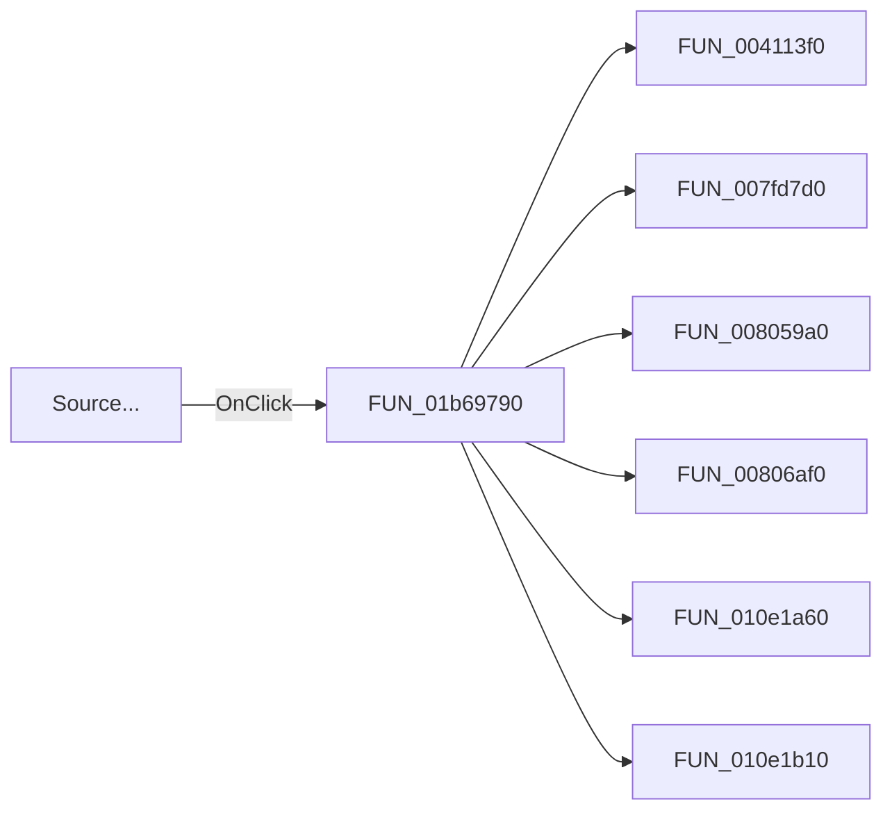

# Source...

> Analysis status: Pending individual source review.

## Control

| Property | Recovered value |
| --- | --- |
| Form | DC_CharMeasWin |
| Component path | DC_CharMeasWin.ControlGroupBox.SourceControlSpBtn |
| Control class | TSpeedButton |
| Caption | Source... |
| Hint | Not present in the recovered resource. |
| Text | Not present in the recovered resource. |
| Handler name | SourceControlSpBtnClick |
| Handler address | 01b69790 |
| Graph node | `resource:dfm:DC_CharMeasWin/DC_CharMeasWin.ControlGroupBox.SourceControlSpBtn` |
| Handler node | `function:01b69790` |
| Graph layer | UI |

## What happens when clicked

Pending individual analysis. An agent must read the recovered handler source and its relevant callees before it replaces this text.

## Click flow

## Handler evidence

- Source: [DecompiledSources/Tina16/functions/0000000001B69790__FUN_01b69790.c](../../../DecompiledSources/Tina16/functions/0000000001B69790__FUN_01b69790.c)
- Recovered role: Not present in the recovered resource.
- Current graph summary: Handles 1 Delphi UI event: DC_CharMeasWin.ControlGroupBox.SourceControlSpBtn.OnClick.
- Current graph behavior: Not present in the recovered resource.
- Current graph evidence: Not present in the recovered resource.
- Complexity: complex
- Distinct outgoing calls: 12

## Direct calls

- `function:004113f0` — FUN_004113f0
- `function:007fd7d0` — FUN_007fd7d0
- `function:008059a0` — FUN_008059a0
- `function:00806af0` — FUN_00806af0
- `function:010e1a60` — FUN_010e1a60
- `function:010e1b10` — FUN_010e1b10
- `function:01138af0` — FUN_01138af0
- `function:01138b30` — FUN_01138b30
- `function:01138d40` — FUN_01138d40
- `function:01138e40` — FUN_01138e40
- `function:0113d290` — FUN_0113d290
- `function:0113d630` — FUN_0113d630

## Resource evidence

- Kind: Not present in the recovered resource.
- Modal result: Not present in the recovered resource.
- Checked state: Not present in the recovered resource.
- List items: Not present in the recovered resource.
- Image reference: Not present in the recovered resource.
- Extracted glyph: None.

## Nearby label candidates

Nearby labels are layout candidates only. They are not proof of behavior.

- No same-parent label candidate is available.

## Analysis limits

- Do not infer behavior from the control class, caption, hint, glyph, or nearby label alone.
- Do not replace the pending status until the handler source and relevant call path provide enough evidence.
