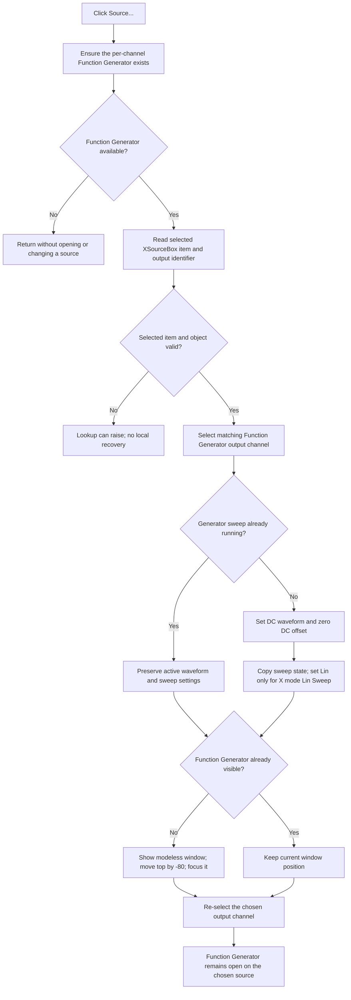

# Open the selected sweep source in the Function Generator

> Analysis status: Complete. The recovered handler, X-source population and change paths, Function Generator channel selector, source-parameter helpers, measurement-start path, and Delphi form resources agree on this behavior.

## Control

| Property | Recovered value |
| --- | --- |
| Form | DC_CharMeasWin (`DC Parameter Analyzer`) |
| Component path | DC_CharMeasWin.ControlGroupBox.SourceControlSpBtn |
| Control class | TSpeedButton |
| Caption | `Source...` |
| Hint or glyph | Not present in the recovered resource. |
| Handler name | SourceControlSpBtnClick |
| Handler address | 01b69790 |
| Graph node | `resource:dfm:DC_CharMeasWin/DC_CharMeasWin.ControlGroupBox.SourceControlSpBtn` |
| Handler node | `function:01b69790` |
| Graph layer | UI |

## What happens when clicked

`Source...` opens the shared modeless **Function Generator** window for the source that is already selected in the analyzer's Sweep `XSourceBox`. It is not a source-selection dialog. The click does not replace the `XSourceBox` choice, and there is no OK or Cancel result to copy back.

The handler first calls `FUN_010e1a60`. This helper returns success when the Function Generator already exists for the analyzer's current instrument channel. Otherwise, it creates `TFuncGenWin` and stores the instance in the shared per-channel form slot. If creation does not produce an instance, the handler returns without opening a window or changing source state.

After it obtains the Function Generator, the handler reads `XSourceBox.ItemIndex`, gets the selected `Items.Objects` source descriptor, and passes that descriptor's 16-bit output identifier at `+0x2e` to `FUN_0113d630`. This selects the matching row in `FuncGenWin.OutputBox.ChannelBox`. The handler repeats this selection at the end so that the Function Generator remains on the analyzer's chosen X source after its other setup calls.

## Source preparation for DC analysis

When the selected generator is not running a sweep, field `TFuncGenWin +0xa09` is clear. In this state, the handler prepares the selected output for DC parameter analysis:

1. It reads the output's current waveform and numeric parameters through `FUN_01138af0`.
2. It calls `FUN_01138b30` with waveform value `0`. The Function Generator waveform handlers establish value `0` as **DC**; sine, triangle, and square use values `1`, `2`, and `3`.
3. It replaces the recovered offset parameter with `0` before it applies the values. The Function Generator parameter-display path associates this model field with the **Offset** button, whose hint is **DC Offset**.
4. It reads the current sweep start, stop, time, step count, continuous/single state, linear/log state, and On state through `FUN_01138d40`.
5. It preserves those values except for the linear/log selection. It sets that flag to linear only when `XChannelMode.ItemIndex` is `1`, the recovered **Lin Sweep** item, and applies the result through `FUN_01138e40`.

This preparation changes the live Function Generator model and its button states. It does not start the generator or start analyzer measurement. If the generator sweep is already running, the handler skips all waveform and sweep-parameter writes. This prevents the click from replacing the active generator setup.

## Window and visual behavior

If the Function Generator is hidden, the handler calls the modeless Show path, sets its top position to 80 pixels above the DC analyzer's top position, and invokes the form's focus or front operation. If the Function Generator is already visible, it does not show it again or change its position. It still performs the source-channel selection and, when no generator sweep is running, the DC-source preparation.

The handler does not change `SourceControlSpBtn.Enabled`, `Visible`, `Down`, caption, hint, or image. The control has no recovered image reference or embedded glyph. The visible result is the separate Function Generator window. Within that window, the selected output row, waveform buttons, parameter controls, and sweep-mode buttons can change to show the applied source state.

## Click flow

## Measurement interaction

`XSourceBoxChange` stores the selected source descriptor in the DC analyzer's live model and updates the analyzer controller. `SourceControlSpBtnClick` reads that same combo-box selection but does not call the change handler and does not choose another analyzer source.

The later measurement-start path uses the same source descriptors and the same shared Function Generator. It selects controllable output identifiers, prepares them as DC sources, installs sweep ranges, and then starts the measurement controller. This establishes why the Source button prepares DC waveform and sweep state. The button itself stops at opening and preparing the source-control window.

Changing `FuncGenWin.OutputBox.ChannelBox` after the window opens changes the Function Generator's current output. No callback from that combo box to `DC_CharMeasWin.XSourceBox` is present in this path. Thus, the initial selections match, but the two combo boxes are not proven to remain bidirectionally linked.

## No-selection, repeated-click, and error paths

- Normal form initialization rebuilds `XSourceBox`, associates source descriptor objects with its rows, and selects a row. The click handler still has no `ItemIndex = -1`, null-object, or item-count guard. Invalid internal state can raise a VCL list or access exception before the window is shown.
- `FUN_0113d630` rejects an output identifier that is outside the current Function Generator channel count and leaves its current channel unchanged. The click handler ignores that return value, continues its setup, and shows no error. A non-controllable input descriptor can therefore open the Function Generator on its prior channel rather than on an analyzer-owned output.
- A repeated click re-selects the same source channel. When the generator is idle, it also repeats the DC waveform, zero-offset, and sweep-mode preparation. There is no unchanged-state test in the handler.
- When the Function Generator is already visible, a repeated click does not bring it to the front through the recovered Show branch. The final channel selection can still refresh that window's channel-dependent controls.
- The handler has no dialog, validation message, local exception handler, retry, or rollback. A failure after some parameter setters run can leave a partial live Function Generator update.
- The final type-based selector `FUN_0113d290` only has recovered branches for instrument-type values `4` and `8`. `DC_CharMeasWin.FormCreate` assigns this form value `0x10`, so that helper makes no selection here. The explicit final output-identifier selection is the effective repair step.

## Ownership, close behavior, and persistence

The handler does not allocate or own the selected source descriptor. `XSourceBox.Items` holds references supplied by the analyzer model. It also does not own the Function Generator instance directly. `FUN_010e1a60` stores that form in the shared instrument-window table for the current channel, and `FUN_010e1b10` retrieves it.

The Function Generator is modeless, so there is no Cancel branch. Edits in that window operate on the shared live source model. Closing the DC analyzer closes its related Function Generator through the normal form-close path, but this Source click does not destroy either object.

No settings writer, file operation, document-dirty marker, or registry call occurs in `FUN_01b69790`. The channel choice and prepared generator values are live runtime state. The recovered click path does not prove that they survive application shutdown or a new form instance.

## Handler and call-path evidence

- Click handler: [FUN_01b69790](../../../DecompiledSources/Tina16/functions/0000000001B69790__FUN_01b69790.c)
- Per-channel Function Generator creation guard: [FUN_010e1a60](../../../DecompiledSources/Tina16/functions/00000000010E1A60__FUN_010e1a60.c)
- Shared Function Generator lookup: [FUN_010e1b10](../../../DecompiledSources/Tina16/functions/00000000010E1B10__FUN_010e1b10.c)
- Shared instrument-form constructor: [FUN_010e1810](../../../DecompiledSources/Tina16/functions/00000000010E1810__FUN_010e1810.c)
- X-source list population: [FUN_01b68200](../../../DecompiledSources/Tina16/functions/0000000001B68200__FUN_01b68200.c)
- X-source model selection: [FUN_01b68830](../../../DecompiledSources/Tina16/functions/0000000001B68830__FUN_01b68830.c)
- Function Generator channel selector: [FUN_0113d630](../../../DecompiledSources/Tina16/functions/000000000113D630__FUN_0113d630.c)
- Current waveform and parameter reader: [FUN_01138af0](../../../DecompiledSources/Tina16/functions/0000000001138AF0__FUN_01138af0.c)
- Waveform and numeric-parameter applier: [FUN_01138b30](../../../DecompiledSources/Tina16/functions/0000000001138B30__FUN_01138b30.c)
- Sweep-state reader: [FUN_01138d40](../../../DecompiledSources/Tina16/functions/0000000001138D40__FUN_01138d40.c)
- Sweep-state applier: [FUN_01138e40](../../../DecompiledSources/Tina16/functions/0000000001138E40__FUN_01138e40.c)
- Modeless form Show path: [FUN_008059a0](../../../DecompiledSources/Tina16/functions/00000000008059A0__FUN_008059a0.c)
- Form top getter and setter: [FUN_007fd7d0](../../../DecompiledSources/Tina16/functions/00000000007FD7D0__FUN_007fd7d0.c), [FUN_00806af0](../../../DecompiledSources/Tina16/functions/0000000000806AF0__FUN_00806af0.c)
- DC analyzer measurement-start preparation: [FUN_01b65dd0](../../../DecompiledSources/Tina16/functions/0000000001B65DD0__FUN_01b65dd0.c)
- DC analyzer close path: [FUN_01b65cc0](../../../DecompiledSources/Tina16/functions/0000000001B65CC0__FUN_01b65cc0.c)
- Function Generator resources and DC waveform handlers: [ui-evidence.json](../../../DecompiledSources/Tina16/resources/dfm/ui-evidence.json), [FUN_01139c40](../../../DecompiledSources/Tina16/functions/0000000001139C40__FUN_01139c40.c)

## Analysis limits

- The recovered source descriptor class name and its output-identifier enum name are not available. This article names these values by their proven combo-box and Function Generator uses.
- The handler does not inspect a hardware acknowledgement or source readiness result. Opening the controller is not proof that an external generator accepted a change.
- The exact VCL virtual method at slot `600` is not named in the recovered source. Its placement after Show and its use by other form-opening paths support a focus or front operation, but not a more specific window-manager claim.
