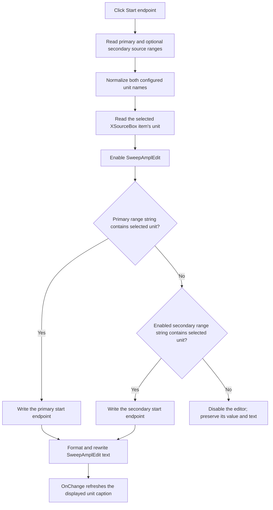

# Start sweep amplitude

## Control

| Property | Recovered value |
| --- | --- |
| Form | DC_CharMeasWin (`DC Parameter Analyzer`) |
| Component path | DC_CharMeasWin.ControlGroupBox.StartSweepAmplBtn |
| Control class | TSpeedButton |
| Caption | Start |
| Hint | Not present in the recovered resource. |
| Glyph | Not present in the recovered resource. |
| Handler name | StartSweepAmplBtnClick |
| Handler address | 01b66800 |
| Graph node | `resource:dfm:DC_CharMeasWin/DC_CharMeasWin.ControlGroupBox.StartSweepAmplBtn` |
| Handler node | `function:01b66800` |
| Graph layer | UI |

## What happens when clicked

`Start` means the start endpoint of the source sweep. It does not start data acquisition.

The handler reads the configured primary source range and, when enabled, the optional secondary source range. Each range supplies a unit name, a start endpoint, a stop endpoint, and a numeric-format descriptor. The click uses only the start endpoint. The sibling `Stop` handler uses the stop endpoint from the same range.

The handler normalizes both configured range-unit strings. For each string, it keeps the prefix before the first `»`, then the prefix before the first `:`, and then removes trailing spaces. It reads the selected `XSourceBox` item and obtains that source's measurement-unit name. It enables `SweepAmplEdit` before it tests the unit:

- If the normalized primary range string contains the selected source unit, the handler writes the primary start endpoint.
- Otherwise, if the normalized enabled secondary range string contains the selected source unit, it writes the secondary start endpoint.
- If neither unit matches, the handler disables `SweepAmplEdit` and keeps its prior value and text.

The match is a one-based substring search, not an equality test. The primary match has priority. The handler does not calculate a step, add an increment, or clamp the endpoint. The range configuration supplies the exact value.

The shared float-edit setter stores the double value and regenerates the edit text with precision argument `6` and the edit's two formatting flags. The evidence does not establish that this means six decimal places. Rewriting the text invokes `SweepAmplEditChange`, which refreshes the adjacent unit caption from the selected source.

## Click flow

## Selection state and repeated clicks

`StartSweepAmplBtn` and `StopSweepAmplBtn` have `GroupIndex = 1` and `AllowAllUp = true`. They act as a releasable pair. The click handler does not test the button's `Down` state. Therefore, each click repeats the range lookup and assignment, including a click that releases the button.

When the selected X source changes, `XSourceBoxChange` updates the form's selected source and controller state first. It then tests the recovered endpoint-selector state. It re-runs this Start handler when Start is down, or the Stop handler otherwise. This later use makes the speed-button state the endpoint-selection mode; the Start handler itself does not change controller or hardware state.

If the endpoint is already stored in the edit, the setter skips only the double assignment. It still formats and rewrites the text, so the unit-caption refresh can run again.

## State, persistence, and failure boundaries

- Direct changes are limited to `SweepAmplEdit.Enabled`, its stored double, its displayed text, and the unit caption updated by the edit's `OnChange` handler.
- The handler reads source configuration and the current `XSourceBox` item. It does not write source configuration, a model object, the sweep controller, or measurement hardware.
- The form-create path calls this handler to initialize the editor. A source change can also call it to refresh the endpoint for the new source.
- The click has no validation dialog, exception handler, rollback path, file operation, or persistence call. Any later use or persistence of the editor value is outside this handler.
- An absent or disabled secondary range becomes an empty unit and cannot match. An unsupported unit is a handled state: the editor becomes disabled and its old value remains visible.
- The handler assumes that `XSourceBox` has a valid selected item. It has no local guard for an invalid index or missing item. Normal form initialization and the source-change handler establish the selection; malformed state can escape through the VCL item lookup.

## Evidence

- The recovered DFM evidence binds `StartSweepAmplBtnClick` to this speed button and records caption `Start`, `GroupIndex = 1`, and `AllowAllUp = true`: [ui-evidence.json](../../../DecompiledSources/Tina16/resources/dfm/ui-evidence.json).
- The handler reads two configured ranges, selects their start fields by unit match, enables or disables `SweepAmplEdit`, and calls the float-edit setter: [FUN_01b66800](../../../DecompiledSources/Tina16/functions/0000000001B66800__FUN_01b66800.c).
- The range helper reads the primary start/stop values and an optional enabled secondary start/stop pair from the source configuration: [FUN_0153b700](../../../DecompiledSources/Tina16/functions/000000000153B700__FUN_0153b700.c).
- The unit helper keeps the prefix before `»`, then the prefix before `:`, and removes trailing spaces before matching: [FUN_010c04f0](../../../DecompiledSources/Tina16/functions/00000000010C04F0__FUN_010c04f0.c).
- The substring helper returns a one-based match position: [FUN_0044f900](../../../DecompiledSources/Tina16/functions/000000000044F900__FUN_0044f900.c).
- The float-edit setter stores the value, formats it with the recovered precision and flags, and rewrites the control text: [FUN_00b90440](../../../DecompiledSources/Tina16/functions/0000000000B90440__FUN_00b90440.c).
- The sibling handler has the same unit-selection flow but writes the stop fields: [FUN_01b669b0](../../../DecompiledSources/Tina16/functions/0000000001B669B0__FUN_01b669b0.c).
- Form creation seeds the edit through the Start handler: [FUN_01b67a10](../../../DecompiledSources/Tina16/functions/0000000001B67A10__FUN_01b67a10.c).
- Source changes update the selected source and controller before re-running Start or Stop according to endpoint-selector state: [FUN_01b68830](../../../DecompiledSources/Tina16/functions/0000000001B68830__FUN_01b68830.c).
- The edit's `OnChange` handler updates only the unit caption: [FUN_01b66b60](../../../DecompiledSources/Tina16/functions/0000000001B66B60__FUN_01b66b60.c).

## Analysis limits

- The recovered delimiters show where normalization cuts the range string, but their suffix semantics are not established here.
- The exact display format selected by the float edit's two flags is not recovered here.
- No direct reader of the `SweepAmplEdit` component field was recovered outside these endpoint handlers. Therefore, this article does not claim how a later measurement serializes or applies the displayed value.
