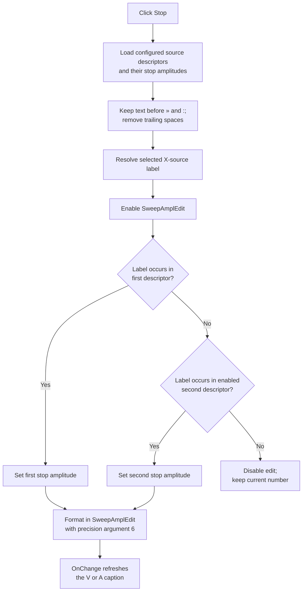

# Stop

> Analysis status: Evidence-backed source review complete.

## Control

| Property | Recovered value |
| --- | --- |
| Form | DC_CharMeasWin |
| Component path | DC_CharMeasWin.ControlGroupBox.StopSweepAmplBtn |
| Control class | TSpeedButton |
| Caption | Stop |
| Hint | Not present in the recovered resource. |
| Handler name | StopSweepAmplBtnClick |
| Handler address | 01b669b0 |
| Graph node | `resource:dfm:DC_CharMeasWin/DC_CharMeasWin.ControlGroupBox.StopSweepAmplBtn` |
| Handler node | `function:01b669b0` |
| Graph layer | UI |

## What happens when clicked

`Stop` selects the configured **stop endpoint** for the current X sweep source and shows it in `SweepAmplEdit`. It does not stop a running measurement and it does not decrease the displayed number.

The handler gets the selected `XSourceBox` item and maps that item's source ID to its source label. It also loads two source descriptors and their start and stop amplitudes from the global sweep configuration. The descriptor cleanup keeps the prefix before the first `»`, then keeps the prefix before the first `:`, and removes trailing spaces when a non-space prefix remains. The handler uses a substring search, not an exact-string comparison:

1. If the selected source label occurs in the first configured descriptor, it writes the first configured stop amplitude to `SweepAmplEdit`.
2. Otherwise, if the label occurs in the enabled second descriptor, it writes the second configured stop amplitude.
3. If neither descriptor contains the selected source label, it disables `SweepAmplEdit` and keeps its current number.

The first matching descriptor has priority. Before the searches, the handler enables the edit. A successful match therefore leaves the edit enabled.

The numeric setter stores the recovered double in the edit and formats it with precision argument `6` plus the edit's format flags. The handler does not add a step, clamp a range, or use the two recovered integer settings that accompany the endpoint values. The DFM also supplies no `Min` or `Max` value for this edit.

`Start` and `Stop` are grouped speed buttons (`GroupIndex = 1`, `AllowAllUp = true`). This handler does not inspect the `Down` state. A repeated `Stop` click runs the same lookup again and writes the same configured endpoint when the configuration and X source have not changed. `XSourceBoxChange` also calls this handler when the `Start` button is not down; when `Start` is down, it calls the paired start-endpoint handler instead. Thus, the grouped button state selects which endpoint is refreshed after an X-source change.

The click path only changes `SweepAmplEdit.Enabled` and its displayed numeric value. It does not write the global sweep configuration, update a sweep-controller object, call measurement start or stop code, or call a hardware API. `SweepAmplEdit.OnChange` only refreshes the adjacent unit caption as `V` or `A`, based on the selected source object's type. No persistence or hardware effect is established for this click.

## Click flow

## Handler evidence

- [StopSweepAmplBtnClick](../../../DecompiledSources/Tina16/functions/0000000001B669B0__FUN_01b669b0.c) loads the two configured endpoint sets, resolves the selected X-source label, enables or disables the edit, and selects `local_28` or `local_38`, which are the two stop values.
- [The paired Start handler](../../../DecompiledSources/Tina16/functions/0000000001B66800__FUN_01b66800.c) has the same source-selection path but selects the two start values instead. This contrast identifies the endpoint meaning.
- [The sweep-configuration reader](../../../DecompiledSources/Tina16/functions/000000000153B700__FUN_0153b700.c) reads the first start and stop values from global offsets `+0x262` and `+0x26A`, and the second values from `+0x274` and `+0x27C`. It accepts the second descriptor only when its enable byte is set.
- [The descriptor cleanup](../../../DecompiledSources/Tina16/functions/00000000010C04F0__FUN_010c04f0.c) replaces the string with the prefix before each recovered delimiter and then removes trailing spaces when a non-space prefix remains. [The search helper](../../../DecompiledSources/Tina16/functions/000000000044F900__FUN_0044f900.c) returns a one-based substring position or zero.
- [The numeric edit setter](../../../DecompiledSources/Tina16/functions/0000000000B90440__FUN_00b90440.c) stores the double when it changed, always formats the current value with precision argument `6`, and sends the resulting text to the control.
- [XSourceBoxChange](../../../DecompiledSources/Tina16/functions/0000000001B68830__FUN_01b68830.c) tests `StartSweepAmplBtn.Down` at form offset `+0xD28`, calls this stop handler when it is clear, and calls the start handler when it is set.
- [SweepAmplEditChange](../../../DecompiledSources/Tina16/functions/0000000001B66B60__FUN_01b66b60.c) changes only the unit caption. It selects `A` when the source type byte is `3`; otherwise, it selects `V`.

## Resource evidence

- `StopSweepAmplBtn` has caption `Stop`, no hint, and no glyph or image.
- `StartSweepAmplBtn` and `StopSweepAmplBtn` both have `GroupIndex = 1` and `AllowAllUp = true`.
- `SweepAmplEdit` is a `TFloatEdit` whose initial text is `0`. No recovered `Min` or `Max` property is present.
- `XSourceBox` is a `csDropDownList` with recovered DFM items `In` and `#1` through `#16`.
- `SweepMeasUnitSpBtn` is adjacent in the same control group and has initial caption `V`; its handler and the edit's change handler can replace this with `A`.

## Boundaries and error behavior

- A source that matches neither configured descriptor is a handled no-match case: the edit becomes disabled and its existing number remains unchanged.
- The handler does not validate `XSourceBox.ItemIndex`, the selected item object, or the global tables before it dereferences them. The recovered source contains no local catch, fallback message, or repair path for invalid internal state; a VCL or access exception can therefore leave the operation incomplete.
- The handler does not validate an amplitude range. Any range enforcement outside the recovered numeric setter is not established by this click path.
- Clicking this UI `Stop` control is not evidence that an active sweep stops. The separate measurement-stop code is not called here.
