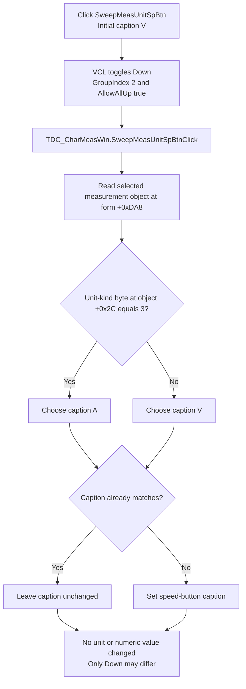

# Sweep measurement unit

> Analysis status: Recovered resource, VCL speed-button state transition, handler, selected-measurement input, caption strings, initialization and selection callers, and adjacent sweep-amplitude paths reviewed.

## Control

| Property | Recovered value |
| --- | --- |
| Form | DC_CharMeasWin |
| Form caption | DC Parameter Analyzer |
| Component path | DC_CharMeasWin.ControlGroupBox.SweepMeasUnitSpBtn |
| Control class | TSpeedButton |
| Initial caption | V |
| Group behavior | `GroupIndex = 2`, `AllowAllUp = true` |
| Handler name | SweepMeasUnitSpBtnClick |
| Handler address | 01b673e0 |
| Graph node | `resource:dfm:DC_CharMeasWin/DC_CharMeasWin.ControlGroupBox.SweepMeasUnitSpBtn` |
| Handler node | `function:01b673e0` |
| Graph layer | UI |

## What happens when clicked

This click does not select or cycle the electrical unit. It refreshes the
button caption from the already-selected sweep-measurement object.

Delphi processes the `TSpeedButton` before it dispatches `OnClick`. Because the
button has a nonzero group index and `AllowAllUp = true`, the VCL toggles its
`Down` field on each valid user click. `SweepMeasUnitSpBtnClick` then performs
these operations:

1. It starts with the recovered UnicodeString `V`.
2. It reads the selected sweep-measurement object from form field `+0xda8` and
   tests its unit-kind byte at object offset `+0x2c`.
3. If that byte is exactly `3`, it replaces the text with `A`. All other byte
   values keep `V`.
4. It passes the chosen text to the caption setter for
   `SweepMeasUnitSpBtn` at form field `+0xd40`.
5. The setter compares the old and new captions. It changes the control only
   when the strings differ.

The recovered runtime bytes at the two handler data references contain the
one-character UTF-16 strings `V` and `A`. The DFM's initial caption `V`
independently confirms the first label. The `A` branch and the selected
measurement object's unit-kind test establish that code `3` is displayed as
amperes. The handler does not assign a new unit-kind value.

## Pressed state is not the unit selection

The button's `Down` state alternates because of the VCL group behavior, but the
handler does not read that state. No recovered `TDC_CharMeasWin` method reads
`SweepMeasUnitSpBtn.Down` as an application input. A click can therefore change
the pressed appearance while leaving the caption and selected measurement
unchanged.

The two application callers confirm that the caption follows other state:

- `FormCreate` calls the handler after it builds the measurement objects. This
  initializes the caption without a user click or a VCL `Down` transition.
- The measurement-selection refresh at `FUN_01b68830` replaces form field
  `+0xda8` with the newly selected measurement object and then calls the same
  handler. This changes `V` to `A`, or `A` to `V`, when the new object's
  unit-kind requires it. It does not need a click on this speed button.

Thus, repeated user clicks do not cycle `V -> A -> V`. With the selected
measurement unchanged, each call chooses the same caption. Only a change to
the selected object's unit-kind can select the other label in this recovered
path.

## Numeric and sweep implications

`SweepMeasUnitSpBtnClick` does not read or write `SweepAmplEdit`. It performs no
scaling, SI-prefix conversion, range conversion, rounding, validation, or
numeric assignment. It also does not change the selected sweep source or
measurement object, start or stop a sweep, update a measured output, or redraw
the analyzer.

The adjacent Start and Stop speed buttons use separate handlers. Those paths
read the selected sweep source's engineering-unit string, compare it with the
two available sweep-range unit strings, enable `SweepAmplEdit` only for a
supported match, and load the corresponding start or stop numeric range value.
They own the numeric value selection. The unit-caption handler is not called by
either of those handlers and does not convert their result.

`SweepAmplEdit.OnChange` is bound to `FUN_01b66b60`. That function has the same
caption-selection logic as the click handler: it chooses `V` or `A` from the
selected measurement object's unit kind and updates only the unit button text.
It does not parse or convert the edit value. This parallel path reinforces that
the `V` or `A` text is a display label for the current context, not a command to
change units.

## Enable, repeat, error, and persistence boundaries

- The DFM does not disable the speed button, and this handler never changes its
  enabled state. The surrounding group or other code can still prevent VCL
  click dispatch; no such decision is made here.
- Start and Stop can disable `SweepAmplEdit` for an unsupported sweep-source
  unit. They do not disable this unit-caption button in the recovered paths.
- Repeated user clicks alternate only the VCL `Down` appearance. The
  change-suppressing caption setter is a no-op when `V` or `A` is already
  displayed.
- A direct programmatic call to the handler does not toggle `Down`; it only
  refreshes the caption.
- The normal initialization and selection paths establish a nonnull object at
  `+0xda8` before they call the handler. The handler itself has no null guard.
  An invalid direct call with no selected object would fault before the caption
  setter. There is no local exception recovery or error message.
- Unknown or unsupported unit-kind byte values do not show an error. They use
  the default `V` label.
- The handler has no settings, registry, file, document-dirty, or hardware
  call. The caption and `Down` state remain UI state for the current form
  instance. A new form starts from the DFM caption and refreshes it during
  `FormCreate`.

## Click flow

## Handler and call-path evidence

- Click handler: [FUN_01b673e0](../../../DecompiledSources/Tina16/functions/0000000001B673E0__FUN_01b673e0.c)
- Change-suppressing VCL text setter: [FUN_0064de00](../../../DecompiledSources/Tina16/functions/000000000064DE00__FUN_0064de00.c)
- VCL speed-button click transition: [FUN_0082a320](../../../DecompiledSources/Tina16/functions/000000000082A320__FUN_0082a320.c)
- VCL speed-button state setter: [FUN_0082a6c0](../../../DecompiledSources/Tina16/functions/000000000082A6C0__FUN_0082a6c0.c)
- Form initialization caller: [FUN_01b67a10](../../../DecompiledSources/Tina16/functions/0000000001B67A10__FUN_01b67a10.c)
- Measurement-selection caller: [FUN_01b68830](../../../DecompiledSources/Tina16/functions/0000000001B68830__FUN_01b68830.c)
- Parallel edit-change caption refresh: [FUN_01b66b60](../../../DecompiledSources/Tina16/functions/0000000001B66B60__FUN_01b66b60.c)
- Start-range handler: [FUN_01b66800](../../../DecompiledSources/Tina16/functions/0000000001B66800__FUN_01b66800.c)
- Stop-range handler: [FUN_01b669b0](../../../DecompiledSources/Tina16/functions/0000000001B669B0__FUN_01b669b0.c)
- Recovered form evidence: [ui-evidence.json](../../../DecompiledSources/Tina16/resources/dfm/ui-evidence.json)

## Direct calls

- `FUN_00414b50` — Assigns the selected recovered UnicodeString constant.
- `FUN_0064de00` — Changes the button caption only when the text differs.
- `FUN_00414480` — Finalizes the temporary Delphi UnicodeString.

## Resource and glyph evidence

- `SweepMeasUnitSpBtn` is a 25-by-17 `TSpeedButton` with caption `V`,
  `GroupIndex = 2`, and `AllowAllUp = true`.
- It is next to the 48-pixel-wide `SweepAmplEdit` in the `Control` group. The
  handler name and data flow, rather than proximity alone, establish it as that
  editor's unit label.
- The control has no recovered hint, action, built-in button kind, image-list
  reference, embedded glyph, picture, or image data. Its text and pressed
  appearance are its only recovered visual evidence.
- No same-parent label is present. The `Control` group caption is contextual
  text, not a unit definition.

## Analysis limits

- The recovered class name for the object at `+0xda8` is not available. This
  article names it by its proven role in the measurement-selection path.
- Only code `3` has a distinct branch. This article does not invent enum names
  for the other unit-kind values.
- The VCL toggles `Down`, but no application consumer was recovered. This
  article does not assign an electrical meaning to the pressed appearance.
- The later measurement engine and hardware behavior are outside this caption
  handler. The displayed `V` or `A` does not by itself prove a numeric
  conversion or output change.
