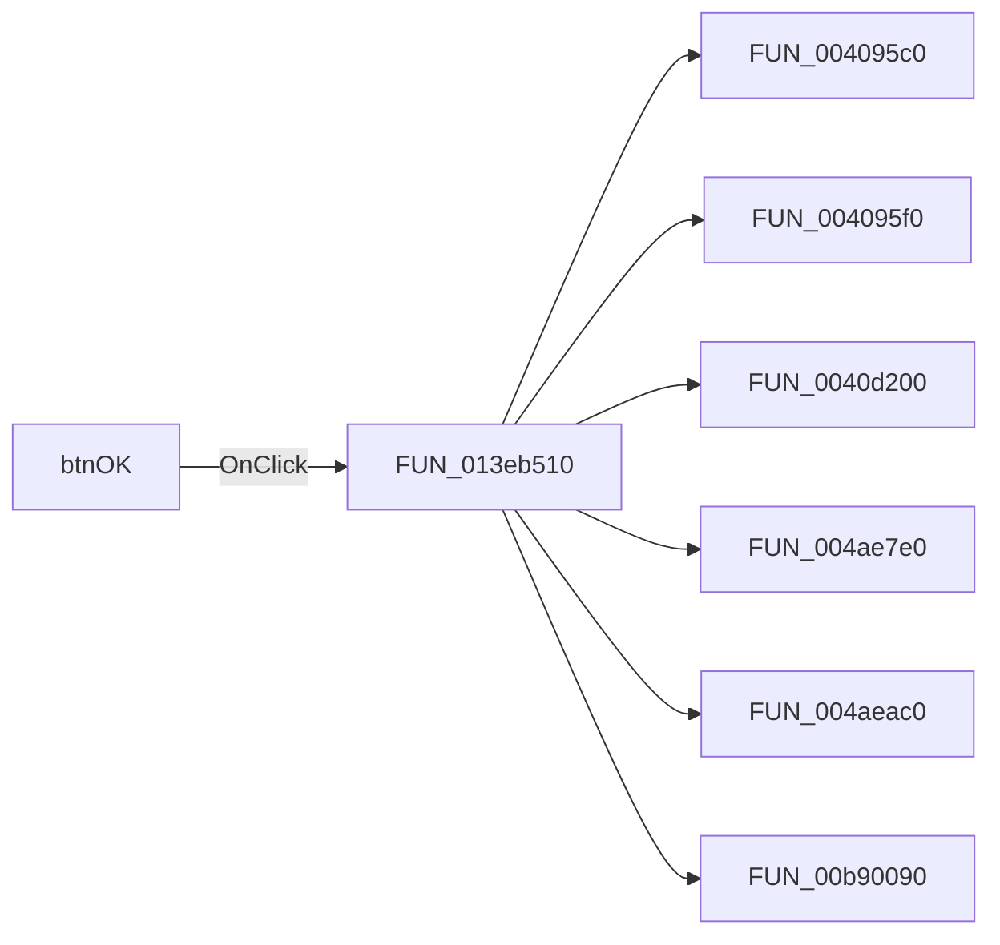

# btnOK

> Analysis status: Pending individual source review.

## Control

| Property | Recovered value |
| --- | --- |
| Form | DCGoalFunctionsDlg |
| Component path | DCGoalFunctionsDlg.btnOK |
| Control class | TBitBtn |
| Caption | Not present in the recovered resource. |
| Hint | Not present in the recovered resource. |
| Text | Not present in the recovered resource. |
| Handler name | btnOKClick |
| Handler address | 013eb510 |
| Graph node | `resource:dfm:DCGoalFunctionsDlg/DCGoalFunctionsDlg.btnOK` |
| Handler node | `function:013eb510` |
| Graph layer | UI |

## What happens when clicked

Pending individual analysis. An agent must read the recovered handler source and its relevant callees before it replaces this text.

## Click flow

## Handler evidence

- Source: [DecompiledSources/Tina16/functions/00000000013EB510__FUN_013eb510.c](../../../DecompiledSources/Tina16/functions/00000000013EB510__FUN_013eb510.c)
- Recovered role: Not present in the recovered resource.
- Current graph summary: Handles 1 Delphi UI event: DCGoalFunctionsDlg.btnOK.OnClick.
- Current graph behavior: Not present in the recovered resource.
- Current graph evidence: Not present in the recovered resource.
- Complexity: complex
- Distinct outgoing calls: 6

## Direct calls

- `function:004095c0` — FUN_004095c0
- `function:004095f0` — FUN_004095f0
- `function:0040d200` — FUN_0040d200
- `function:004ae7e0` — FUN_004ae7e0
- `function:004aeac0` — FUN_004aeac0
- `function:00b90090` — FUN_00b90090

## Resource evidence

- Kind: bkOK
- Modal result: Not present in the recovered resource.
- Checked state: Not present in the recovered resource.
- List items: Not present in the recovered resource.
- Image reference: Not present in the recovered resource.
- Extracted glyph: None.

## Nearby label candidates

Nearby labels are layout candidates only. They are not proof of behavior.

- Rank 1: Tol. at distance 202.
- Rank 2: [%] at distance 303.

## Analysis limits

- Do not infer behavior from the control class, caption, hint, glyph, or nearby label alone.
- Do not replace the pending status until the handler source and relevant call path provide enough evidence.
