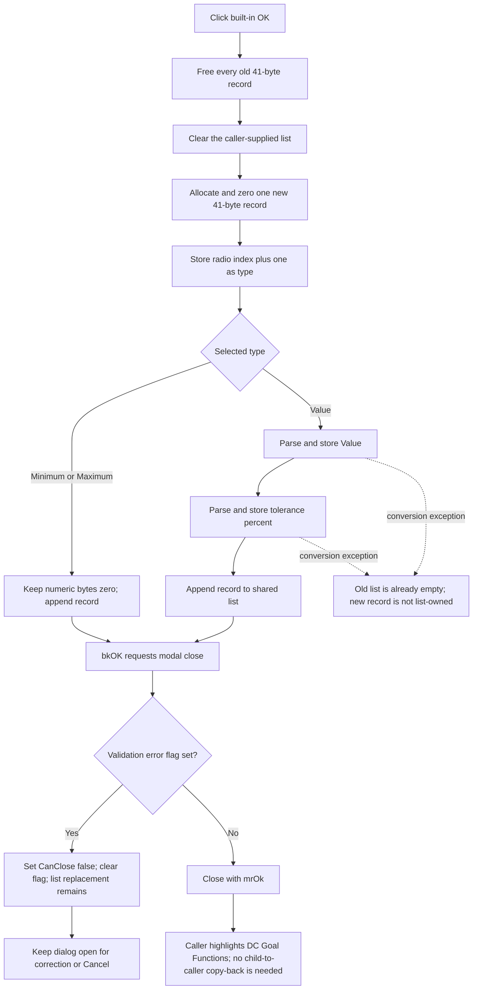

# Replace the DC goal-function record and accept the dialog

> Analysis status: Reviewed from recovered handler, form-resource, validation, caller, and ownership evidence.

## Control

| Property | Recovered value |
| --- | --- |
| Form | DCGoalFunctionsDlg |
| Form caption | DC Goal Functions |
| Component path | DCGoalFunctionsDlg.btnOK |
| Control class | TBitBtn |
| Kind | bkOK |
| Handler name | btnOKClick |
| Handler address | 013eb510 |
| Graph node | `resource:dfm:DCGoalFunctionsDlg/DCGoalFunctionsDlg.btnOK` |
| Handler node | `function:013eb510` |
| Graph layer | UI |

## What happens when clicked

`TDCGoalFunctionsDlg.btnOKClick` replaces the list that the caller supplied to the dialog. The dialog does not have a private record list and does not copy a result back after it closes. Its field at `+0x6f0` is the caller's list pointer.

The handler performs a destructive replacement in this order:

1. get and free every existing record in the shared list;
2. clear the list;
3. allocate one 41-byte record;
4. store the selected radio index plus one as its one-byte type;
5. zero the remaining 40 bytes;
6. for a Value record, parse and store value and tolerance;
7. append the new record pointer to the shared list.

It always reduces a normal list to exactly one record. If the input list contains more than one record, all old records are freed. The form loader scans all existing records and leaves the controls set from the last record, but OK still creates only one replacement.

## Selection and record format

The resource gives `rgDCGoalFuncs` three items. The zero-based radio index maps to the stored type byte as follows:

| Radio choice | Index | Record type | Numeric fields |
| --- | ---: | ---: | --- |
| Value | 0 | 1 | Value at byte offset `1`; tolerance at byte offset `9`. |
| Minimum | 1 | 2 | All 40 bytes after the type stay zero. |
| Maximum | 2 | 3 | All 40 bytes after the type stay zero. |

The record is packed: the two doubles start at unaligned offsets `1` and `9`. The remaining bytes through offset `40` stay zero on this path.

For Minimum and Maximum, the handler does not read either float edit. Text in those edits does not contribute to the new record. For Value, it reads `feValuePar` first and `feTolerance` second. The `Tol.` and `[%]` labels establish that the second input is a percentage tolerance. The handler stores the parsed number directly; it does not divide it by 100.

## Numeric validation

Both Value inputs use the shared `TFloatEdit` value getter. It:

- reads the edit text;
- parses the application's engineering-number syntax;
- rejects a result below `-1e50` or above `1e50`;
- calls an edit-specific validator when one is installed;
- stores and returns the accepted double.

The recovered DFM does not set a minimum or maximum for these two edits. The OK handler adds no rule that tolerance must be positive or within a percentage range.

Both edits bind `OnError` to `EditFloatError`. That route displays the edit's validation message only while the form error flag at `+0x700` is clear, then sets the flag. The handler itself does not inspect this flag and does not delay list replacement until `FormCloseQuery`.

## Modal result and close veto

The button's `bkOK` kind supplies the normal `mrOk` action. The application-specific handler runs before the resulting modal close completes.

When a close request reaches `FormCloseQuery`, the form writes `CanClose` as the inverse of error flag `+0x700`, then clears the flag:

- clear flag: allow the close and let the modal call return `mrOk` for this button;
- set flag: veto this close request, reset the flag, and keep the dialog open for another attempt.

The close veto is not a transaction boundary. By the time it runs, the OK handler can already have freed the old records, cleared the list, and added the replacement. A veto does not restore the old list.

The same form-level close query also applies to Cancel. If an edit error flag is still set, the first Cancel close request can be vetoed and clear the flag. A later close request can then proceed.

## Click flow

## Caller state and ownership

The modal caller is `TAnalModeRangeDlg.btnDCGFEditClick`. It passes its working DC goal-function list at parent offset `+0x10d0` directly to the child constructor. For an existing optimization target, the parent created this as a deep copy of the persistent target list. Thus:

- the child changes the parent's working list immediately;
- the child does not directly change the persistent target record;
- no separate child-dialog copy-back occurs on `mrOk`;
- after `mrOk`, the caller only changes the visual target selector to DC Goal Functions;
- the outer parent dialog later transfers the list pointer to the persistent target only when its own acceptance path commits the working state.

The parent owns the working list while ownership flag `+0x744` is zero. On outer commit, it transfers the list pointer into the target and sets that flag so its destructor does not free the transferred list. If the outer dialog is canceled before transfer, its cleanup frees the working records and list. The temporary DC child never owns or frees the list object.

This creates two different Cancel boundaries. A direct child Cancel before any OK attempt leaves the parent's working list unchanged. A later Cancel of the outer parent can discard the whole working copy. However, child Cancel after a failed or vetoed OK attempt cannot restore records that the child OK handler already freed.

## Error and partial-state behavior

- The old records and list contents are destroyed before record allocation or numeric parsing. There is no backup or rollback.
- Allocation failure after the clear leaves the shared working list empty.
- A Value conversion failure occurs after the new 41-byte record was allocated but before it was appended. A tolerance failure can also leave the parsed Value in that allocation. The recovered path has no cleanup that transfers or frees this unappended record; a retry overwrites form field `+0x6f8` with another allocation.
- An append failure can likewise leave the new record outside list ownership.
- If an error was reported earlier but the handler completes, it can append a valid-looking replacement before `FormCloseQuery` vetoes closure. The replacement stays in the caller's working list while the dialog remains open.
- A retry frees records that are currently in the list and rebuilds the list again. It cannot recover the records from before the first attempt.
- Minimum and Maximum skip the numeric getters. The OK handler therefore cannot raise their text-conversion errors on this path, although an edit event before the click can already have set the form error flag.
- The handler has no local exception handler. The exact top-level VCL presentation and continuation behavior for a numeric conversion exception is outside the recovered function.

## Cancel contrast

`btnCancel` is a built-in `bkCancel` button with no custom `OnClick` handler. A direct Cancel does not execute `FUN_013eb510`, does not free records, and does not build a replacement. The modal caller does not highlight the DC Goal Functions selector when the returned result is not `mrOk`.

Cancel is not a rollback command. If an earlier OK attempt already changed or emptied the shared list, closing the child with Cancel leaves that changed working list in the parent. Only cancellation of the outer parent dialog can later discard its owned working copy before it is transferred.

## Handler evidence

- Primary handler: [FUN_013eb510](../../../DecompiledSources/Tina16/functions/00000000013EB510__FUN_013eb510.c) frees old entries, clears the list, allocates and initializes one packed record, parses Value fields, and appends the result.
- Dialog constructor: [FUN_013eb320](../../../DecompiledSources/Tina16/functions/00000000013EB320__FUN_013eb320.c) stores the caller's list pointer at child offset `+0x6f0`.
- Form loader: [FUN_013eb440](../../../DecompiledSources/Tina16/functions/00000000013EB440__FUN_013eb440.c) restores the radio type and Value numbers from existing records.
- Float getter: [FUN_00b90090](../../../DecompiledSources/Tina16/functions/0000000000B90090__FUN_00b90090.c) performs engineering-number conversion, the `-1e50` to `1e50` range check, and optional edit-specific validation.
- Edit error route: [FUN_013eb600](../../../DecompiledSources/Tina16/functions/00000000013EB600__FUN_013eb600.c) forwards an edit's recovered error message to the dialog error guard.
- Error guard: [FUN_013eb3e0](../../../DecompiledSources/Tina16/functions/00000000013EB3E0__FUN_013eb3e0.c) uses the form error byte to show one message and set the close-block state.
- Close query: [FUN_013eb620](../../../DecompiledSources/Tina16/functions/00000000013EB620__FUN_013eb620.c) sets `CanClose` from the error flag and resets that flag.
- Modal caller: [FUN_013ee690](../../../DecompiledSources/Tina16/functions/00000000013EE690__FUN_013ee690.c) passes parent list `+0x10d0`, checks modal result `1`, and only then selects the DC Goal Functions target button visually.
- Parent working-copy load: [FUN_013ed020](../../../DecompiledSources/Tina16/functions/00000000013ED020__FUN_013ed020.c) allocates and deep-copies the working DC record list.
- Parent commit: [FUN_013ed640](../../../DecompiledSources/Tina16/functions/00000000013ED640__FUN_013ed640.c) transfers the working list pointer into the target and marks ownership transferred.
- Parent cleanup: [FUN_013ec960](../../../DecompiledSources/Tina16/functions/00000000013EC960__FUN_013ec960.c) frees the DC working records and list only while the parent still owns them.
- Related reviewed article: [DC Goal Functions editor command](../analmoderangedlg/btndcgfedit-9142cb07e6.md) documents the outer modal call and target-selection behavior.
- Recovered component tree: [ui-evidence.json](../../../DecompiledSources/Tina16/resources/dfm/ui-evidence.json) provides the dialog caption, three radio items, numeric edit defaults, labels, events, and built-in button kinds.
- Complexity: complex; the graph records six distinct outgoing calls.

## Resource evidence

- The button has no recovered caption, hint, action, image reference, or extracted glyph. Its built-in `bkOK` kind supplies its standard visual and modal role.
- `rgDCGoalFuncs` contains `Value`, `Minimum`, and `Maximum`.
- `feValuePar` starts with text `0`.
- `feTolerance` starts with text `5` and is accompanied by `Tol.` and `[%]`.
- The dialog also has built-in Cancel and Help buttons.

## Analysis limits

- Original record type and field names are not recovered. The type byte, packed offsets, sizes, and ownership follow from matching read, write, copy, transfer, and cleanup paths.
- The source proves the error flag and close-query veto. It does not fully expose the VCL exception dispatcher that connects every possible numeric-conversion failure to the edit's `OnError` event.
- `mrOk` is the Delphi semantic name for modal result value `1`, which the caller tests.
- This fragment reuses the existing `FUN_013eb510` annotation from `TIARA-diz.6.7.53` without changes. Related helper descriptions remain owned by that canonical fragment.
