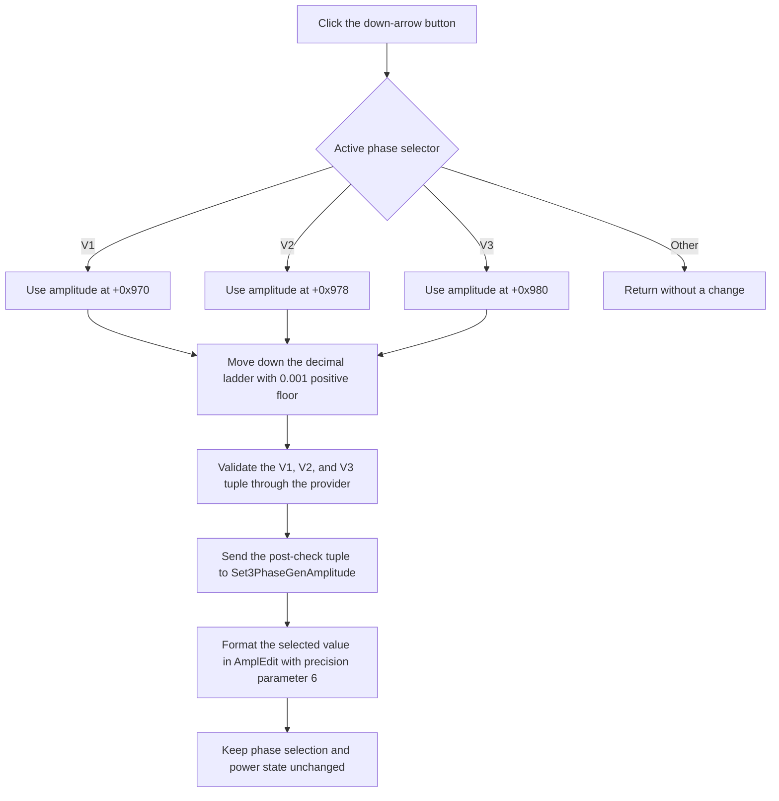

# Decrease the selected DC-supply amplitude

> Analysis status: Evidence-backed source review complete.

## Control

| Property | Recovered value |
| --- | --- |
| Form | DCSupplyGen (`Variable DC Supply`) |
| Component path | DCSupplyGen.AmpDownBtn |
| Control class | TSpeedButton |
| Nearby heading | `AMPLITUDE` |
| Caption or hint | Not present in the recovered resource. |
| Handler name | AmpDownBtnClick |
| Handler address | 010d8fb0 |
| Graph node | `resource:dfm:DCSupplyGen/DCSupplyGen.AmpDownBtn` |
| Handler node | `function:010d8fb0` |
| Graph layer | UI |

## Selected phase

The form keeps one active phase selector at offset `+0x9be`. Values zero, one, and two select V1, V2, and V3. Their amplitudes are doubles at offsets `+0x970`, `+0x978`, and `+0x980`.

Amp Down reads this selector and changes only the selected field before it calls the common amplitude updater. If the selector is not zero, one, or two, the handler does nothing. It does not change the selected phase.

## Exact decrement rule

The button passes `0.001` and precision parameter `1` to the shared decrement helper. This is not a fixed subtraction of `0.001`.

For a positive value, the helper moves to the next lower point on a two-significant-digit decimal ladder. At a normal point, it decreases the last significant digit. At a decade boundary, it changes the scale so that the sequence remains continuous. Examples from the recovered rule are:

- `100` becomes `99`.
- `12` becomes `11`.
- `10` becomes `9.9`.
- `1` becomes `0.99`.
- `0.01` becomes `0.0099`.
- `0.001` remains `0.001`.

For a positive value that is not already on this ladder, the helper rounds it to the nearest ladder position and then takes the preceding position. It clamps the positive result to at least `0.001`. A positive value below that floor can therefore be raised to `0.001`.

Zero is a separate case: it becomes `-0.001`. For a negative value, the helper increases the absolute magnitude on the same decimal ladder and restores the negative sign. For example, `-12` becomes `-13` and `-99` becomes `-100`. The helper has no fixed negative limit.

These are the local stepping rules. The final allowed range is provider-dependent. After the step, the form passes pointers to all three amplitudes to the dynamically resolved `Check3PhaseGenAmplitude` function. That provider can adjust the selected value or the other phase values before the form sends the complete tuple onward. The recovered executable does not contain a fixed upper limit or a fixed negative limit for this control.

## Applying and formatting the value

The common amplitude updater writes the requested value to the selected phase field. It then performs these operations:

1. It calls `Check3PhaseGenAmplitude` with the V1, V2, and V3 field addresses.
2. It calls `Set3PhaseGenAmplitude` with the post-check V1, V2, and V3 values.
3. It temporarily sets the shared numeric-format selector to `3`.
4. It writes the post-check selected value to `AmplEdit` through the shared `TFloatEdit` setter.
5. It restores the previous numeric-format selector.

The edit setter uses formatting precision parameter `6`. Its formatter uses the edit's own format flags. In engineering mode, it scales in powers of 1000 and can append the corresponding SI prefix. Values outside the formatter's recovered `1e-15` through `1e+15` normal range use its exponential path. The button does not construct text itself.

## Generator and display effects

`Set3PhaseGenAmplitude` is the proven downstream generator update. The wrapper resolves that name from the loaded three-phase generator provider and sends the complete amplitude tuple. If the provider or symbol is absent, both the check and set wrappers return without an error. The local phase field and `AmplEdit` still receive the locally stepped value.

No recovered call in this click path redraws a waveform, redraws the schematic, or changes a supply indicator. Any electrical-model, waveform, or schematic effect after `Set3PhaseGenAmplitude` belongs to the external provider and is not visible in the recovered source.

## Power-state interaction

The amplitude and power paths are separate. Amp Down does not read the selected phase's on/off flag or the Power button's Down state. It updates and sends the amplitude tuple even when the selected phase is off. It does not call `Enable3PhaseGen` and does not change the V1, V2, or V3 on/off images.

The Power handler separately stores the selected phase's power state, calls `Enable3PhaseGen`, and refreshes the on/off indicators. It does not perform the amplitude decrement. Thus an amplitude selected while a phase is off remains available to the provider when that phase is enabled later, but the provider's electrical behavior is outside this source.

## Click flow

## Repeated-click, error, and persistence boundaries

- Repeated clicks continue down the decimal ladder. A positive value stops changing at `0.001` unless the provider changes it.
- Zero crosses to `-0.001`. Further clicks move to more-negative ladder values.
- A provider-enforced limit can make the final post-check value stop or change differently. That limit is not recovered in this executable.
- The handler has no local exception handler or rollback. It changes the selected field before it calls the provider and formatter, so a later exception can leave a partial local update.
- A missing provider or missing dynamic function is a silent boundary, not an exception path.
- The handler has no file, registry, preferences, or explicit circuit-document save call. It updates the live provider state only. Persistence after the provider call is not proven.

## Glyph and resource evidence

The DFM stores a 526-byte embedded BMP in `Glyph.Data`. The extractor converted it to this 17 by 9 PNG:

- [Amp Down glyph](../../../glyph/0057_DCSupplyGen_DCSupplyGen_AmpDownBtn_Glyph_Data.png)

The glyph is a black downward triangle. The `AMPLITUDE` label and the adjacent V1, V2, and V3 labels support the control context. The constant, selector branches, and decrement helper prove the actual direction and step rule.

## Source evidence

- Handler: [FUN_010d8fb0](../../../DecompiledSources/Tina16/functions/00000000010D8FB0__FUN_010d8fb0.c)
- Decimal-ladder decrement helper: [FUN_010bfbe0](../../../DecompiledSources/Tina16/functions/00000000010BFBE0__FUN_010bfbe0.c)
- Common selected-phase amplitude updater: [FUN_010d8e20](../../../DecompiledSources/Tina16/functions/00000000010D8E20__FUN_010d8e20.c)
- Three-phase amplitude check wrapper: [FUN_00e1dad0](../../../DecompiledSources/Tina16/functions/0000000000E1DAD0__FUN_00e1dad0.c)
- Three-phase amplitude set wrapper: [FUN_00e1da10](../../../DecompiledSources/Tina16/functions/0000000000E1DA10__FUN_00e1da10.c)
- Float-edit value and text updater: [FUN_00b90440](../../../DecompiledSources/Tina16/functions/0000000000B90440__FUN_00b90440.c)
- Engineering-number formatter: [FUN_00b8f7f0](../../../DecompiledSources/Tina16/functions/0000000000B8F7F0__FUN_00b8f7f0.c)
- Amp Up counterpart: [FUN_010d9070](../../../DecompiledSources/Tina16/functions/00000000010D9070__FUN_010d9070.c)
- Power handler: [FUN_010d9630](../../../DecompiledSources/Tina16/functions/00000000010D9630__FUN_010d9630.c)
- Generator-enable wrapper: [FUN_00e1d9a0](../../../DecompiledSources/Tina16/functions/0000000000E1D9A0__FUN_00e1d9a0.c)
- Power and selection indicator refresh: [FUN_010d8b90](../../../DecompiledSources/Tina16/functions/00000000010D8B90__FUN_010d8b90.c)

`FUN_010d8fb0` branches on form offset `+0x9be`. Each valid branch passes the selected amplitude field, constant `0.001`, and precision `1` to `FUN_010bfbe0`, then passes the resulting field value to `FUN_010d8e20`. There is no branch on the power-state fields and no persistence or redraw call.

## Direct calls

- `function:010bfbe0` - Moves the selected double to the next lower decimal-ladder value with the recovered positive floor and zero behavior.
- `function:010d8e20` - Validates and sends the three phase amplitudes, then formats the selected phase in `AmplEdit`.

## Evidence limits

- The dynamic provider's code is not present. Its exact range rules and electrical update behavior are unknown.
- The formatter call proves its precision parameter and engineering/exponential paths. The DFM does not expose the active `TFloatEdit` format-flag values.
- No direct schematic or waveform redraw is recovered on this path.
