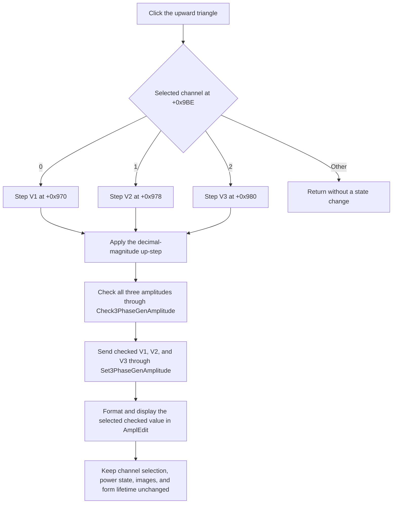

# Increase DC-supply amplitude

> Analysis status: Reviewed from recovered handler, numeric-step helper, shared amplitude-update path, hardware callback wrappers, form initialization, resource evidence, and paired controls.

## Control

| Property | Recovered value |
| --- | --- |
| Form | DCSupplyGen |
| Form caption | Variable DC Supply |
| Component path | DCSupplyGen.AmpUpBtn |
| Control class | TSpeedButton |
| Caption | Not present in the recovered resource. |
| Hint | Not present in the recovered resource. |
| Handler name | AmpUpBtnClick |
| Handler address | 010d9070 |
| Graph node | `resource:dfm:DCSupplyGen/DCSupplyGen.AmpUpBtn` |
| Handler node | `function:010d9070` |
| Graph layer | UI |

## What happens when clicked

`AmpUpBtnClick` reads the selected supply channel from form byte `+0x9BE`. Values `0`, `1`, and `2` select the amplitude doubles at `+0x970`, `+0x978`, and `+0x980`, which correspond to the V1, V2, and V3 controls. The handler increments only that selected value. It then calls the common amplitude-update path with the new value.

The increment is magnitude-dependent, not a fixed voltage delta. For a nonzero positive value `x`, the recovered helper uses this rule with `e = floor(log10(abs(x)))`:

1. Set the working scale to `10^(e - 1)`.
2. Round `abs(x) / scale` to an integer.
3. If that integer is exactly `10` within a `1e-9` tolerance, divide it by `10` and increase the scale by one decade.
4. Add one integer step and restore the original sign and scale.

The `1` argument supplied by this button is what selects the two-position decimal scale. Proven examples are `0 -> 0.001`, `0.001 -> 0.002`, `1 -> 2`, `2 -> 2.1`, `9.9 -> 10`, and `10 -> 20`. For a negative amplitude, the helper applies the paired decrement rule to its magnitude, then restores the negative sign. Thus `-2 -> -1.9`: an up click moves the value toward zero. That route clamps the magnitude to at least `0.001`, so repeated up clicks stop at `-0.001` until another input path changes the sign or value.

## Validation, application, and display

The shared update first stores the candidate in the selected channel field. It then passes pointers to all three channel amplitudes to the dynamically resolved `Check3PhaseGenAmplitude` export. This callback can correct the selected value and can also correct the other two values. The update next passes the checked V1, V2, and V3 values to `Set3PhaseGenAmplitude`.

The handler contains no fixed upper limit. The `0.001` constant is the zero-start value and the negative-side magnitude floor in the step helpers; it is not proof of the hardware's complete range. `FormCreate` obtains current amplitudes through `Get3PhaseGenAmplitude` and probes channel availability with positive and negative test values. This proves that supported ranges depend on the loaded hardware module. The implementation of `Check3PhaseGenAmplitude`, and therefore its exact hardware limits, is outside the recovered executable.

After the hardware callbacks, the common updater writes the checked value for the selected channel to `AmplEdit`. The numeric setter uses the float editor's formatting route with precision argument `6` and the editor's stored format flags. The recovered DFM starts the edit with text `12.5`, but it does not expose enough nondefault format properties to prove one literal output string for every magnitude.

## Power and other UI state

The amplitude handler does not read the per-channel power bytes at `+0x9BB` through `+0x9BD`, and it does not read or change `PowerBtn.Down`. Therefore an up click updates and sends amplitude values even when the selected channel is off. The separate Power handler owns the enable-state change.

This click does not change the selected V1/V2/V3 channel, toggle power, change the on/off images, or repaint a schematic or waveform in the recovered path. Its only direct visible update is `AmplEdit`. Any physical DC-output change is made through `Set3PhaseGenAmplitude`; no waveform or schematic update call is present.

## Click flow

## Handler evidence

- Primary handler: [FUN_010d9070](../../../DecompiledSources/Tina16/functions/00000000010D9070__FUN_010d9070.c) selects one of three amplitude fields, calls the up-step helper with `0.001` and scale argument `1`, and passes the result to the common updater.
- Up-step helper: [FUN_010bfa60](../../../DecompiledSources/Tina16/functions/00000000010BFA60__FUN_010bfa60.c) implements the sign-aware, base-10 magnitude step and the zero-to-`0.001` transition.
- Paired down-step helper: [FUN_010bfbe0](../../../DecompiledSources/Tina16/functions/00000000010BFBE0__FUN_010bfbe0.c) proves the negative-value route and clamps its positive magnitude result to the supplied `0.001` minimum.
- Shared amplitude updater: [FUN_010d8e20](../../../DecompiledSources/Tina16/functions/00000000010D8E20__FUN_010d8e20.c) stores the selected value, checks and applies all three channel amplitudes, and refreshes `AmplEdit` with the post-check selected value.
- Hardware range callback: [FUN_00e1dad0](../../../DecompiledSources/Tina16/functions/0000000000E1DAD0__FUN_00e1dad0.c) resolves and calls `Check3PhaseGenAmplitude` only when the hardware module and export are available.
- Hardware application callback: [FUN_00e1da10](../../../DecompiledSources/Tina16/functions/0000000000E1DA10__FUN_00e1da10.c) resolves and calls `Set3PhaseGenAmplitude` only when the hardware module and export are available.
- Form initialization: [FUN_010d9170](../../../DecompiledSources/Tina16/functions/00000000010D9170__FUN_010d9170.c) obtains the current three amplitudes, probes channel availability, selects an available channel, and initializes the editor through the same updater.
- Power handler: [FUN_010d9630](../../../DecompiledSources/Tina16/functions/00000000010D9630__FUN_010d9630.c) changes the selected channel's power byte and calls the separate enable route. This confirms that amplitude stepping does not own power state.
- Float editor setter: [FUN_00b90440](../../../DecompiledSources/Tina16/functions/0000000000B90440__FUN_00b90440.c) stores the checked double and formats it with precision argument `6` plus the editor's format flags.
- Complexity: moderate; the handler has two distinct outgoing calls.

## Resource and glyph evidence

- The form caption is `Variable DC Supply`. The nearby recovered label is `AMPLITUDE`, and the three channel labels are `V1`, `V2`, and `V3`.
- The control has no caption or hint. Its extracted 17 by 10 pixel glyph is an upward-pointing black triangle: [`0058_DCSupplyGen_DCSupplyGen_AmpUpBtn_Glyph_Data.png`](../../../glyph/0058_DCSupplyGen_DCSupplyGen_AmpUpBtn_Glyph_Data.png).
- The adjacent AmpDown control has the opposite downward triangle. The glyph pair corroborates direction. The handler and the numeric helper prove the amplitude meaning and the step direction.
- `AmplEdit` is a `TFloatEdit` with recovered initial text `12.5`. It has separate error, exit, and key-press handlers for typed input.

## No-op and error boundaries

- If the selected-channel byte is not `0`, `1`, or `2`, the handler takes no branch and changes nothing.
- There is no unchanged-value guard. Each valid click runs the step, check, apply, and display path. A hardware clamp can make a repeated click display the same checked value.
- If the hardware module or either export is absent, its wrapper silently skips that external call. Local amplitude state and `AmplEdit` still update. The recovered code shows no user error for this case.
- The handler has no local exception handler, rollback, confirmation, or error message. An exception from numeric processing, a hardware callback, or the editor update can leave a partial state. For example, the candidate is stored before the check and external apply calls.
- Text-entry errors are handled by `AmplEdit`'s separate event path. This button reads the stored double and does not parse the current edit text itself.

## Analysis limits

- The external hardware module is not part of this recovered call tree. Its exact channel limits, corrections, and physical-device error behavior are not proven here.
- The recovered source proves a DC-supply amplitude update. It does not contain a waveform or schematic refresh that can be attributed to this click.
- The numeric setter's precision argument is recovered, but the DFM does not preserve enough format flags to guarantee an exact displayed string for every input value.
