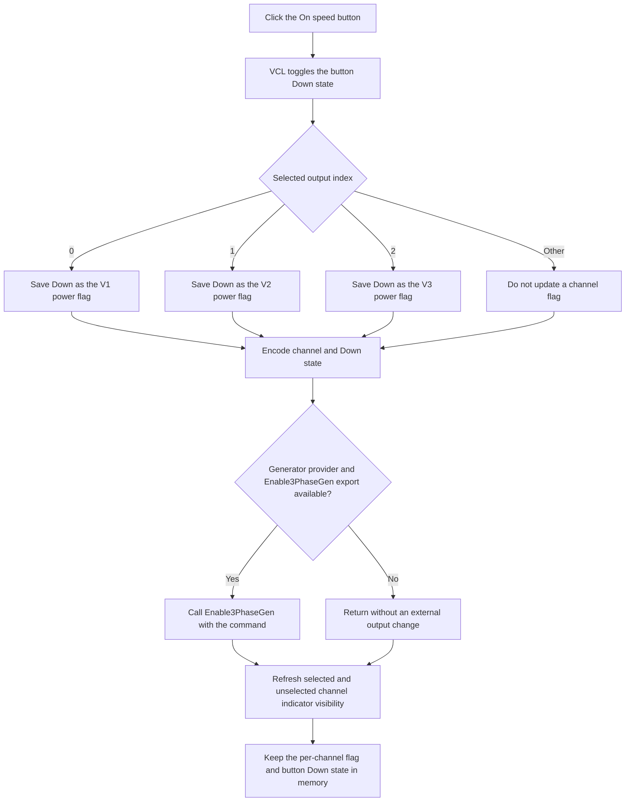

# Toggle the selected DC supply output

> Analysis status: Reviewed from the recovered handler, Delphi speed-button state handling, form initialization, output selection, amplitude update paths, generator-provider bridge, and indicator-image resources.

## Control

| Property | Recovered value |
| --- | --- |
| Form | DCSupplyGen |
| Component path | DCSupplyGen.PowerBtn |
| Control class | TSpeedButton |
| Caption | On |
| Hint | Not present in the recovered resource. |
| Group behavior | `GroupIndex = 2`, `AllowAllUp = true` |
| Handler name | PowerBtnClick |
| Handler address | 010d9630 |
| Graph node | `resource:dfm:DCSupplyGen/DCSupplyGen.PowerBtn` |
| Handler node | `function:010d9630` |
| Graph layer | UI |

## What happens when clicked

The button toggles the generator output state for the currently selected DC supply channel, V1, V2, or V3. The three channels keep separate on/off flags. A click changes only the selected channel's flag and sends that channel and its new state to the loaded three-phase generator provider.

Delphi processes the `TSpeedButton` click before it invokes `PowerBtnClick`. Because this button has a nonzero group index and allows its group to be fully released, the VCL changes its `Down` field at `+0x328` on each valid click. The handler then performs these operations:

1. It reads the selected channel index from form field `+0x9be`: `0` is V1, `1` is V2, and `2` is V3.
2. It copies the button's new `Down` value into the selected channel's remembered power flag at `+0x9bb`, `+0x9bc`, or `+0x9bd`.
3. It calculates `2 * (channel index + 1) + Down`. The observed command values are V1 off/on `2`/`3`, V2 off/on `4`/`5`, and V3 off/on `6`/`7`.
4. It stores this command byte at form field `+0x9bf` and passes it to the dynamically resolved `Enable3PhaseGen` export.
5. After the provider call returns, it refreshes the six V1/V2/V3 selection-indicator images.

The external provider implementation is not recovered. The export name and call path establish that this command requests a generator enable-state change. They do not establish the provider's electrical timing, voltage ramp, protection behavior, or hardware acknowledgement policy.

## Power-toggle flow

## State machine and channel selection

Form creation initializes all three remembered power flags to false, forces `PowerBtn.Down` to false, stores an initial command value of zero, and sends that zero value through the same `Enable3PhaseGen` bridge. After the available channels are known, the form selects the first available channel starting at V1 and restores that channel's remembered false state into the button.

The `Sel` button cycles through available channels. Selection does not combine their power states. It updates `PowerBtn.Down` from the newly selected channel's saved flag. Programmatic restoration uses the speed-button state setter and does not invoke `PowerBtnClick`, so changing the selection does not send another generator enable command.

For normal channel indices, repeated user clicks alternate the selected channel between on and off. Each click stores the new flag and sends a new encoded command. If code invokes the handler directly without the preceding VCL toggle, the handler repeats the current state and command; it has no duplicate-command guard.

## UI state, caption, and images

The caption remains `On`; the handler does not replace it with `Off` or any other text. The PowerBtn resource has no hint and no glyph. Its pressed or released speed-button appearance is the direct indication of the selected channel's remembered power state.

The form has paired 13-by-13 images named `V1On`/`V1Off`, `V2On`/`V2Off`, and `V3On`/`V3Off`. The light image is green and the dark image is gray-green. Despite these component names, the refresh helper selects between each pair from the selected channel index and channel-availability flags; it does not read the three power flags. The selected available channel shows its light image, other available channels show their dark images, and unavailable channels hide both images. A power click does not change the selection or availability, so this final refresh is normally idempotent.

The nearby `POWER` label supports the button's purpose, but it is hidden in the recovered DFM. V1, V2, and V3 labels identify the three independently remembered outputs.

## Interaction with amplitude controls

Each channel also has an independent amplitude value at form fields `+0x970`, `+0x978`, and `+0x980`. The amplitude editor and the up/down buttons change the selected channel's amplitude, pass all three values through the optional `Check3PhaseGenAmplitude` and `Set3PhaseGenAmplitude` provider exports, and display the selected value.

`PowerBtnClick` does not read, clear, validate, or resend these amplitude values. Turning a channel off therefore preserves its in-memory amplitude. When the user later selects that channel, the same amplitude is displayed, and the saved power flag restores the button's pressed state. The recovered source does not establish whether the external provider continues to retain or apply the amplitude while that channel is off.

## Enable guards, no-op paths, and errors

The DFM does not set `Enabled = false`, and no DCSupplyGen method was found that disables PowerBtn. Normal form initialization selects an available channel, but the click handler itself has no channel-availability check, range check, null check, provider-result check, exception handler, or rollback.

- If the generator-provider module is not loaded, or if `Enable3PhaseGen` cannot be resolved, the bridge returns silently. The button and saved form flag still change, but no external output change is requested and no error appears in this path.
- If the selected index is outside `0` through `2`, no per-channel flag changes. The handler still calculates a command from that index, stores it, and sends it if the export is available.
- If the provider call fails by raising an exception, the VCL Down state, selected power flag, and command byte were already changed. The indicator refresh does not run, and there is no rollback.
- The provider wrapper does not inspect or return a status. This path has no acknowledgement, retry, validation message, or status display.
- The indicator refresh uses visibility setters that do nothing when a requested visibility already matches the current state.

## Persistence and shutdown boundary

The three power flags and the last command byte are fields of the live DCSupplyGen form. This click does not call a settings service, file writer, document-save command, or dirty-state setter. The recovered code contains no reader of the last-command field `+0x9bf` outside initialization and this handler.

When the form is destroyed, its destroy handler calls the dynamically resolved `Done3PhaseGen` provider export. The recovered code does not establish whether that cleanup disables physical outputs or preserves device state. No power state survives a new form instance in the recovered initialization path because all three saved flags are reset to false.

## Handler and call-path evidence

- Power handler: [FUN_010d9630](../../../DecompiledSources/Tina16/functions/00000000010D9630__FUN_010d9630.c) saves the selected channel's speed-button state, encodes the channel and state, calls the provider bridge, and refreshes indicator visibility.
- Generator enable bridge: [FUN_00e1d9a0](../../../DecompiledSources/Tina16/functions/0000000000E1D9A0__FUN_00e1d9a0.c) resolves and caches `Enable3PhaseGen` from the loaded provider and calls it when available.
- Indicator refresh: [FUN_010d8b90](../../../DecompiledSources/Tina16/functions/00000000010D8B90__FUN_010d8b90.c) shows the selected available channel's light image and the other available channels' dark images.
- Form initialization: [FUN_010d9170](../../../DecompiledSources/Tina16/functions/00000000010D9170__FUN_010d9170.c) clears all saved power flags, releases PowerBtn, sends the initial zero command, discovers available channels, selects one, and initializes amplitudes.
- Channel selection: [FUN_010d8ca0](../../../DecompiledSources/Tina16/functions/00000000010D8CA0__FUN_010d8ca0.c) skips unavailable channels, changes the selected index, restores its amplitude, and restores its saved power flag into PowerBtn.
- Selection click: [FUN_010d9130](../../../DecompiledSources/Tina16/functions/00000000010D9130__FUN_010d9130.c) advances V1 to V2 to V3 and delegates availability handling to the selection helper.
- Amplitude update: [FUN_010d8e20](../../../DecompiledSources/Tina16/functions/00000000010D8E20__FUN_010d8e20.c) saves the selected amplitude, validates and sends all three amplitudes, and updates the editor.
- Speed-button toggle path: [FUN_0082a320](../../../DecompiledSources/Tina16/functions/000000000082A320__FUN_0082a320.c) toggles the Down state before it dispatches the click event; [FUN_0082a6c0](../../../DecompiledSources/Tina16/functions/000000000082A6C0__FUN_0082a6c0.c) is the state setter used by form initialization and channel selection.
- Visibility setter: [FUN_0064dbe0](../../../DecompiledSources/Tina16/functions/000000000064DBE0__FUN_0064dbe0.c) changes a control's visible flag only when the requested value differs.
- Form destruction: [FUN_010d9600](../../../DecompiledSources/Tina16/functions/00000000010D9600__FUN_010d9600.c) calls the provider cleanup bridge before inherited destruction.

## Resource evidence

- PowerBtn is a 30-by-31 `TSpeedButton` with caption `On`, `GroupIndex = 2`, and `AllowAllUp = true`.
- It has no recovered hint, glyph, action, built-in button kind, modal result, initial checked property, or explicit enabled property.
- The six embedded channel images are picture resources rather than a PowerBtn glyph. The recovered images and visibility logic support channel-selection feedback, not a direct power-state lamp.
- `AMPLITUDE` labels a separate editor and two glyph buttons. Source data flow confirms that those controls do not supply an input to PowerBtnClick.

## Analysis limits

- The provider DLL name and the implementation of `Enable3PhaseGen` are not recovered here. This article records the observed integer protocol without assigning undocumented enum names to values `0` through `7`.
- The export name proves an enable-state request, but the hardware response, output settling, and failure reporting are outside the recovered executable path.
- The DFM component names call the light and dark selection images `On` and `Off`; the refresh helper's inputs prove that their runtime visibility represents channel selection and availability, not the three saved power flags.
- No persistence or provider acknowledgement path is present in this handler.
