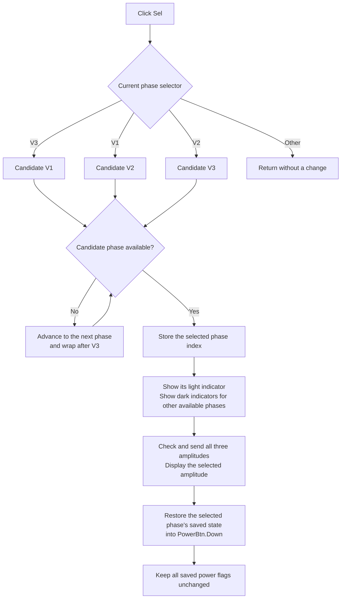

# Select the next available DC-supply phase

> Analysis status: Evidence-backed from the recovered click handler, phase-selection helper, form initialization, amplitude and power paths, and indicator resources.

## Control

| Property | Recovered value |
| --- | --- |
| Form | DCSupplyGen (`Variable DC Supply`) |
| Component path | DCSupplyGen.VBtn |
| Control class | TSpeedButton |
| Caption | Sel |
| Hint | Not present in the recovered resource. |
| Handler name | VBtnClick |
| Handler address | `010d9130` |
| Graph node | `resource:dfm:DCSupplyGen/DCSupplyGen.VBtn` |
| Handler node | `function:010d9130` |
| Graph layer | UI |

## What happens when clicked

The form stores the selected phase in byte `+0x9be`. Values `0`, `1`, and `2`
mean V1, V2, and V3. `VBtnClick` maps the current value to the next candidate:

- V1 (`0`) requests V2 (`1`).
- V2 (`1`) requests V3 (`2`).
- V3 (`2`) wraps to V1 (`0`).

The handler then delegates to `FUN_010d8ca0`. If the candidate phase is not
available, this helper advances in the same direction and tries again. It wraps
after V3. Thus, with all phases available, repeated clicks select V1, V2, V3,
V1. With V2 unavailable, for example, the sequence skips from V1 to V3. The
helper never selects a phase whose availability flag is false.

The form creates the availability flags at `+0x9b8`, `+0x9b9`, and `+0x9ba`.
During creation, it gives the provider positive and negative test values for
all three phases and calls `Check3PhaseGenAmplitude`. A phase is available when
at least one checked test limit remains nonzero. Form creation then asks the
same selection helper to select V1, which means "V1 or the first later
available phase." The click handler does not probe availability itself.

## Selection state and indicators

After it finds an available phase, `FUN_010d8ca0` stores its index at `+0x9be`
and calls the shared indicator refresh. The form has a light and dark 13 by 13
image for each phase. The refresh applies these rules:

- The selected available phase shows its light green image and hides its dark
  image.
- Each unselected available phase hides its light image and shows its dark
  gray-green image.
- An unavailable phase hides both images and its phase label is already hidden
  by form initialization.

The recovered component names are `V1On`/`V1Off`, `V2On`/`V2Off`, and
`V3On`/`V3Off`. Those names do not mean that the images show electrical power
state. `FUN_010d8b90` reads only the selected index and availability flags. It
does not read the three remembered power flags. The source therefore proves
that these six images show phase selection and availability.

## Amplitude editor and provider effects

The three phase amplitudes are doubles at `+0x970`, `+0x978`, and `+0x980`.
After selection, `FUN_010d8ca0` passes the newly selected phase's current value
to the common amplitude updater. This does more than copy text:

1. It stores the value in the selected phase field.
2. It passes pointers to all three amplitude fields to the optional provider's
   `Check3PhaseGenAmplitude` export.
3. It sends the post-check three-value tuple to `Set3PhaseGenAmplitude`.
4. It formats the post-check value for the selected phase in `AmplEdit`.

The selection click does not calculate a new amplitude. However, the provider's
check can adjust the selected value or either other phase value. The helper then
sends that checked tuple. This means phase selection can cause a live provider
amplitude update even when the user did not press an amplitude arrow.

If the provider module or either export is absent, its wrapper returns without
an error. The form still changes the selected index, refreshes the selection
images, and displays its local selected amplitude. The recovered path does not
contain a waveform or schematic redraw.

## Power-state effect

The form keeps one remembered power flag for each phase at `+0x9bb`, `+0x9bc`,
and `+0x9bd`. After the amplitude update, the selection helper copies the newly
selected phase's flag into `PowerBtn.Down`. The button's pressed or released
appearance therefore follows the selected phase.

This is only a UI-state restoration. The VCL speed-button setter does not call
`PowerBtnClick`, and the selection path does not call `Enable3PhaseGen`.
Selecting a phase does not toggle or overwrite any of the three remembered
power flags and does not send a power command. The separate Power button click
owns that operation.

## Repeated clicks and boundary behavior

- With three available phases, every click moves exactly one phase forward and
  wraps after V3.
- With one or two unavailable phases, one click can skip them. The user does
  not stop on an unavailable phase.
- With only one available phase, the helper wraps through the unavailable
  candidates and selects the current phase again. The visible phase does not
  change, but indicator refresh, amplitude validation and sending, editor
  refresh, and PowerBtn-state restoration still run.
- If the current selector is not `0`, `1`, or `2`, `VBtnClick` takes no branch
  and changes nothing.
- The recursive availability search has no all-unavailable exit. If all three
  availability flags are false, it repeats V1, V2, V3 until the stack fails.
  Form creation normally establishes at least one supported phase. If the
  provider is absent, the unchanged positive and negative probe values make all
  three phases available. The recovered code still has no explicit guard for a
  provider that rejects all three.

## Error and persistence boundaries

- The handler has no validation message, retry, confirmation, exception
  handler, or rollback.
- The helper stores the selected index and updates indicator visibility before
  it calls the amplitude updater. An exception during provider validation,
  provider application, or edit formatting can therefore leave the new phase
  and indicators selected while later UI state is not refreshed.
- Provider wrappers ignore missing modules and exports. They do not report a
  hardware acknowledgement or failure to this handler.
- The selected index and remembered power flags are live form fields. This
  click has no settings, registry, file, circuit-document save, or dirty-state
  call. A new form instance runs phase discovery and starts from the first
  available phase again.
- Provider amplitude state is updated live when the exports are available.
  Later hardware or project persistence is outside this call path.

## Selection flow

## Handler and call-path evidence

- Selection handler: [FUN_010d9130](../../../DecompiledSources/Tina16/functions/00000000010D9130__FUN_010d9130.c)
- Available-phase selection helper: [FUN_010d8ca0](../../../DecompiledSources/Tina16/functions/00000000010D8CA0__FUN_010d8ca0.c)
- Selection-indicator refresh: [FUN_010d8b90](../../../DecompiledSources/Tina16/functions/00000000010D8B90__FUN_010d8b90.c)
- Common amplitude updater: [FUN_010d8e20](../../../DecompiledSources/Tina16/functions/00000000010D8E20__FUN_010d8e20.c)
- Form initialization: [FUN_010d9170](../../../DecompiledSources/Tina16/functions/00000000010D9170__FUN_010d9170.c)
- Amplitude check wrapper: [FUN_00e1dad0](../../../DecompiledSources/Tina16/functions/0000000000E1DAD0__FUN_00e1dad0.c)
- Amplitude apply wrapper: [FUN_00e1da10](../../../DecompiledSources/Tina16/functions/0000000000E1DA10__FUN_00e1da10.c)
- Float-edit value setter: [FUN_00b90440](../../../DecompiledSources/Tina16/functions/0000000000B90440__FUN_00b90440.c)
- Speed-button state setter: [FUN_0082a6c0](../../../DecompiledSources/Tina16/functions/000000000082A6C0__FUN_0082a6c0.c)
- Power click counterpart: [FUN_010d9630](../../../DecompiledSources/Tina16/functions/00000000010D9630__FUN_010d9630.c)
- Generator-enable wrapper: [FUN_00e1d9a0](../../../DecompiledSources/Tina16/functions/0000000000E1D9A0__FUN_00e1d9a0.c)
- Recovered DFM evidence: [ui-evidence.json](../../../DecompiledSources/Tina16/resources/dfm/ui-evidence.json)

## Direct calls

- `FUN_010d8ca0` - Selects the requested or next available phase and
  synchronizes its indicators, amplitude editor, provider tuple, and power
  button appearance.

## Glyph and resource evidence

- `VBtn` is a 39 by 17 `TSpeedButton` with caption `Sel`. It has no hint,
  action, image reference, or embedded glyph.
- The V1, V2, and V3 labels are next to the paired indicator images. The V3,
  V2, and V1 labels are also the three nearest label candidates to VBtn. Their
  proximity supports context, while the selector branches prove the mapping.
- The three light indicator resources have the same image hash. The three dark
  resources also have one common hash. Representative extracted files are the
  [light green indicator](../../../glyph/0059_DCSupplyGen_DCSupplyGen_V1On_Picture_Data.png)
  and [dark gray-green indicator](../../../glyph/0062_DCSupplyGen_DCSupplyGen_V1Off_Picture_Data.png).
- The `AMPLITUDE` label and `AmplEdit` are to the right of VBtn. Source data
  flow, not layout alone, proves that selection reloads that editor.

## Annotation ownership

This Bead owns the annotations for `FUN_010d9130`, `FUN_010d8ca0`, and
`FUN_010d8b90`. `TIARA-diz.6.7.240` owns the shared amplitude updater
`FUN_010d8e20` and decimal decrement helper `FUN_010bfbe0`. The neighboring
amplitude and power articles own their control handlers. This fragment does not
repeat those canonical fields.

## Analysis limits

- The provider DLL implementation is not recovered. Its exact phase-support
  rules, amplitude corrections, and hardware behavior are unknown.
- The component names use `On` and `Off` for the light and dark images. The
  refresh function proves selection behavior, but it does not expose the
  original design terminology for these indicators.
- The source proves that `AmplEdit` is updated through the common float setter.
  Its active format flags are not sufficiently recovered to promise one exact
  text string for every amplitude.
