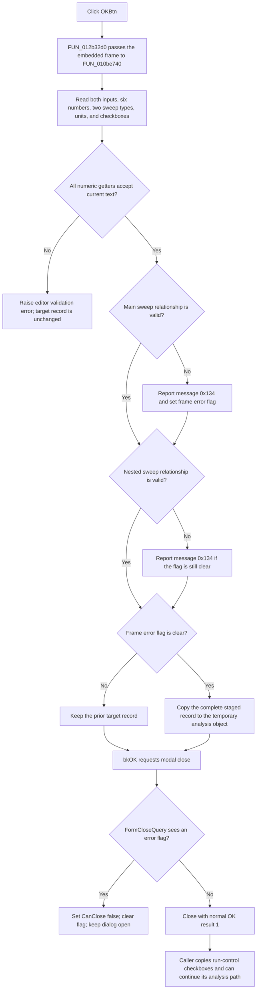

# Validate and accept DC Transfer settings

> Analysis status: Reviewed from the recovered handler, frame helper, form resource, close query, and modal caller.

## Control

| Property | Recovered value |
| --- | --- |
| Form | DCTransferDlg |
| Form caption | DC Transfer Characteristic |
| Component path | DCTransferDlg.OKBtn |
| Control class | TBitBtn |
| Kind | bkOK |
| Handler name | OKBtnClick |
| Handler address | 012b32d0 |
| Graph node | `resource:dfm:DCTransferDlg/DCTransferDlg.OKBtn` |
| Handler node | `function:012b32d0` |
| Graph layer | UI |

## What happens when clicked

`TDCTransferDlg.OKBtnClick` has one direct operation. It passes the embedded `TDCTransferDlgFrame` to the shared DC Transfer settings helper. The helper reads and validates the complete main and nested sweep configuration. It copies the configuration to the caller-supplied analysis record only when the frame error flag is clear.

The click stages settings for the caller. It does not run a DC Transfer analysis, save a file, or write a persistent preference. The caller can start its analysis path only after the modal dialog returns.

## Inputs and validation

The helper starts with a working copy of the current transfer record. It then reads these frame values:

- main start value, end value, point count, sweep type, selected input, and `Enable hysteresis run` state;
- nested start value, end value, point count, sweep type, selected input, unit data, and `Enable nested sweep` state.

There is no grid or separate active-cell commit. The handler does not change focus. Each numeric getter reads the edit's current text directly, including text in the focused edit.

The four `TFloatEdit` getters parse the application's engineering-number syntax. Each value must be between `-1e50` and `1e50`, inclusive, and must pass an optional edit-specific validator. The two `TIntEdit` getters parse the point counts and check each configured minimum and maximum. The recovered form resource does not contain those integer limits.

After the edit controls accept their individual values, the helper applies a rule for each sweep:

| Sweep type | Accepted relationship |
| --- | --- |
| Linear | Start and end must be different. Either direction is accepted by this recovered rule. |
| Logarithmic | Start must be positive, end must be greater than start, and end must not exceed `1e50`. |

The helper reads and validates the nested values even when `Enable nested sweep` is clear. The checkbox controls later use of the staged nested sweep. It does not bypass parsing or the relationship checks.

An invalid relationship loads localized message `0x134` and routes it through the frame error reporter. If frame byte `+0x5a8` is clear, the first error displays a message and sets that byte. Later relationship failures in the same attempt do not display more messages while the byte is set.

## Staged record and commit boundary

The dialog constructor receives the temporary analysis object from its only recovered modal caller. `FormCreate` gives that object to the embedded frame loader, which fills the controls from the record at object offset `+0x5d8`.

On OK, the frame helper builds the full transfer record in working storage. Its final operation is conditional:

- error flag clear: copy the complete working record to the caller's temporary object at `+0x5d8`;
- error flag set: skip the copy and preserve the prior record.

The source has no field-by-field copy to the target. A relationship error therefore cannot leave only part of the target sweep record updated. The frame helper owns the staging decision; `FUN_012b32d0` does not perform a second copy after it returns.

## Modal close and caller behavior

The button's built-in `bkOK` kind requests the standard OK modal result. The click handler itself does not set `ModalResult`.

`TDCTransferDlg.FormCloseQuery` reads the same frame error flag. It sets `CanClose` to true only when the flag is clear, and then clears the flag in both cases:

- clear flag: the OK close can complete and the normal modal result is `1`;
- set flag: the close is vetoed, the flag is reset, and the dialog stays open for correction.

After `ShowModal` returns, the caller reads `CBHyster` and `CBFineDC` into two separate run-control bytes in its temporary analysis object. It does this before it destroys the dialog. The frame helper has already copied the accepted sweep record directly into the same object, so there is no second sweep-record copy-back.

The caller records modal result `2` as Cancel. A normal OK result can continue to the caller's DC Transfer preparation and execution path when its other checks pass. That downstream work is outside `OKBtnClick`. The temporary analysis object is destroyed when the caller finishes.

## Click flow

## Error and partial-state behavior

- A float or integer parse or range exception occurs before the final record copy. The target transfer record stays unchanged.
- All four float edits bind `OnError` to `EditFloatError`; both integer edits bind `OnError` to `EditIntError`. These handlers forward the editor's error text to the same frame error flag.
- A main or nested relationship failure sets the flag after all numeric values were read. The helper still skips the complete target copy.
- If an earlier edit event already set the flag and the current text is now valid, the helper still skips its target copy. `FormCloseQuery` then rejects this close request and clears the stale flag for a retry.
- Working values remain local until the complete-copy condition succeeds. The recovered path has no partial target update and no rollback call because a failed attempt never performs that target copy.

## Cancel contrast

`CancelBtn` is a built-in `bkCancel` button with no custom click handler. A direct Cancel does not call `FUN_012b32d0`, does not rebuild the transfer record, and does not start the caller's analysis path.

`FormCloseQuery` also applies to Cancel. If an edit error left the frame flag set, the first Cancel request can be vetoed and clear the flag. A later Cancel request can close the form.

The caller reads `CBHyster` and `CBFineDC` after both OK and Cancel results, but it writes them only into the temporary analysis object. On modal result `2`, it skips the downstream analysis path and later destroys that object. Thus, these post-modal reads do not make Cancel persist or execute the dialog settings.

## Handler evidence

- Primary handler: [FUN_012b32d0](../../../DecompiledSources/Tina16/functions/00000000012B32D0__FUN_012b32d0.c) delegates the OK action to the embedded frame helper.
- Settings helper: [FUN_010be740](../../../DecompiledSources/Tina16/functions/00000000010BE740__FUN_010be740.c) reads all controls, applies the linear and logarithmic rules, and gates the complete record copy on frame flag `+0x5a8`.
- Form loader: [FUN_012b3290](../../../DecompiledSources/Tina16/functions/00000000012B3290__FUN_012b3290.c) passes the target object to [FUN_010be2d0](../../../DecompiledSources/Tina16/functions/00000000010BE2D0__FUN_010be2d0.c), which loads the current record and fills the frame controls.
- Close query: [FUN_012b3270](../../../DecompiledSources/Tina16/functions/00000000012B3270__FUN_012b3270.c) sets `CanClose` from the inverse of the frame flag and then clears that flag.
- Error wrappers: [FUN_010bed50](../../../DecompiledSources/Tina16/functions/00000000010BED50__FUN_010bed50.c) and [FUN_010bed70](../../../DecompiledSources/Tina16/functions/00000000010BED70__FUN_010bed70.c) route float and integer edit messages to the frame error reporter.
- Float getter: [FUN_00b90090](../../../DecompiledSources/Tina16/functions/0000000000B90090__FUN_00b90090.c) parses current text and enforces its recovered numeric range and optional validator.
- Integer getter: [FUN_00f04d50](../../../DecompiledSources/Tina16/functions/0000000000F04D50__FUN_00f04d50.c) parses current text and enforces the edit's configured bounds.
- Modal caller: [FUN_01324990](../../../DecompiledSources/Tina16/functions/0000000001324990__FUN_01324990.c) constructs the dialog with its temporary analysis object, calls `ShowModal`, copies the two run-control checkboxes, destroys the dialog, skips its downstream path for result `2`, and destroys the temporary object before return.
- Recovered resources: [ui-evidence.json](../../../DecompiledSources/Tina16/resources/dfm/ui-evidence.json) supplies the form caption, control names, sweep labels, radio items, edit error events, and built-in button kinds.
- Graph evidence: `FUN_012b32d0` is a simple UI-layer function with one outgoing call to `FUN_010be740`.

## Resource evidence

- `OKBtn` has kind `bkOK`, no recovered caption or hint, and no image or extracted glyph.
- The frame identifies `Main sweep`, `Nested sweep`, `Start value`, `End value`, `Number of points`, and `Input`.
- Both sweep-type groups contain `Linear` and `Logarithmic`.
- The frame identifies `Enable hysteresis run` and `Enable nested sweep`.
- `CBFineDC` has only the truncated recovered caption `Enable ...`; this article keeps the component name and does not invent the missing text.
- No same-parent nearby label is available for `OKBtn`.

## Analysis limits

- Original record field names are not recovered. The article uses control names and target offsets only where the source and resource agree.
- The exact text for localized message `0x134` is not present in the UI evidence. Its validation conditions and error-flag effect are recovered.
- The resource does not expose the two integer edit limits or any optional float-validator rules.
- The standard names `mrOk` and `mrCancel` correspond to modal results `1` and `2`. The recovered caller tests result `2` directly and tests result `1` in one additional branch.
- The canonical description for `FUN_010be740` remains in `TIARA-diz.6.7.113`; this control fragment does not duplicate it.
