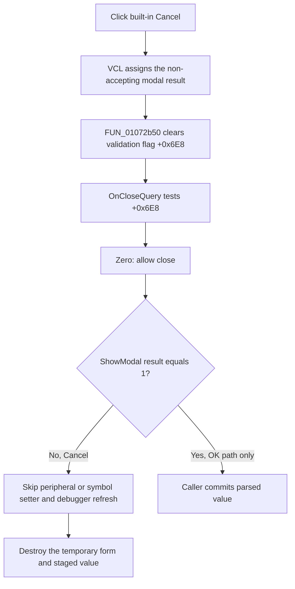

# Cancel a pending debugger value change

> Analysis status: Evidence-backed source review complete.

## Control

| Property | Recovered value |
| --- | --- |
| Form | DebuggerChangeValue |
| Form caption | Change Value |
| Component path | DebuggerChangeValue.bCancel |
| Control class | TBitBtn |
| Caption | Supplied by the standard `bkCancel` kind; no explicit caption is stored. |
| Kind | `bkCancel` |
| Handler name | bCancelClick |
| Handler address | 01072b50 |
| Graph node | `resource:dfm:DebuggerChangeValue/DebuggerChangeValue.bCancel` |
| Handler node | `function:01072b50` |
| Graph layer | UI |

## What happens when clicked

`FUN_01072b50` clears the form's one-byte validation-error flag at `+0x6E8`. It does not read the **New value** edit, parse a value, write debugger state, call a controller, or free an object.

The custom flag clear is needed when Cancel follows a rejected OK. `FUN_01072c80`, the form's `OnCloseQuery` handler, allows the form to close only while `+0x6E8` is zero. The OK parser sets this flag for invalid input and leaves the dialog open. Cancel clears that stale error before the close query runs, so the Cancel close is not blocked by the earlier validation failure.

`bCancel` is a standard `bkCancel` button. The recovered VCL button path assigns its non-accepting modal result to the form before it dispatches `OnClick`. The custom handler itself does not assign a modal result or call `Close`. If another caller invoked `FUN_01072b50` directly without the VCL button action, it would only clear the flag; it would not close the form by itself.

## Staged value and external state

The form keeps the proposed value in its own field at `+0x6D8`. `OnShow` formats this field into `eNewValue`. The sibling OK handler reads the edit, parses it into the form field, and leaves `+0x6E8` set when validation fails. Cancel does not restore the form's earlier `+0x6D8` value or edit text. That state is temporary and is destroyed with the modal form.

Two recovered controller paths prove the external commit boundary:

- `FUN_0108de70` reads the current peripheral value through `_Dbg_XMC_GetPeriphValue`, stages it in the form, and shows the dialog. Only when `ShowModal` returns `1` does it read form field `+0x6D8`, call `_Dbg_XMC_SetPeriphValue`, and refresh the debugger view.
- `FUN_0108e060` obtains a debugger symbol pointer and type, copies at most four source bytes into the form's staging field, and shows the dialog. Only when the result is `1` does it call `_Debug_SetSymbolValue` with the staged value and refresh the debugger view.

The `bkCancel` result is not `1`. Both callers therefore skip their external setters and refresh calls, then destroy the form. Cancel does not need to copy an original value back because neither controller changes the peripheral or symbol before the accepted-result test.

This also covers Cancel after an invalid OK: the parser may have changed form-local fields, but the rejected OK has not passed either caller's result gate. Cancel clears the close-veto flag, closes with the non-accepting result, and discards that form-local state.

## No-op, cleanup, and error boundaries

- When `+0x6E8` is already zero, the handler writes zero again. This repeated click has no additional state effect.
- The handler has no branches, calls, allocation, conversion, message, retry, or local exception path. The recovered body is one byte store followed by return.
- The handler does not explicitly clean up form strings or controls. Both recovered modal owners call the Delphi object destructor after `ShowModal` returns, for accepted and non-accepted results.
- Cancel cannot undo a peripheral or symbol write that happened before this dialog was opened. It only prevents the proposed form value from reaching the two proven setters.
- The separate OK parser, its error messages, and its input-type rules belong to the sibling OK control analysis. They are cited here only to establish why Cancel clears the close-veto flag and where external mutation occurs.

## Cancel flow

## Source evidence

- Cancel's one-byte validation-flag clear: [FUN_01072b50](../../../DecompiledSources/Tina16/functions/0000000001072B50__FUN_01072b50.c)
- Close query that gates the close on the same flag: [FUN_01072c80](../../../DecompiledSources/Tina16/functions/0000000001072C80__FUN_01072c80.c)
- Form initialization and staged-value display: [FUN_01072c90](../../../DecompiledSources/Tina16/functions/0000000001072C90__FUN_01072c90.c) and [FUN_01072cd0](../../../DecompiledSources/Tina16/functions/0000000001072CD0__FUN_01072cd0.c)
- Sibling OK parse, form-local value update, validation flag, and error message: [FUN_01072b60](../../../DecompiledSources/Tina16/functions/0000000001072B60__FUN_01072b60.c) and [FUN_01072e30](../../../DecompiledSources/Tina16/functions/0000000001072E30__FUN_01072e30.c)
- Peripheral controller's accepted-result gate and external setter: [FUN_0108de70](../../../DecompiledSources/Tina16/functions/000000000108DE70__FUN_0108de70.c)
- Symbol controller's accepted-result gate and external setter: [FUN_0108e060](../../../DecompiledSources/Tina16/functions/000000000108E060__FUN_0108e060.c)
- Standard button-kind and modal-result dispatch: [FUN_0082bc30](../../../DecompiledSources/Tina16/functions/000000000082BC30__FUN_0082bc30.c) and [FUN_00687f30](../../../DecompiledSources/Tina16/functions/0000000000687F30__FUN_00687f30.c)
- Recovered caption, New value label, button kind, and form event bindings: [ui-evidence.json](../../../DecompiledSources/Tina16/resources/dfm/ui-evidence.json)

## Resource and annotation limits

- `bCancel` has no explicit caption, hint, text, image reference, or extracted glyph. Its caption, standard image, and modal result come from `bkCancel`.
- The nearby **New value (%s)** label identifies the edit's purpose, not a Cancel action. The controller supplies the `%s` substitution before the dialog is shown.
- The recovered callers prove cancellation for peripheral-value and debugger-symbol changes. Other indirect users of this form are not visible in the static call graph.
- This Bead owns only the canonical annotation for `FUN_01072b50`. The OK handler, parser, form lifecycle, VCL infrastructure, callers, debugger APIs, and refresh helpers remain evidence only.
