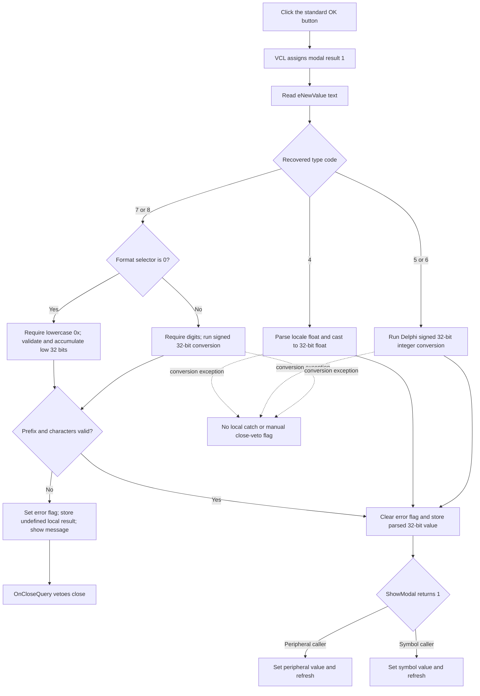

# Parse and accept a debugger value change

> Analysis status: Evidence-backed source review complete.

## Control

| Property | Recovered value |
| --- | --- |
| Form | DebuggerChangeValue |
| Form caption | Change Value |
| Component path | DebuggerChangeValue.bOK |
| Control class | TBitBtn |
| Caption | Supplied by the standard `bkOK` kind; no explicit caption is stored. |
| Kind | `bkOK` |
| Handler name | bOKClick |
| Handler address | 01072b60 |
| Graph node | `resource:dfm:DebuggerChangeValue/DebuggerChangeValue.bOK` |
| Handler node | `function:01072b60` |
| Graph layer | UI |

## What happens when clicked

`bOKClick` reads the text from `eNewValue`, parses it for the configured debugger value type and display format, and stores the resulting 32-bit value in form field `+0x6d8`. It does not call a debugger setter directly.

The standard `bkOK` button path assigns accepting modal result `1` to the form before it dispatches this custom handler. If parsing reports a manual validation error, the handler shows a localized error message and the form's `OnCloseQuery` vetoes the close. If no validation error remains, the modal dialog can return `1`; the caller then applies the staged value.

## Parser inputs and form state

`FUN_01072e30` uses these form fields:

| Offset | Recovered purpose |
| --- | --- |
| `+0x6d8` | 32-bit staged result returned to the caller |
| `+0x6e0` | Pointer to original symbol storage; used to format an initial float value |
| `+0x6e8` | Manual validation-error and close-veto flag |
| `+0x6ec` | Number-format selector; recovered normal values are `0` for prefixed hexadecimal and `2` for decimal |
| `+0x6f0` | Debugger value-type code |

`FormCreate` initializes the result to zero, format `0`, type code `7`, and error flag zero. `FormShow` formats the initial staged or source value into `eNewValue`. The peripheral caller keeps type `7` and format `0`. The symbol caller supplies a type code from `_Debug_GetSymbolPtr`, copies at most four source bytes into the staging field, and supplies its current number-format setting.

The original enum names for the type and format values are not recovered. The conversion branches establish their behavior.

## Accepted formats and ranges

### Type code 4: single-precision floating point

The parser calls the recovered Delphi floating-point conversion with the current format settings, then casts the result to a 32-bit float. The converter accepts a locale-specific decimal separator and an optional `E` or `e` exponent. Invalid syntax raises a conversion exception. This path has no separate finite-range check after the cast and does not set the form's manual error flag.

### Type codes 5 and 6: direct 32-bit integer conversion

These types call the recovered Delphi integer conversion directly. The low-level parser accepts leading spaces, an optional `+` or `-`, decimal digits, and hexadecimal forms that start with `0x`, `0X`, `x`, `X`, or `$`. It requires the remaining text to end after the number. Invalid text and signed 32-bit overflow raise a conversion exception. There is no extra type-specific byte, word, signed, or unsigned range check in this dialog parser.

### Type codes 7 and 8 with format 0: prefixed hexadecimal

This path requires at least three characters and an exact, case-sensitive lowercase `0x` prefix. The recovered mapped-image constant at `DAT_01073044` is the Unicode string `0x`. The parser removes the prefix and validates the remaining text.

The validator accepts ASCII digits and **all** ASCII letters. It rejects whitespace, signs, punctuation, and an empty post-prefix value. The hexadecimal converter, however, maps only `0`–`9`, `A`–`F`, and `a`–`f`; any other accepted letter returns nibble value zero. For example, the validation path accepts `0xG`, and the converter contributes zero for `G`. This is a recovered validation/conversion mismatch, not valid hexadecimal syntax.

The accumulator is 32 bits and has no digit-count or overflow check. Values longer than eight hexadecimal digits wrap to their low 32 bits. The substring operation keeps at most 255 characters after the prefix.

### Type codes 7 and 8 with nonzero format

The custom validator accepts ASCII digits only. It rejects a sign, whitespace, a decimal separator, and letters. The following Delphi integer conversion enforces the signed 32-bit upper bound, so normally accepted text is `0` through `2147483647`.

An empty string passes the custom character loop because it has no character to reject, but the following Delphi integer conversion raises an exception. Recovered normal decimal formatting uses selector `2`. A different nonzero selector is parsed as digit-only decimal even though the initial formatter uses hexadecimal for values other than `2`; no such normal caller value is established.

### Unsupported type codes

The parser has value-producing branches only for codes `4`, `5`, `6`, `7`, and `8`. Another code reaches the return with no initialized result and no new validation error. The two recovered modal callers provide the default peripheral type or a single-value symbol type, but the handler has no local type-range guard.

## Validation error and close veto

For type codes `7` and `8`, a valid character sequence clears `+0x6e8`; an invalid prefix or character sets it. The parser returns without initializing its local result on the invalid path. `bOKClick` still writes that returned value to staged field `+0x6d8` before it tests the flag. Invalid input can therefore overwrite the form-local staged value with an undefined recovered result, but it does not yet reach an external debugger setter.

When the flag is set, the handler:

1. loads localized string resource `0x131`;
2. reads the current **New value** label, which the caller can format with the symbol or peripheral name;
3. inserts that label into the localized error template; and
4. displays the resulting message.

The exact English text of resource `0x131` is not present in the recovered PE string export. `OnCloseQuery` returns false while `+0x6e8` is nonzero, so the `bkOK` modal result cannot close the dialog after this manual error.

A corrected type-7 or type-8 value clears the flag and replaces the staged field. The user can also click Cancel. The sibling [Cancel analysis](bcancel-ca91e9af5d.md) proves that its handler clears `+0x6e8`, the close query then allows the non-accepting close, and both recovered callers skip their external setters.

## Caller-specific commit

Two callers prove the external commit boundary:

- `FUN_0108de70` reads a peripheral value through `_Dbg_XMC_GetPeriphValue`, stages it in this dialog, and uses prefixed hexadecimal mode. Only when `ShowModal` returns `1` does it read `+0x6d8`, call `_Dbg_XMC_SetPeriphValue`, and refresh the debugger view.
- `FUN_0108e060` obtains a debugger symbol pointer, byte count, and type, stages at most four bytes, and shows this dialog. Only result `1` causes `_Debug_SetSymbolValue` to receive the staged 32-bit buffer and the debugger view to refresh.

Cancel and a manually rejected OK do not pass these result gates. No file, registry setting, or project document is changed by the handler.

## Exception and partial-state behavior

- Floating-point conversion and the direct integer conversions raise on invalid syntax or range. They do not set `+0x6e8`, show the handler's custom message, or catch the exception locally.
- The VCL button path has already assigned modal result `1` before `bOKClick` runs. The recovered handler does not show whether the outer VCL exception path resets that result after a conversion exception. An external commit after such an exception is therefore not established as either guaranteed or impossible.
- A manual type-7 or type-8 validation failure writes an uninitialized recovered return value to form field `+0x6d8`, then shows the error and vetoes close. A later valid parse replaces it. Cancel discards it because the callers require modal result `1`.
- The error-message allocation, formatting, and display calls have no local catch or rollback. The manual error flag is already set before those calls.
- Successful parsing updates only the form-local 32-bit field. External peripheral or symbol state changes later in the caller, after the accepted-result check. Failures in those external setters are outside this handler and have no rollback here.

## OK flow

## Source evidence

- Edit read, parser call, staged-value write, error-template formatting, and message display: [FUN_01072b60](../../../DecompiledSources/Tina16/functions/0000000001072B60__FUN_01072b60.c)
- Type and format dispatch, prefix check, conversions, error flag, and invalid return path: [FUN_01072e30](../../../DecompiledSources/Tina16/functions/0000000001072E30__FUN_01072e30.c)
- ASCII digit or letter validation: [FUN_01072d50](../../../DecompiledSources/Tina16/functions/0000000001072D50__FUN_01072d50.c)
- Hexadecimal digit conversion and 32-bit accumulation: [FUN_01aa1170](../../../DecompiledSources/Tina16/functions/0000000001AA1170__FUN_01aa1170.c) and [FUN_01aa1090](../../../DecompiledSources/Tina16/functions/0000000001AA1090__FUN_01aa1090.c)
- Delphi signed integer and locale-aware floating-point conversions: [FUN_0043fc00](../../../DecompiledSources/Tina16/functions/000000000043FC00__FUN_0043fc00.c) and [FUN_00448650](../../../DecompiledSources/Tina16/functions/0000000000448650__FUN_00448650.c)
- Initial value formatting and form lifecycle: [FUN_01073050](../../../DecompiledSources/Tina16/functions/0000000001073050__FUN_01073050.c), [FUN_01072c90](../../../DecompiledSources/Tina16/functions/0000000001072C90__FUN_01072c90.c), [FUN_01072cd0](../../../DecompiledSources/Tina16/functions/0000000001072CD0__FUN_01072cd0.c), and [FUN_01072c80](../../../DecompiledSources/Tina16/functions/0000000001072C80__FUN_01072c80.c)
- Standard button modal-result dispatch: [FUN_00687f30](../../../DecompiledSources/Tina16/functions/0000000000687F30__FUN_00687f30.c)
- Peripheral and symbol accepted-result gates: [FUN_0108de70](../../../DecompiledSources/Tina16/functions/000000000108DE70__FUN_0108de70.c) and [FUN_0108e060](../../../DecompiledSources/Tina16/functions/000000000108E060__FUN_0108e060.c)
- Recovered form caption, New value label, edit, and standard button kinds: [ui-evidence.json](../../../DecompiledSources/Tina16/resources/dfm/ui-evidence.json)

## Resource and annotation limits

- `bOK` has no explicit caption, hint, text, image reference, or extracted glyph. Its caption, standard image, and accepting modal result come from `bkOK`.
- The nearby label starts as **New value (%s)**. The callers replace `%s` with symbol or peripheral context before the dialog is shown.
- The original debugger type enum and format enum names are not recovered. This article uses their numeric codes and proven conversion behavior.
- This Bead owns `FUN_01072b60`, parser `FUN_01072e30`, and validator `FUN_01072d50`. Bead `.409` owns Cancel. Form lifecycle, standard VCL button behavior, modal callers, external debugger setters, and refresh helpers remain evidence only.
