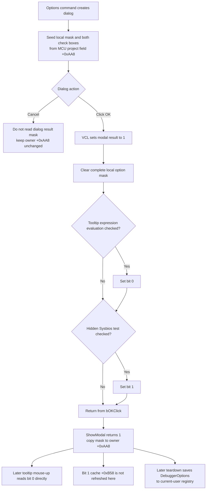

# Accept debugger option flags

> Analysis status: Evidence-backed source review complete.

## Control

| Property | Recovered value |
| --- | --- |
| Form | DebuggerOptions |
| Form caption | Options |
| Component path | DebuggerOptions.bOK |
| Control class | TBitBtn |
| Caption | Supplied by the standard `bkOK` kind; no explicit caption is stored. |
| Kind | `bkOK` |
| Hint | Not present in the recovered resource. |
| Glyph | No extracted custom glyph; the standard kind supplies its image. |
| Handler name | bOKClick |
| Handler address | 01073800 |
| Graph node | `resource:dfm:DebuggerOptions/DebuggerOptions.bOK` |
| Handler node | `function:01073800` |
| Graph layer | UI |

## What happens when clicked

`FUN_01073800` replaces the dialog's option mask at `+0x6D8` with the current states of its two check boxes. It first clears the complete 32-bit mask, then reads each check box through its VCL `Checked` getter:

| Bit | Control | Recovered caption | Result when checked |
| --- | --- | --- | --- |
| `0x01` | `cbTooltip` | Tooltip expression evaluation | Set bit 0. |
| `0x02` | `cbSysbiosTest` | Sysbios test | Set bit 1. |

No other option control exists on this form. The handler performs no text parse, range check, cross-field check, warning, confirmation, or error-message call. All four low-bit combinations from `0` through `3` are accepted.

The setter used before the dialog opens can receive a mask with higher bits. It stores the full mask but maps only bits 0 and 1 to the check boxes. OK clears the mask and reconstructs only those two bits. An accepted OK therefore discards any unrecognized higher bits. The current persisted default and all identified consumers use only the two recovered bits.

## Hidden Sysbios option

The DFM marks `cbSysbiosTest` as both disabled and invisible. Normal user interaction cannot change it. The dialog setter still initializes its checked state from bit 1, and OK still reads it back. The hidden value is therefore preserved when the user changes only the visible tooltip option.

Programmatic code could change the hidden check box before OK. The handler would then accept that state because it has no enabled, visible, or authorization guard.

## Modal commit and Cancel

The owning [MCU project Options command](../../../DecompiledSources/Tina16/functions/000000000108DA80__FUN_0108da80.c) creates the dialog, passes its current option mask at owner field `+0xAA8` to the dialog setter, and calls `ShowModal`.

Because `bOK` has `Kind = bkOK`, the VCL assigns modal result `1` before it dispatches `bOKClick`. The handler itself does not close the form or set a modal result. After `ShowModal` returns, the owner copies the dialog mask back to `+0xAA8` only when the result equals `1`. It then destroys the dialog.

`bCancel` has `Kind = bkCancel` and no custom click handler. Cancel returns a result other than accepted, so the owner does not call the mask getter and leaves `+0xAA8` unchanged. The form's `OnShow` handler is a recovered no-op; it does not validate, refresh, or overwrite the state prepared by the setter.

The accepted owner update is one 32-bit assignment. There is no separate per-option commit, so the normal caller update cannot contain one new bit and one old bit.

## Runtime effects and refresh behavior

The visible tooltip option applies to later editor events without a restart. The MCU editor's `EditorMouseUp` handler reads bit 0 directly from owner field `+0xAA8`. When the relevant mouse-button branch runs and bit 0 is set, it gets the expression under the editor position, evaluates a symbol or register value, and stores an `expression = value` hint string. `ApplicationEvents.OnShowHint` supplies that string for the editor.

Clearing bit 0 prevents later mouse-up events from calling the expression evaluator. The Options path does not clear the already cached hint string and does not request an immediate hint refresh. The recovered source does not establish whether an already visible hint is withdrawn at once.

The Sysbios option has a different state path. Settings load copies mask bit 1 to cached owner byte `+0xB58`, and the debugger run loop reads that byte. The accepted Options command updates `+0xAA8` but does not update `+0xB58`, restart the debugger, or call a refresh helper. A programmatic change to the hidden bit therefore does not affect this cached runtime flag until another settings-load path synchronizes it. Normal users cannot create this difference because the check box is hidden and disabled.

No direct global variable, debugger engine API, view repaint, project-modified flag, or restart call occurs in `bOKClick` or in the modal owner after acceptance.

## Persistence

The MCU project settings loader reads the integer value named `DebuggerOptions` from a current-user registry key into owner field `+0xAA8`. If the value is absent, it uses default mask `1`, which enables Tooltip expression evaluation and leaves Sysbios test clear. The same load path copies bit 1 to runtime cache `+0xB58`.

OK does not write the registry. The settings saver writes owner field `+0xAA8` as `DebuggerOptions` later from the MCU project form's teardown path. Thus, the accepted mask is live in the current form before it is durable. If the application or process ends before that save path completes, the recovered code provides no immediate persistence guarantee.

The saver attempts the write only when its registry key opens successfully. It does not return a status to this dialog, and the OK path does not report a later persistence failure.

## Repeated actions and errors

Calling the handler repeatedly with unchanged check boxes produces the same two-bit local mask. In normal use, the first accepted click ends the modal dialog, so there is no second OK click on that instance.

The handler has no direct function calls because both check-box reads are virtual VCL calls. It has no local exception handler, rollback, or cleanup action. If a VCL getter raises after the mask is cleared, the form-local mask can be only partly rebuilt. The normal owner copy occurs only after `ShowModal` returns accepted, so an exception that prevents that return does not reach the normal caller-assignment statement. Higher-level Delphi exception behavior is not recovered here.

Registry-open or registry-write failure occurs later and cannot partially change the two-bit in-memory assignment. It can leave the current session with the new mask while the stored value remains old.

## Accept flow

## Evidence

- [bOKClick](../../../DecompiledSources/Tina16/functions/0000000001073800__FUN_01073800.c) clears form field `+0x6D8`, reads check boxes `+0x6C8` and `+0x6D0`, and sets mask bits 0 and 1.
- [The dialog mask setter](../../../DecompiledSources/Tina16/functions/0000000001073870__FUN_01073870.c) stores the incoming mask and maps bits 0 and 1 to the two `Checked` properties. [The getter](../../../DecompiledSources/Tina16/functions/0000000001073900__FUN_01073900.c) returns the reconstructed mask.
- [The modal owner](../../../DecompiledSources/Tina16/functions/000000000108DA80__FUN_0108da80.c) seeds the dialog from MCU project field `+0xAA8`, copies the getter result back only for modal result `1`, and destroys the dialog. Bead `.804` owns its canonical annotation.
- [The no-op OnShow handler](../../../DecompiledSources/Tina16/functions/0000000001073860__FUN_01073860.c) proves that showing the dialog adds no validation or refresh step.
- [The settings loader](../../../DecompiledSources/Tina16/functions/000000000108D0E0__FUN_0108d0e0.c) reads `DebuggerOptions`, uses default `1` when absent, and derives cached Sysbios byte `+0xB58` from bit 1. [The settings saver](../../../DecompiledSources/Tina16/functions/000000000108CF00__FUN_0108cf00.c) writes the integer value later, and [the teardown path](../../../DecompiledSources/Tina16/functions/00000000010859B0__FUN_010859b0.c) establishes its timing.
- [EditorMouseUp](../../../DecompiledSources/Tina16/functions/00000000010854A0__FUN_010854a0.c) reads bit 0 for later mouse events. [The hint builder](../../../DecompiledSources/Tina16/functions/000000000108A580__FUN_0108a580.c) gets and evaluates the current expression, and [ApplicationEventsShowHint](../../../DecompiledSources/Tina16/functions/000000000108A6A0__FUN_0108a6a0.c) returns the cached hint string for the editor.
- [The debugger run loop](../../../DecompiledSources/Tina16/functions/00000000010888B0__FUN_010888b0.c) reads cached Sysbios byte `+0xB58`, not the option mask directly.
- Standard `bkOK` setup and modal-result dispatch are recovered in [TBitBtn.SetKind](../../../DecompiledSources/Tina16/functions/000000000082BC30__FUN_0082bc30.c) and [TCustomButton.Click](../../../DecompiledSources/Tina16/functions/0000000000687F30__FUN_00687f30.c).
- The recovered [UI evidence](../../../DecompiledSources/Tina16/resources/dfm/ui-evidence.json) gives the form caption, the two check-box captions and visibility states, the standard OK/Cancel/Help kinds, the no-op OnShow binding, and the OK event binding. No custom glyph or hint is present.

## Ownership and limits

- This Bead owns canonical annotations for `FUN_01073800`, `FUN_01073870`, `FUN_01073900`, `FUN_0108d0e0`, and `FUN_0108cf00`.
- Bead `.804` owns the MCU project Options modal owner `FUN_0108da80`. Tooltip and Sysbios consumers are evidence only here.
- The `Sysbios test` caption is preserved as recovered. The exact SysBIOS test algorithm and the reason that the control is hidden are not established.
- The current-user registry key path is supplied through a recovered global string. This article does not invent a product-version-specific path.
