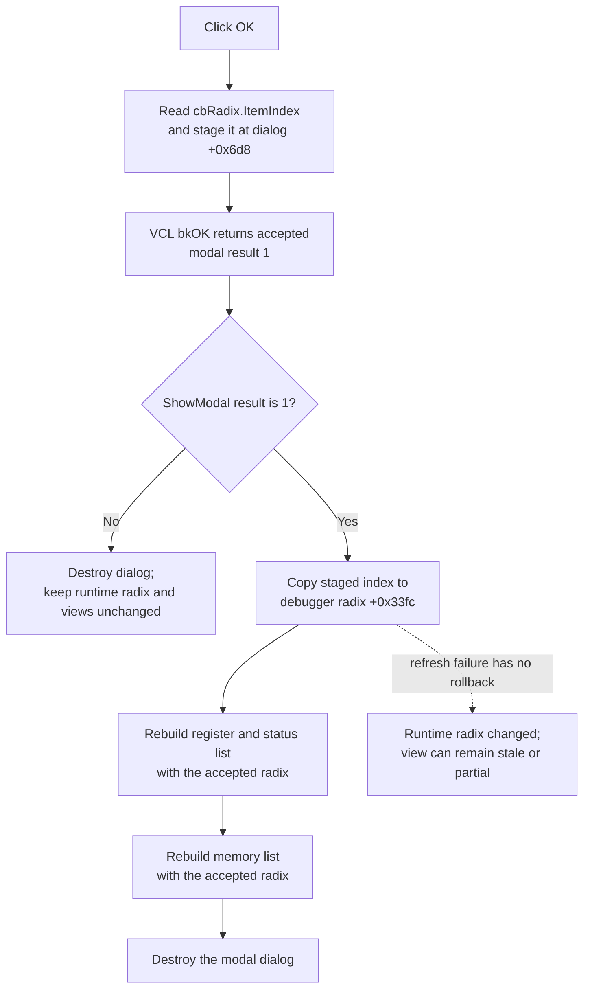

# Apply the debugger display radix

> Analysis status: Evidence-backed source review complete.

## Control

| Property | Recovered value |
| --- | --- |
| Form | DebugPreferences |
| Form caption | Debug Preferences |
| Component path | DebugPreferences.bOK |
| Control class | TBitBtn |
| Button kind | bkOK |
| Handler name | bOKClick |
| Handler address | 00f867c0 |
| Graph node | `resource:dfm:DebugPreferences/DebugPreferences.bOK` |
| Handler node | `function:00f867c0` |
| Graph layer | UI |

## Preference in this dialog

The recovered form contains one preference input: `cbRadix`, a
`csDropDownList` combo box under the **Radix** label. Its three entries and
zero-based indexes are:

| Index | Entry | Downstream formatting effect |
| ---: | --- | --- |
| 0 | HEX | Convert the generated binary digit string to hexadecimal. |
| 1 | BIN | Keep the generated binary digit string. |
| 2 | DEC | Convert the generated binary digit string to decimal. |

The mapping is established by the combo item order and by
`FUN_015fa320`. That formatter handles value `0` as hexadecimal and value `2`
as decimal. Other values leave its binary input unchanged. The register/status
and memory views both pass the accepted preference to this formatter.

No other edit, checkbox, list, or option control is present in the recovered
`DebugPreferences` form. The OK path therefore handles one integer preference.

## What happens when clicked

`FUN_00f867c0` reads `cbRadix.ItemIndex` through the combo box getter at virtual
slot `+0x260` and copies that 32-bit value to dialog field `+0x6d8`. It makes no
function call and performs no conversion, range check, display refresh, file
write, or close request itself.

The DFM defines `bOK` as a built-in `bkOK` button. VCL supplies the accepted
modal result for this button. The modal controller treats ShowModal result `1`
as acceptance. Thus the click handler first captures the current combo index
in the dialog, and the built-in modal-button behavior returns acceptance to the
caller.

The handler does not test that the index is in the expected range `0..2`.
Ordinary user input is constrained by `csDropDownList`, but a `-1` selection or
another programmatically supplied value would be copied unchanged.

## Dialog initialization and staging

Three small dialog methods manage the staged radix field:

- `FUN_00f86770` stores a supplied value in dialog field `+0x6d8`.
- `FUN_00f86780` returns that field to the caller.
- `FUN_00f86790`, the recovered `FormCreate` handler, writes the field to
  `cbRadix.ItemIndex` through the combo setter at virtual slot `+0x268`.

The modal controller `FUN_00f8f980` creates the dialog and then calls the
staging setter with the debugger object's current radix at `+0x33fc`. After the
modal call, it uses the getter only if the result is `1`.

The recovered controller calls the form constructor before it calls the
staging setter, and no later call to `FUN_00f86790` or another combo-index setter
is visible in this path. The source therefore proves the staged field transfer,
but it does not prove that a nonzero value staged after construction is copied
to the visible combo before ShowModal. This article does not assume an
unrecovered data binding or a second lifecycle event.

## Accepted commit and view refresh

When ShowModal returns `1`, `FUN_00f8f980`:

1. reads dialog field `+0x6d8` through `FUN_00f86780`;
2. writes it to the active debugger object's radix field `+0x33fc`; and
3. calls `FUN_00f8a700` to rebuild the two radix-dependent debugger views.

`FUN_00f8a700` calls two broad refresh routines. `FUN_00f8ae10` clears and
repopulates the register/status list, while `FUN_00f8a840` clears and
repopulates the memory list. Both format numeric values with the updated radix
field. The refresh therefore applies the accepted selection immediately to the
visible debugger values. It does not restart the simulator or modify MCU
memory.

The caller destroys the modal form after either result. The menu route is
`FlowChartMainForm.MainMenu.mnDebug.mnPreferences` through `FUN_01053ca0`,
which delegates to this modal controller for the active debugger object.

## Cancel, close, and error behavior

- `bCancel` is a built-in `bkCancel` button and has no recovered click handler.
  If ShowModal returns any value other than `1`, the controller does not read
  the staged field, does not update debugger field `+0x33fc`, and does not
  refresh the views.
- The form has no recovered `OnCloseQuery` event. The OK handler sets no error
  byte, validation flag, or close-veto result. There is no confirmation dialog.
- The handler has no local exception handler or rollback. A combo getter
  failure occurs before the staged field write.
- The caller writes the accepted runtime field before it refreshes either
  debugger view. If a refresh fails, the new radix remains stored in the
  debugger object while one or both views can remain stale or partly rebuilt.
- An index outside `0..2` is not rejected. The downstream formatter handles
  only `0` and `2` specially, so other values follow its unchanged-binary path.
  No error message is shown by this dialog path.

## Persistence boundary

Neither `FUN_00f867c0` nor its modal controller calls a registry, INI, file,
settings, or serialization routine. Acceptance immediately updates only the
active debugger object's runtime field.

`FUN_00f8edf0` initially loads that runtime field from offset `+0x104` of the
current recovered debugger/subcircuit record. On separate debugger stop or
state-synchronization paths, `FUN_00f8f400` can copy the current runtime radix
back to the same record field. This establishes later in-memory record
synchronization. It does not establish registry, INI, file, project-save, or
cross-session persistence for the OK click. No such persistence is claimed.

## Click flow

## Handler and call-path evidence

- OK selection capture:
  [FUN_00f867c0](../../../DecompiledSources/Tina16/functions/0000000000F867C0__FUN_00f867c0.c)
- Staged radix setter and getter:
  [FUN_00f86770](../../../DecompiledSources/Tina16/functions/0000000000F86770__FUN_00f86770.c)
  and
  [FUN_00f86780](../../../DecompiledSources/Tina16/functions/0000000000F86780__FUN_00f86780.c)
- Form creation and combo initialization:
  [FUN_00f86790](../../../DecompiledSources/Tina16/functions/0000000000F86790__FUN_00f86790.c)
- Modal setup, accepted commit, Cancel branch, refresh, and ownership:
  [FUN_00f8f980](../../../DecompiledSources/Tina16/functions/0000000000F8F980__FUN_00f8f980.c)
- Register/status and memory refresh dispatcher:
  [FUN_00f8a700](../../../DecompiledSources/Tina16/functions/0000000000F8A700__FUN_00f8a700.c)
- Register/status and memory list rebuilds:
  [FUN_00f8ae10](../../../DecompiledSources/Tina16/functions/0000000000F8AE10__FUN_00f8ae10.c)
  and
  [FUN_00f8a840](../../../DecompiledSources/Tina16/functions/0000000000F8A840__FUN_00f8a840.c)
- Radix-dependent conversion:
  [FUN_015fa320](../../../DecompiledSources/Tina16/functions/00000000015FA320__FUN_015fa320.c)
- Runtime initialization and later record synchronization:
  [FUN_00f8edf0](../../../DecompiledSources/Tina16/functions/0000000000F8EDF0__FUN_00f8edf0.c)
  and
  [FUN_00f8f400](../../../DecompiledSources/Tina16/functions/0000000000F8F400__FUN_00f8f400.c)
- Debug Preferences menu route:
  [FUN_01053ca0](../../../DecompiledSources/Tina16/functions/0000000001053CA0__FUN_01053ca0.c)
- Recovered form, combo entries, and event binding:
  [ui-evidence.json](../../../DecompiledSources/Tina16/resources/dfm/ui-evidence.json)

## Resource evidence and annotation ownership

- `bOK` has no caption, hint, action, image reference, or extracted glyph. Its
  direct semantic resource evidence is `Kind = bkOK`.
- The nearby **Radix** label is confirmed by the `cbRadix` name, its
  `HEX`/`BIN`/`DEC` items, the handler's combo access, and downstream formatter
  behavior. Proximity is not the sole evidence.
- This Bead owns `FUN_00f867c0`, `FUN_00f86770`, `FUN_00f86780`,
  `FUN_00f86790`, and the Debug Preferences modal controller `FUN_00f8f980`.
- The broad debugger-view refresh, numeric formatter, record synchronization,
  and parent menu handler remain evidence-only under their coordinated owners.
- Original Delphi names for the staged and runtime fields are not recovered.
  The names in this article describe their proven data flow and formatting use.
