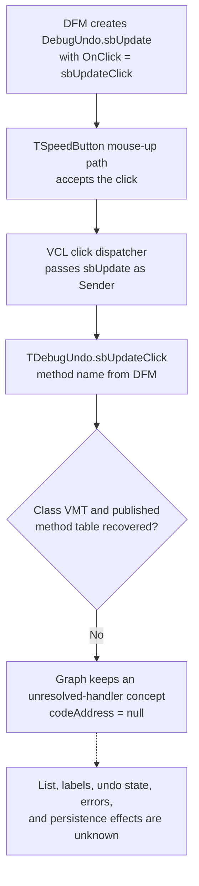

# DebugUndo update button

> Analysis status: The standard VCL click dispatch and the resource context are recovered. The custom `TDebugUndo.sbUpdateClick` address and behavior remain unresolved.

## Control

| Property | Recovered value |
| --- | --- |
| Form | DebugUndo |
| Form class | TDebugUndo |
| Form caption | DebugUndo |
| Component path | DebugUndo.sbUpdate |
| Control class | TSpeedButton |
| Handler name | sbUpdateClick |
| Handler address | Not recovered |
| Graph node | `resource:dfm:DebugUndo/DebugUndo.sbUpdate` |
| Handler node | `concept:dfm-handler:TDebugUndo/sbUpdateClick` |
| Graph layer | tina.exe |

## What happens when clicked

The recovered framework path proves only that the speed button dispatches its assigned `OnClick` event:

1. The DFM creates `sbUpdate` as a `TSpeedButton`. It does not set `GroupIndex`, `AllowAllUp`, `Down`, or `Action`.
2. On a valid mouse release, the recovered speed-button path calls its click method. Because the resource does not configure a nonzero group index, this path does not use the grouped-button branch that toggles a persistent `Down` state.
3. The common VCL click dispatcher invokes the assigned event with `sbUpdate` as `Sender`.
4. The DFM names that event method `TDebugUndo.sbUpdateClick`, but its code address is null.

The custom handler can read or replace list entries, update the three labels, read an undo service, or do nothing. No recovered address-backed source proves any one of these actions. The control name `sbUpdate` is not sufficient proof that the click refreshes the form.

## Resource context

The form contains only these recovered child controls:

- `lblListEmpty`, a label whose stored caption is the same identifier;
- `lblUndoIndex`, a label whose stored caption is the same identifier;
- `lblCount`, a label whose stored caption is the same identifier;
- `sbUpdate`, the 25 by 25 speed button;
- `lbList`, an empty-resource `TListBox`.

The names give undo-list and count context, but the stored captions are developer identifiers, not user-facing explanations. The DFM supplies no button caption, hint, text, action, image-list reference, embedded glyph, checked state, or modal result. No glyph entry exists for this control in the extracted resource manifest.

## Evidence flow

## Address-recovery evidence

### Graph neighborhood

The complete graph has one `triggers` edge from `DebugUndo.sbUpdate` to `concept:dfm-handler:TDebugUndo/sbUpdateClick`. The concept has no function node, source path, incoming call edge, outgoing call edge, or connection to a form constructor or form caller. The form node has only DFM `contains` edges and this event edge.

### DFM, RTTI, and VMT

[Recovered DFM evidence](../../../DecompiledSources/Tina16/resources/dfm/ui-evidence.json) stores `OnClick = sbUpdateClick` and `codeAddress = null`. The exporter first uses the event binding's address and then calls `resolve_event_handler` on the owning form class, as shown in [`TiaraUiEvidence.rs`](../../../analysis/undelphi/TiaraUiEvidence.rs). That fallback needs a parsed `TDebugUndo` class VMT and its published method table.

A read-only byte search found exactly one ASCII `TDebugUndo` instance and one `sbUpdateClick` instance in each available artifact: the rebuilt runtime executable, the mapped runtime image, and the complete captured process dump. Both instances are inside the same `TPF0` DFM stream. The class-name ShortString starts at mapped-image RVA `034192e0`, and no 64-bit pointer in the mapped image refers to it. The event method text starts at RVA `034194d8`; its preceding bytes encode the DFM `OnClick` property, not a Delphi published-method record. There is no UTF-16 instance and no second class-name or method-name instance that can belong to class RTTI or a published method table. Therefore, no recovered method-table entry can map `sbUpdateClick` to a code address.

### Decompiled sources and callers

The recovered main code section contains 89,226 decompiled function files, as recorded in the [decompilation README](../../../DecompiledSources/Tina16/README.md). A case-insensitive search of all function sources and `function-index.csv` found no `TDebugUndo`, `DebugUndo`, `sbUpdateClick`, `lblListEmpty`, `lblUndoIndex`, or `lblCount` reference. This search cannot identify code that uses only numeric field offsets, but the missing VMT prevents those offsets from being tied to this form.

No graph call edge identifies a caller of the unresolved concept. No address-backed form construction, singleton reference, `Show`, `ShowModal`, or downstream consumer is recovered for `DebugUndo`.

## Recovered VCL path

- [`FUN_0082a320`](../../../DecompiledSources/Tina16/functions/000000000082A320__FUN_0082a320.c) is the recovered speed-button mouse-up path. It uses the grouped-button state branch only when the button group index is nonzero, then calls the button's click method after an accepted release.
- [`FUN_0082a460`](../../../DecompiledSources/Tina16/functions/000000000082A460__FUN_0082a460.c) forwards the speed-button click to the common control dispatcher.
- [`FUN_00650840`](../../../DecompiledSources/Tina16/functions/0000000000650840__FUN_00650840.c) invokes the stored click event with the control as `Sender`, or uses an action-link path when one applies. The DFM does not assign an action to `sbUpdate`.

These functions establish dispatch mechanics only. They do not establish the custom application's update operation.

## Inputs, outputs, and limits

| Question | Proven result |
| --- | --- |
| Immediate input | A valid user click on `DebugUndo.sbUpdate`; the dispatcher passes the button as `Sender`. |
| Built-in state change | No persistent grouped `Down` transition is configured by the DFM. |
| Custom inputs | Unknown. No form field, undo object, selection, or list source can be assigned to the unresolved handler. |
| List and label changes | Unknown. The resource proves that the controls exist, not that this event modifies them. |
| Application-model change | Unknown. No undo-stack read, undo command, mutation, or notification call is tied to this event. |
| Error or no-op behavior | Unknown. No guard, exception handler, message, return value, or empty-list branch is recovered. |
| Persistence | Unknown. No settings, document, file, registry, or database call is tied to the event. |

## Analysis limits

- The word **update** comes from the component identifier `sbUpdate`. It is not a recovered implementation claim.
- The nearby labels are layout candidates only. Their identifier-like captions do not prove which values the handler reads or writes.
- The checked rebuilt runtime has SHA-256 value `40A8F62B0B54C4C0609EF95129ACDEA1D25495E9C29B65716E2F8DFC521E2F26`. Its mapped image has SHA-256 value `EDDBE40C4493AB7CD4647CE766EFE2E50715EC6B41E735B48A973055BC17AC3E`.
- No function annotation fragment is added because no application function address has a proven `TDebugUndo` responsibility.
- Further analysis needs the binary module that owns the `TDebugUndo` VMT, a symbol or map file, or a new runtime capture that contains the class RTTI and published method table.
