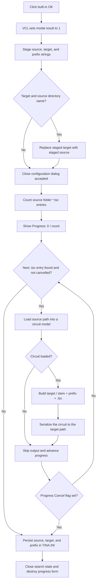

# Stage folders and run the circuit rewrite batch

> Analysis status: Evidence-backed source review complete.

## Control

| Property | Recovered value |
| --- | --- |
| Form | DecryptCircuits |
| Form caption | Decrypt Circuits |
| Component path | DecryptCircuits.bOK |
| Control class | TBitBtn |
| Caption | Supplied by the standard `bkOK` kind; no explicit caption is stored. |
| Kind | `bkOK` |
| Handler name | bOKClick |
| Handler address | 012e7a40 |
| Graph node | `resource:dfm:DecryptCircuits/DecryptCircuits.bOK` |
| Handler node | `function:012e7a40` |
| Graph layer | UI |

## What happens when clicked

`FUN_012e7a40` stages the three text inputs in form-owned strings:

| Input | Form field |
| --- | --- |
| `eSourceFolder.Text` | `+0x720` |
| `eTargetFolder.Text` | `+0x728` |
| `eTargetPrefix.Text` | `+0x730` |

It then reads `cbTargetSame.Checked`. When the checkbox **Target and source directory same** is checked, the handler replaces staged target field `+0x728` with `eSourceFolder.Text`. The visible target edit is not changed by this step; the accepted batch uses the overridden staged field.

The handler performs no folder existence check, empty-text check, source/target comparison, prefix check, file search, decryption, file write, progress update, or INI write. `bOK` is `bkOK`, so the VCL sets modal result `1` before it dispatches the handler. DecryptCircuits has no recovered `OnCloseQuery`. The form therefore closes accepted after these copies, and the modal owner starts the batch only after `ShowModal` returns.

## Accepted batch pipeline

`FUN_012f5900` owns the post-dialog operation. If the modal result is not `1`, it skips the complete batch and all settings writes. For the accepted result it:

1. reads the staged source folder, target folder, and target prefix from form fields `+0x720`, `+0x728`, and `+0x730`;
2. counts entries that match `source\*.tsc` with a separate `FindFirst` and `FindNext` pass;
3. creates and shows an `MTBProgress` form with `Progress: 0/<count>`;
4. enumerates `source\*.tsc` again;
5. builds the full source path and creates an in-memory circuit object;
6. loads the source through `FUN_014a74d0`;
7. when the load returns a circuit, extracts the filename, keeps the text before its first dot, and constructs `target\<stem><prefix>.tsc`;
8. writes a fresh circuit file through `FUN_014a16d0` and releases the per-file circuit object;
9. increments the progress number, updates the progress text, processes UI messages, and reads the progress form's cancel flag; and
10. after enumeration stops, writes the three accepted strings to `TINA.INI`, section `ModelTest Settings`, under `DE_SourceFolder`, `DE_TargetFolder`, and `DE_TargetPrefix`.

The recovered code loads each `.tsc` into a circuit model and serializes a new target `.tsc`; it is not a byte-for-byte file copy. The form and command identify this as **Decrypt Circuits**. The exact encryption container transformation is inside the shared circuit loader and writer and is not reconstructed here.

The DFM gives the target-prefix edit the initial text `_m`. With that prefix, a source such as `source\filter.tsc` is written as `target\filter_m.tsc`. If a filename contains more than one dot, the recovered forward delimiter search keeps only the text before the first dot. If the same-directory checkbox is checked, the target directory in that formula is the source directory.

## Folder and filename validation

There is no application-level preflight in either `FUN_012e7a40` or `FUN_012f5900`:

- An empty, missing, or unreadable source that yields no `*.tsc` match produces count zero, shows `Progress: 0/0`, writes no output file, and still persists the accepted strings on the normal path.
- The code does not create the target directory before the writer call.
- It does not reject identical source and target directories. That case is an explicit checkbox option.
- It does not require a nonempty prefix. With the same source and target directory and an empty prefix, the constructed output path can equal the input path. The coordinator has no overwrite confirmation or same-file guard.
- It does not validate forbidden prefix characters. Any path error is deferred to the lower writer.
- Only lowercase `*.tsc` appears in the recovered search mask. Windows matching is normally case-insensitive, but this code does not implement a separate case rule.

The separate **Select folder** buttons call the common folder browser and update only their respective edits after an accepted selection. Their behavior and annotations belong to sibling control tasks.

## Progress cancellation and partial output

The progress form's Cancel handler sets its flag at `+0x6C9`. The batch checks that flag after it finishes the current file, updates the progress text, and processes UI messages. Cancellation is therefore cooperative between files; it does not interrupt a load or write already in progress.

When the flag becomes set, enumeration stops. Files written before the check remain in the target directory. There is no batch rollback and no deletion of completed outputs. The coordinator then persists the accepted source, target, and prefix settings even though the user stopped the batch early.

The outer DecryptCircuits `bCancel` is different. It returns a non-accepting modal result before `FUN_012f5900` creates the progress form, so it produces no files and writes none of these settings.

## Load failures, write errors, and cleanup

- `FUN_014a74d0` first checks that the source path exists. If it returns no circuit object, the coordinator skips the save for that entry, advances progress, and continues. It does not show a command-level failure summary.
- The loader explicitly raises through a lower exception helper for a source larger than `0x300000` bytes. Other parser, allocation, and file errors can also propagate from shared routines.
- The coordinator does not catch, retry, or aggregate load or write errors. It has no transaction and no batch rollback. Outputs completed before a later exception remain.
- The coordinator does not inspect the return value from `FUN_014a16d0`. The shared writer owns any lower-level status or exception behavior.
- On the recovered normal path, the search record is closed, the progress form is destroyed, its global pointer is cleared, the saved global byte is restored, and local strings are finalized. The code does not display a final success, skipped-file count, or failure count.
- Because settings persistence occurs after enumeration, an exception that leaves the loop before those writes can leave output files without updating the remembered folders and prefix.

## OK and batch flow

## Source evidence

- OK staging and same-directory override: [FUN_012e7a40](../../../DecompiledSources/Tina16/functions/00000000012E7A40__FUN_012e7a40.c)
- Accepted-result gate, enumeration, per-file pipeline, progress cancellation, persistence, and normal cleanup: [FUN_012f5900](../../../DecompiledSources/Tina16/functions/00000000012F5900__FUN_012f5900.c)
- Separate `*.tsc` counting pass: [FUN_012f4ad0](../../../DecompiledSources/Tina16/functions/00000000012F4AD0__FUN_012f4ad0.c)
- First-dot suffix removal for the target stem: [FUN_012f5840](../../../DecompiledSources/Tina16/functions/00000000012F5840__FUN_012f5840.c)
- Shared circuit load and fresh target serialization: [FUN_014a74d0](../../../DecompiledSources/Tina16/functions/00000000014A74D0__FUN_014a74d0.c) and [FUN_014a16d0](../../../DecompiledSources/Tina16/functions/00000000014A16D0__FUN_014a16d0.c)
- Source and target folder-picker handlers: [FUN_012e7b60](../../../DecompiledSources/Tina16/functions/00000000012E7B60__FUN_012e7b60.c) and [FUN_012e7bf0](../../../DecompiledSources/Tina16/functions/00000000012E7BF0__FUN_012e7bf0.c)
- Progress cancel flag and progress-text setter: [FUN_012ea5e0](../../../DecompiledSources/Tina16/functions/00000000012EA5E0__FUN_012ea5e0.c) and [FUN_012ea640](../../../DecompiledSources/Tina16/functions/00000000012EA640__FUN_012ea640.c)
- Initial `TINA.INI` reads for the three settings: [FUN_012e7c90](../../../DecompiledSources/Tina16/functions/00000000012E7C90__FUN_012e7c90.c)
- Standard `bkOK` setup and modal-result dispatch: [FUN_0082bc30](../../../DecompiledSources/Tina16/functions/000000000082BC30__FUN_0082bc30.c) and [FUN_00687f30](../../../DecompiledSources/Tina16/functions/0000000000687F30__FUN_00687f30.c)
- Recovered form caption, edit defaults, labels, checkbox text, button kinds, and event bindings: [ui-evidence.json](../../../DecompiledSources/Tina16/resources/dfm/ui-evidence.json)

## Resource and annotation limits

- `bOK` has no explicit caption, hint, text, image reference, or extracted glyph. Its caption, standard image, default state, and modal result come from `bkOK`.
- Resource text proves the meanings of Source folder, Target folder, Target file prefix, and Target and source directory same. Source inspection proves how the accepted values are used.
- The shared loader and writer support many circuit operations. Their full format, encryption, overwrite, and lower-level recovery semantics are outside this control's call tree and remain unnamed.
- This Bead owns canonical annotations for `FUN_012e7a40`, `FUN_012f5900`, `FUN_012f4ad0`, and `FUN_012f5840`. Folder-picker handlers and generic VCL, search, path, progress, circuit-load, and circuit-save helpers remain evidence only.
