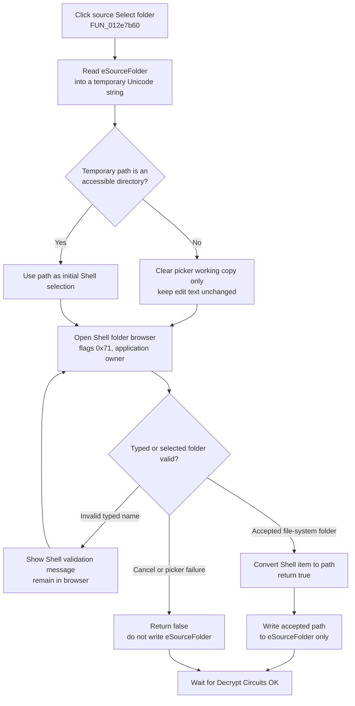

# Choose the circuit-decryption source folder

> Analysis status: Evidence-backed source review complete.

## Control

| Property | Recovered value |
| --- | --- |
| Form | DecryptCircuits |
| Component path | DecryptCircuits.bSourceFolder |
| Control class | TButton |
| Caption | Select folder |
| Handler name | bSourceFolderClick |
| Handler address | 012e7b60 |
| Graph node | `resource:dfm:DecryptCircuits/DecryptCircuits.bSourceFolder` |
| Handler node | `function:012e7b60` |
| Graph layer | UI |

The button is beside the **Source folder:** edit on the modal **Decrypt Circuits** form. The same form also has a target-folder picker, the **Target and source directory same** option, a target-file prefix, and standard OK and Cancel buttons.

## What happens when clicked

`TDecryptCircuits.bSourceFolderClick` reads the current `eSourceFolder` text into a temporary Unicode string and passes it by reference to the shared Shell folder picker. It uses option byte `0x2b`, no custom root, no custom prompt, and no explicit owner control.

The shared picker maps `0x2b` to Shell browse flags `0x71`:

- return file-system directories only;
- use the newer dialog style;
- show an edit box; and
- validate a typed folder name.

With no owner control, the picker uses the application main-window handle. Its initialization callback centers the dialog and sends the current valid source path as the initial selection. No custom root means the handler does not restrict browsing to the current source directory or to the TINA installation.

## Initial path and validation

`DecryptCircuits.FormShow` reads `ModelTest Settings/DE_SourceFolder` from `TINA.INI` and writes it to `eSourceFolder`. This stored value, or any text entered later by the user, is the next picker invocation's initial path.

Before the Shell dialog opens, the shared picker checks whether its temporary initial string identifies an accessible directory. If the check fails, it clears only that working copy. The folder browser then opens without that invalid initial selection. The control text is not cleared unless the browser returns an accepted replacement.

The Shell dialog validates typed names. Its callback shows the recovered validation message when the Shell reports a failed typed-name validation and keeps the browse operation from producing an accepted path on that attempt.

The button adds no application-specific path validation. It does not trim whitespace, change case, add or remove a trailing separator, resolve relative text, check for `.tsc` files, or test write access to the target folder. On acceptance, it copies the file-system path returned by the Shell picker into `eSourceFolder` exactly through the recovered Unicode control-text setter.

## Accepted and canceled results

- On an accepted Shell result, the picker converts the returned item identifier to a file-system path, updates the temporary string, and returns true. The handler then replaces `eSourceFolder` with that string.
- On Cancel, a null Shell item result, or picker initialization failure, the picker returns false. The handler does not call the text setter, so `eSourceFolder` keeps its prior text.
- The shared picker frees its Shell item identifiers and temporary helper objects on its normal return path.

This click changes only the edit control. It does not copy the path into the form's result field at `+0x720`, start circuit processing, or update `TINA.INI`.

## Selection flow

## Later OK use and persistence

`TDecryptCircuits.bOKClick` is the next staging boundary. It copies the source edit to result field `+0x720`, the target edit to `+0x728`, and the prefix to `+0x730`. If **Target and source directory same** is checked, it overwrites the target result with the source edit. This OK handler performs no path validation or normalization.

The outer command uses these fields only when the modal form returns result `1`. It:

1. counts and enumerates `*.tsc` files under the selected source folder;
2. opens each source circuit;
3. builds the target name from the selected target folder, prefix, and `.tsc` extension;
4. writes the decrypted circuit when the source open succeeds; and
5. stores the source folder, target folder, and prefix back to the three `DE_*` values in `TINA.INI` after the processing loop.

The outer loop supports cancellation through its progress form. It still reaches the settings writes after leaving that loop. Therefore, an accepted Decrypt Circuits dialog can persist the selected source path even when no `.tsc` file is found or when the progress operation stops early.

The form's standard Cancel path does not run `bOKClick`. The source edit remains dialog-local and the outer command skips processing and INI writes when the modal result is not `1`.

## Error and no-op behavior

- Canceling this folder picker is a no-op for the source edit and all result fields.
- An invalid current edit is removed only from the picker's working initial-selection string. Canceling afterward leaves the invalid edit text visible.
- Manual text entered in `eSourceFolder` can bypass the picker. The later OK handler does not verify that it exists or is a directory.
- A missing or empty source folder makes the downstream `*.tsc` enumeration yield no work in the recovered loop. No specific source-folder error message is present in that path, and the accepted values are still written to the INI file.
- If an individual circuit open returns null, the loop skips its decrypt/write work and continues progress accounting. This function shows no folder-specific recovery or rollback.
- The click handler has no local exception handler. The recovered normal cleanup is not evidence that Shell, allocation, or control-text exceptions are caught here.

## Recovered evidence

- [`FUN_012e7b60`](../../../DecompiledSources/Tina16/functions/00000000012E7B60__FUN_012e7b60.c) is `TDecryptCircuits.bSourceFolderClick`. It reads `eSourceFolder`, calls the shared picker with option `0x2b`, and writes the control only on true.
- [`FUN_00b96980`](../../../DecompiledSources/Tina16/functions/0000000000B96980__FUN_00b96980.c) is the shared Shell folder-picker wrapper. It checks the initial path, builds flags `0x71`, uses the application window, invokes the Shell browser, and converts an accepted item to a path. This handler preserves the edit on false because it skips the text setter. Clone Test Bench Bead `.170` owns the picker's canonical graph annotation.
- [`FUN_00440b00`](../../../DecompiledSources/Tina16/functions/0000000000440B00__FUN_00440b00.c) checks whether the initial picker string resolves to an accessible directory, including its recovered reparse-point branch.
- [`FUN_00b96eb0`](../../../DecompiledSources/Tina16/functions/0000000000B96EB0__FUN_00b96eb0.c) centers the Shell dialog, applies the initial selection, and handles typed-name validation failure.
- [`FUN_012e7c90`](../../../DecompiledSources/Tina16/functions/00000000012E7C90__FUN_012e7c90.c) loads `DE_SourceFolder`, `DE_TargetFolder`, and `DE_TargetPrefix` from `TINA.INI` when the form shows.
- [`FUN_012e7a40`](../../../DecompiledSources/Tina16/functions/00000000012E7A40__FUN_012e7a40.c) is the later OK staging handler. It copies the source, target, and prefix controls and applies the same-directory override.
- [`FUN_012e7bf0`](../../../DecompiledSources/Tina16/functions/00000000012E7BF0__FUN_012e7bf0.c) is the target-folder sibling. It uses the same picker configuration but reads and writes `eTargetFolder`; Bead `.414` owns that control.
- [`FUN_012f5900`](../../../DecompiledSources/Tina16/functions/00000000012F5900__FUN_012f5900.c) opens the modal form, gates work on result `1`, enumerates source `.tsc` files, writes accepted outputs, handles progress cancellation, and persists all three settings. Bead `.412` owns the accepted-processing annotations.
- [`ui-evidence.json`](../../../DecompiledSources/Tina16/resources/dfm/ui-evidence.json) supplies the form caption, source and target labels, same-directory option, prefix default `_m`, and standard button kinds.

## Analysis limits

The shared picker calls recovered Shell-shaped thunks rather than named imports in these sources. Its flags and callback behavior identify the standard Shell folder-browser contract, but the exact Windows function symbols are not retained. The outer circuit reader and writer are outside this control's direct call tree; they are used only to establish how the accepted source path is consumed. This Bead annotates only the unique source-folder handler. Bead `.170` owns the shared picker, `.412` owns accepted processing, and `.414` owns the parallel target-folder handler.
