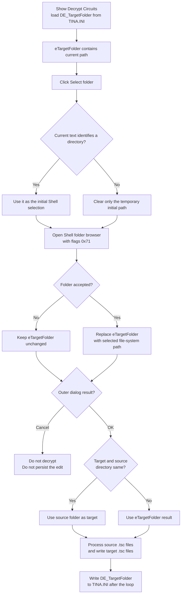

# Select the decrypted-circuit target folder

> Analysis status: Complete. The recovered handler, shared Shell folder browser, form initialization, OK handler, and accepted decryption command establish the path-selection and persistence boundaries.

## Control

| Property | Recovered value |
| --- | --- |
| Form | DecryptCircuits (`Decrypt Circuits`) |
| Component path | DecryptCircuits.bTargetFolder |
| Control class | TButton |
| Caption | Select folder |
| Hint | Not present in the recovered resource. |
| Handler name | bTargetFolderClick |
| Handler address | 012e7bf0 |
| Graph node | `resource:dfm:DecryptCircuits/DecryptCircuits.bTargetFolder` |
| Handler node | `function:012e7bf0` |
| Graph layer | UI |

## What happens when clicked

`FUN_012e7bf0` opens the shared Windows Shell folder browser for `eTargetFolder`. It first reads the edit's current text and passes that temporary UnicodeString to `FUN_00b96980` as the initial directory.

For this call, option value `0x2B` produces Shell browse flags `0x71`. The dialog returns file-system directories, uses the newer dialog style, includes an edit box, and validates a typed folder name. The call has no application-defined title or root and uses the application's main window as its owner. The option set does not suppress the Shell dialog's new-folder button.

If the user accepts a folder, the handler replaces `eTargetFolder.Text` with the returned file-system path. If the user cancels or the helper does not return a selected item identifier, the handler does not call the edit setter. The visible target path then stays unchanged.

## Initial path and accepted result

| Stage | Proven behavior |
| --- | --- |
| Restored value | `FUN_012e7c90` reads `ModelTest Settings / DE_TargetFolder` from `TINA.INI` when the form is shown and writes it to `eTargetFolder`. |
| Click input | The handler reads the current edit text. This includes a path that the user typed after the form was shown. |
| Initial-path check | The shared picker tests whether the temporary text identifies a directory. If it does not, the picker clears only the temporary initial value before it opens. |
| Accepted folder | The selected Shell item is converted to a file-system path and replaces the edit text. The handler does not add or remove a trailing separator and does not perform another normalization pass. |
| Browser cancel or failure | The temporary result is finalized. The current edit text is not changed. |

The handler does not create, decrypt, copy, or save a circuit file. The Shell dialog can offer its standard new-folder operation, but the click handler itself only changes the target-folder edit after acceptance.

## Later OK and output behavior

The button changes form-local UI state. `FUN_012e7a40`, the outer `bkOK` handler, later copies the source folder, target folder, and target prefix edits to form result fields `+0x720`, `+0x728`, and `+0x730`.

The `Target and source directory same` checkbox changes the target result at that boundary. If it is checked, OK replaces result field `+0x728` with the current source-folder text after it has copied the target edit. In that case, an accepted target-folder selection remains visible in `eTargetFolder`, but the accepted decryption command does not use it.

`FUN_012f5900` creates this dialog and continues only when its modal result is 1. It then reads source field `+0x720`, target field `+0x728`, and prefix field `+0x730`. It enumerates source `*.tsc` files, loads each circuit, builds an output path from the target folder and prefix, and writes the processed `.tsc` result there. The folder button itself does not start this work.

After the processing loop exits, the command writes all three result fields to `TINA.INI` under `ModelTest Settings`, including `DE_TargetFolder`. Outer Cancel skips the processing and these INI writes. Therefore, accepting a folder in the browser is not a persistence boundary.

## Selection and use flow

## Evidence

- [Target-folder handler `FUN_012e7bf0`](../../../DecompiledSources/Tina16/functions/00000000012E7BF0__FUN_012e7bf0.c) reads form field `+0x6C8`, calls the shared picker with option `0x2B`, writes the accepted string back to the same edit, and otherwise leaves it unchanged.
- [Shared folder picker `FUN_00b96980`](../../../DecompiledSources/Tina16/functions/0000000000B96980__FUN_00b96980.c) validates the initial directory, constructs the Shell browser record and flags, returns false for no selected item, and copies the accepted file-system path through the caller's string reference. TIARA-diz.6.7.170 owns its canonical annotation.
- [Folder-browser callback `FUN_00b96eb0`](../../../DecompiledSources/Tina16/functions/0000000000B96EB0__FUN_00b96eb0.c) centers the dialog, applies the initial selection, and handles typed-name validation failure.
- [Form-show handler `FUN_012e7c90`](../../../DecompiledSources/Tina16/functions/00000000012E7C90__FUN_012e7c90.c) reads `DE_SourceFolder`, `DE_TargetFolder`, and `DE_TargetPrefix` from `TINA.INI` into their edits.
- [Dialog OK handler `FUN_012e7a40`](../../../DecompiledSources/Tina16/functions/00000000012E7A40__FUN_012e7a40.c) copies those edits to result fields and overrides the target result with the source folder when the same-directory checkbox is checked. TIARA-diz.6.7.412 owns this accepted pipeline.
- [Decrypt Circuits command `FUN_012f5900`](../../../DecompiledSources/Tina16/functions/00000000012F5900__FUN_012f5900.c) consumes the result fields only after modal result 1, processes source `.tsc` files, writes target files, and then stores the three values in `TINA.INI`.
- The DFM places `eTargetFolder` and `bTargetFolder` on the `Target folder:` row. The handler's direct read and conditional write of the edit establishes the mapping; it does not rely only on coordinate proximity.

## Cancel, validation, and error boundaries

- An invalid initial path is cleared only in the picker's temporary string. Browser Cancel leaves the edit's original text visible.
- The Shell browser validates a typed folder name. The click handler has no separate empty-path, directory-existence, writability, or output-name check after selection.
- Browser Cancel does not close the outer form and does not change its modal result.
- Outer Cancel returns without running the decrypt command or updating `DE_TargetFolder` in `TINA.INI`. A later form show reloads the persisted value.
- The OK handler copies edit text without validating the target folder. Target path or write errors can therefore occur later during the accepted command's file processing.
- The click handler, Shell helper, and accepted command show no recovered application-level exception handler or rollback for an unexpected Shell, allocation, path, load, or write exception. An exception before the final INI calls can prevent the new path from being persisted.

## Analysis limits

- The Shell API roles are recovered from the browser record layout, flag values, callbacks, allocator use, and call signatures. The imported thunks do not retain their original API symbols.
- The browser helper does not separately test the recovered path-conversion thunk's return value. The accepted path is expected to be a file-system directory because the folder browser uses the return-file-system-directories flag.
- The recovered code proves when target processing and INI writes are attempted. It does not expose the exact operating-system error presentation for every invalid or unwritable target path.
