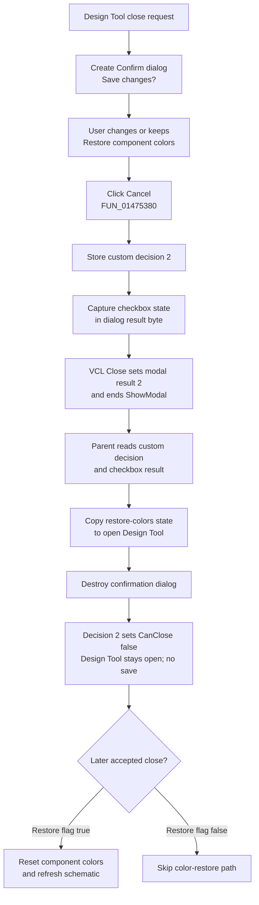

# Cancel the Design Tool close request

> Analysis status: Evidence-backed source review complete.

## Control

| Property | Recovered value |
| --- | --- |
| Form | DesignToolConfDlg |
| Form caption | Confirm |
| Prompt | Save changes? |
| Component path | DesignToolConfDlg.bCancel |
| Control class | TBitBtn |
| Caption | Cancel |
| Hint | Not present in the recovered resource. |
| Glyph | None |
| Handler name | bCancelClick |
| Handler address | 01475380 |
| Graph node | `resource:dfm:DesignToolConfDlg/DesignToolConfDlg.bCancel` |
| Handler node | `function:01475380` |
| Graph layer | UI |

The prompt also contains a checked-by-default **Restore component colors** checkbox and the sibling **Yes** and **No** buttons. The Cancel button has no recovered `Kind` or DFM `ModalResult`; its handler implements the result protocol.

## What happens when clicked

`TDesignToolConfDlg.bCancelClick` performs three operations in this order:

1. It writes `2` to the confirmation form's private decision field at `+0x6dc`.
2. It reads the current **Restore component colors** checked state and stores it in the form's private result byte at `+0x6d8`.
3. It calls the shared VCL form-close routine.

The close routine sees that the confirmation form is modal and sets the VCL modal result to `2`, the Delphi `mrCancel` value. This ends `ShowModal`. The handler does not save the Design Tool, discard its edits, restore colors, or destroy either form directly.

The confirmation uses two result channels. The VCL modal result only ends the modal session. The private field at `+0x6dc` tells the caller which custom button was selected: Cancel writes `2`, Yes writes `6`, and No writes `7`. The parent close-query handler ignores the returned `ShowModal` value and reads this private field instead.

## Parent close decision

`TfrmDesignTool.FormCloseQuery` creates a new confirmation form for each close attempt and shows it modally. After it returns, the caller performs these steps before it branches on the custom decision:

1. Read decision field `+0x6dc`.
2. Copy result byte `+0x6d8` to the Design Tool field at `+0xba0`.
3. Destroy the confirmation form.

For Cancel decision `2`, the caller sets its `CanClose` output to false. It does not call the Design Tool save routine. The outer Design Tool therefore stays open with its existing edits and owned objects. The confirmation form is released.

The sibling decisions use the same caller:

- Yes decision `6` calls the Design Tool save routine. `CanClose` becomes true only when that routine succeeds.
- No decision `7` sets `CanClose` to true without saving.

This confirmation form does not own a staged copy of the Design Tool content. It owns only the custom decision and captured checkbox state. The open `frmDesignTool` remains the owner of its edited title, parameter grid, interpreter text, and related configuration when Cancel rejects the close.

## Restore-colors state survives Cancel

The caller copies **Restore component colors** before it tests the Cancel result. This is a side effect that survives the rejected close attempt. For example, clearing the checkbox and then clicking Cancel writes false to `frmDesignTool +0xba0` even though the Design Tool remains open.

The outer form initializes this field to true. When a later close is accepted, `TfrmDesignTool.FormClose` tests the current field. If it is true, it invokes the recovered component-reset loop and requests a schematic refresh before setting the close action to release the form. If it is false, it skips that restore path.

Each close attempt constructs a new confirmation form whose DFM checkbox default is checked. The previous confirmation instance is not reused. A later Yes, No, or Cancel click captures the new instance's current checkbox state and can overwrite the state saved by an earlier canceled attempt.

## Window close, repeated use, and errors

`TDesignToolConfDlg.FormCreate` initializes the private decision to `2`. Closing the prompt through its window close control without clicking a button therefore follows the parent's Cancel branch. That path does not run `bCancelClick`, so it does not explicitly copy the checked state into private byte `+0x6d8`; the recovered allocation and create path do not establish that this byte mirrors the DFM default. The caller still copies the byte before rejecting the outer close.

After a Cancel click ends the modal session, the caller destroys that confirmation instance. The same instance cannot receive a normal repeated click. A later Design Tool close attempt creates a new instance.

The handler has no guard, validation, error message, catch, or rollback. It stores the private decision and checkbox result before it calls the VCL close routine. An exception from the checkbox getter or close pipeline can propagate. The parent close-query path also has no recovered `finally` around the confirmation instance, so an exception before its explicit destruction can bypass normal cleanup. No persistent file, registry value, or document data is written by Cancel itself.

## Cancel flow

## Evidence

- [Cancel handler `FUN_01475380`](../../../DecompiledSources/Tina16/functions/0000000001475380__FUN_01475380.c) writes custom result `2`, reads the checkbox through its checked-state getter, stores the result byte, and calls the shared VCL close routine.
- [Yes handler `FUN_01475300`](../../../DecompiledSources/Tina16/functions/0000000001475300__FUN_01475300.c) and [No handler `FUN_01475340`](../../../DecompiledSources/Tina16/functions/0000000001475340__FUN_01475340.c) prove the same protocol with custom results `6` and `7`.
- [Confirmation FormCreate `FUN_014753c0`](../../../DecompiledSources/Tina16/functions/00000000014753C0__FUN_014753c0.c) initializes the custom result to `2`, which establishes the window-close fallback.
- [VCL form close `FUN_00805200`](../../../DecompiledSources/Tina16/functions/0000000000805200__FUN_00805200.c) writes modal result `2` for a modal form. Bead `.65` owns its canonical Delphi VCL annotation.
- [Design Tool close-query handler `FUN_01498be0`](../../../DecompiledSources/Tina16/functions/0000000001498BE0__FUN_01498be0.c) creates and shows the prompt, reads both private results, copies the checkbox state before destroying the prompt, rejects custom result `2`, saves for `6`, and accepts without saving for `7`.
- [Design Tool save routine `FUN_01498190`](../../../DecompiledSources/Tina16/functions/0000000001498190__FUN_01498190.c) is called only for the Yes branch and returns the success value used as `CanClose`.
- [Design Tool FormCreate `FUN_01494080`](../../../DecompiledSources/Tina16/functions/0000000001494080__FUN_01494080.c) initializes restore-colors field `+0xba0` to true.
- [Design Tool FormClose `FUN_014970f0`](../../../DecompiledSources/Tina16/functions/00000000014970F0__FUN_014970f0.c) tests that field, calls the component-reset and schematic-refresh path when true, and requests form release.
- [Component-reset loop `FUN_01497e80`](../../../DecompiledSources/Tina16/functions/0000000001497E80__FUN_01497e80.c) iterates Design Tool component pairs and applies the recovered reset operation to each present object.
- [Recovered UI evidence](../../../DecompiledSources/Tina16/resources/dfm/ui-evidence.json) supplies the **Confirm**, **Save changes?**, **Restore component colors**, **Yes**, **No**, and **Cancel** text, the checkbox default, and all three click bindings. Cancel has no hint, glyph, `Kind`, or DFM `ModalResult`.

## Ownership and limits

- This Bead owns the canonical annotations for `FUN_01475380` and parent coordinator `FUN_01498be0`.
- Beads `.416` and `.417` own the unique No and Yes handlers. They cite the parent coordinator without duplicating its annotation. Bead `.65` owns the shared VCL close routine.
- The recovered code establishes the custom result values from the three sibling handlers and the matching caller branches. It does not recover an original Delphi enum name for field `+0x6dc`.
- The label and later FormClose consumer establish the purpose of the copied checkbox byte. The exact original names of the outer fields and component-reset helpers are not recovered.
