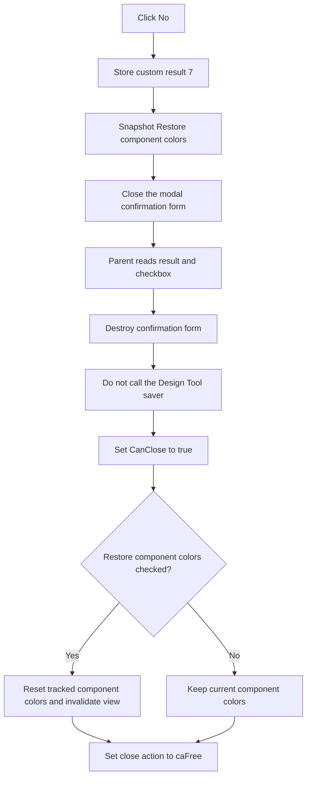

# Close the Design Tool without saving changes

> Analysis status: Evidence-backed source review complete.

## Control

| Property | Recovered value |
| --- | --- |
| Form | DesignToolConfDlg |
| Form caption | Confirm |
| Prompt | Save changes? |
| Component path | DesignToolConfDlg.bNo |
| Control class | TBitBtn |
| Caption | No |
| Kind | Not set in the recovered resource. |
| ModalResult | Not set in the recovered resource. |
| Handler name | bNoClick |
| Handler address | 01475340 |
| Graph node | `resource:dfm:DesignToolConfDlg/DesignToolConfDlg.bNo` |
| Handler node | `function:01475340` |
| Graph layer | UI |

## What happens when clicked

**No** accepts the pending close of `frmDesignTool` without saving its current changes. It does not mean Cancel, and it does not call the Design Tool save routine.

`FUN_01475340` performs three operations in order:

1. It writes custom confirmation value `7` to dialog field `+0x6dc`.
2. It reads the checked state of **Restore component colors** from checkbox field `+0x6b0` and stores the Boolean at dialog field `+0x6d8`.
3. It calls the shared VCL form-close routine.

The numbers match Delphi's `mrNo` value `7`, but `+0x6dc` is an application-owned result field. It is not the form's standard `ModalResult` property.

## Modal close and result transfer

The button has no DFM `Kind` or `ModalResult`. The close routine detects that this form is running modally and sets the real VCL modal result to `2`, which ends `ShowModal`. The parent close-query handler ignores that `ShowModal` return value. After the modal call returns, it reads custom field `+0x6dc` to distinguish the three buttons:

| Custom result | Button | Parent action |
| --- | --- | --- |
| `2` | Cancel | Set `CanClose` to false. Keep the Design Tool open. |
| `6` | Yes | Call the save routine. Set `CanClose` from the save result. |
| `7` | No | Set `CanClose` to true without calling the save routine. |

The confirmation form's `OnCreate` handler initializes `+0x6dc` to `2`. Closing the prompt through the window frame without pressing a button therefore has Cancel semantics rather than No semantics.

## Staged choice and commit boundaries

The confirmation dialog does not own the Design Tool document. Its two outputs are the custom result and the restore-colors checkbox state.

After `ShowModal` returns, `frmDesignTool.OnCloseQuery`:

1. reads custom result `+0x6dc`;
2. copies checkbox snapshot `+0x6d8` to Design Tool field `+0xba0`;
3. destroys the confirmation dialog; and
4. applies the result branch.

The checkbox copy happens before the result branch. Thus, clicking **No** preserves the current **Restore component colors** selection for the accepted close. The same copy also occurs after Yes or Cancel.

For **No**, the parent writes true to its `CanClose` output immediately. It does not call `FUN_01498190`, the save operation used by Yes. Unsaved Design Tool content is therefore not serialized before the close is accepted.

## Close cleanup and restore-colors effect

After the accepted close, `frmDesignTool.OnClose` reads field `+0xba0`:

- If it is true, the close path iterates the tracked design items and calls the recovered component-specific color reset paths with value `0`. It then invalidates the related global view.
- If it is false, that color-reset and view-invalidation branch is skipped.
- The close handler then sets the VCL close action to `2`, which is `caFree`, so the Design Tool form is released.

This restore operation is an immediate close-time cleanup choice. The No handler does not write a settings store, file, registry key, or document field to persist it for a later Design Tool session.

## Contrast with Yes and Cancel

- **Yes** stores custom result `6`, snapshots the same checkbox, and closes the prompt. The parent then calls the save routine. A failed save keeps the Design Tool open.
- **No** stores custom result `7`, snapshots the checkbox, and closes the prompt. The parent accepts close without a save attempt.
- **Cancel** stores custom result `2`, snapshots the checkbox, and closes the prompt. The parent rejects the Design Tool close, so no close-time color restoration or form release runs during that attempt.

The three button handlers share the checkbox snapshot and VCL Close call. Their custom result values cause the different parent behavior.

## No-op and error paths

- The No handler has no prompt, validation, unchanged-state guard, result test, retry, or local exception handler.
- The handler writes result `7` and the checkbox snapshot before it asks VCL to close. If inherited close processing refuses the close or raises an exception, those dialog fields remain changed and the caller has not yet received them.
- The recovered confirmation form has no application `OnCloseQuery` event. Under normal modal use, the VCL Close call ends the prompt.
- The parent destroys the prompt before it acts on result `7`. No-handler cleanup therefore does not depend on the later Design Tool close.
- Result `7` has no save-failure path because it does not call the saver. Exceptions in prompt construction, modal processing, checkbox access, form close, parent copy, dialog destruction, color restoration, or form cleanup have no local rollback in the recovered paths.
- The No handler does not directly free either form, restore colors, invalidate the view, update `CanClose`, or delete document data. Those effects occur in the parent close-query and close handlers.

## No-button flow

## Handler and caller evidence

- No result, checkbox snapshot, and close call: [FUN_01475340](../../../DecompiledSources/Tina16/functions/0000000001475340__FUN_01475340.c)
- Default custom Cancel result: [FUN_014753c0](../../../DecompiledSources/Tina16/functions/00000000014753C0__FUN_014753c0.c)
- Parent prompt, result transfer, save bypass, and `CanClose` branch: [FUN_01498be0](../../../DecompiledSources/Tina16/functions/0000000001498BE0__FUN_01498be0.c)
- Yes and Cancel handler contrast: [FUN_01475300](../../../DecompiledSources/Tina16/functions/0000000001475300__FUN_01475300.c) and [FUN_01475380](../../../DecompiledSources/Tina16/functions/0000000001475380__FUN_01475380.c)
- Shared VCL form-close behavior: [FUN_00805200](../../../DecompiledSources/Tina16/functions/0000000000805200__FUN_00805200.c)
- Yes-only save operation: [FUN_01498190](../../../DecompiledSources/Tina16/functions/0000000001498190__FUN_01498190.c)
- Design Tool close and restore-colors guard: [FUN_014970f0](../../../DecompiledSources/Tina16/functions/00000000014970F0__FUN_014970f0.c)
- Tracked-item color reset: [FUN_01497e80](../../../DecompiledSources/Tina16/functions/0000000001497E80__FUN_01497e80.c)
- View invalidation wrapper: [FUN_01ca2aa0](../../../DecompiledSources/Tina16/functions/0000000001CA2AA0__FUN_01ca2aa0.c)
- [Cancel](bcancel-050b6931fc.md) owns the parent close-query coordinator annotation.
- [Yes](byes-fd9171fd64.md) owns the Yes-specific handler behavior.
- Recovered form and control resources: [ui-evidence.json](../../../DecompiledSources/Tina16/resources/dfm/ui-evidence.json)

## Resource and annotation limits

- The captions **Save changes?**, **No**, and **Restore component colors** agree with the handler, parent result branch, and close-time consumer. The captions alone are not the basis for the behavior.
- The checkbox is checked in the recovered DFM by default. The handler always reads its live state, so the user can clear it before choosing No.
- The recovered color-reset callees have no Delphi symbols. Their iteration, zero-valued setter calls, and the checkbox caption establish the close-time reset role. This article does not invent component class names or original color values.
- Bead `.415` owns parent coordinator `FUN_01498be0`. The generic VCL Close helper is already owned elsewhere. This Bead owns only unique No handler `FUN_01475340`; the parent, Yes, Cancel, save, color reset, invalidation, and cleanup functions remain evidence only.
