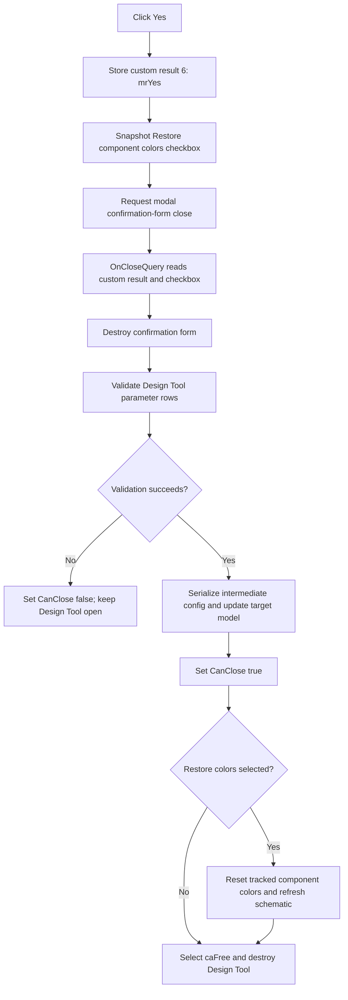

# Choose Yes for the Design Tool save-on-close prompt

> Analysis status: Reviewed from the Yes, No, and Cancel handlers, confirmation-form creation, modal close helper, `frmDesignTool.OnCloseQuery` caller, shared save path, Design Tool close and destroy paths, and DFM resources.

## Control

| Property | Recovered value |
| --- | --- |
| Form | DesignToolConfDlg |
| Component path | DesignToolConfDlg.bYes |
| Control class | TBitBtn |
| Caption | Yes |
| Hint | Not present in the recovered resource. |
| Size | 75 by 25 |
| Handler name | bYesClick |
| Handler address | 01475300 |
| Graph node | `resource:dfm:DesignToolConfDlg/DesignToolConfDlg.bYes` |
| Handler node | `function:01475300` |
| Graph layer | UI |

## Direct handler effect

[`FUN_01475300`](../../../DecompiledSources/Tina16/functions/0000000001475300__FUN_01475300.c) performs three operations in order:

1. It writes `6` to confirmation-form field `+0x6DC`. Delphi defines this value as `mrYes`.
2. It reads the checked state of `cbRestoreColor` and stores the Boolean value at form field `+0x6D8`.
3. It calls the [canonical VCL form-close helper](../../../DecompiledSources/Tina16/functions/0000000000805200__FUN_00805200.c).

The handler does not validate, serialize, save, restore colors, or mutate the Design Tool configuration. Its output is the staged Yes choice plus the staged checkbox value.

The close helper sees that this is a modal form and writes `2` to the framework modal-result field to end the modal loop. That framework value is not the user's Yes choice. The caller ignores the `ShowModal` return value and reads the separate custom field `+0x6DC`, which preserves `6`.

## Caller action after Yes

[`FUN_01498be0`](../../../DecompiledSources/Tina16/functions/0000000001498BE0__FUN_01498be0.c) is `frmDesignTool.OnCloseQuery`. It creates `TDesignToolConfDlg`, whose form caption is **Confirm** and whose label asks **Save changes?**. After the modal call returns, the coordinator:

- reads the custom result from `+0x6DC`;
- copies checkbox snapshot `+0x6D8` to Design Tool field `+0xBA0`;
- destroys the confirmation form; and
- branches on the copied custom result.

For `mrYes`, it calls [`FUN_01498190`](../../../DecompiledSources/Tina16/functions/0000000001498190__FUN_01498190.c), the shared Design Tool save routine. It writes the save routine's Boolean result to the `CanClose` output:

- save success sets `CanClose` to true; and
- save failure sets `CanClose` to false, so the Design Tool remains open.

The sibling [No](bno-6c838e93d8.md) result is `7` (`mrNo`) and allows close without calling the save routine. [Cancel](bcancel-050b6931fc.md) and the confirmation form's initial result are `2` (`mrCancel`) and veto the Design Tool close.

## Save and mutation boundary

The shared save routine first calls [`FUN_01497210`](../../../DecompiledSources/Tina16/functions/0000000001497210__FUN_01497210.c). This validation walks the Design Tool parameter rows and rejects proven cases that include invalid or duplicate parameter names, invalid values, empty minimum or maximum expressions, and invalid expressions. It reports the error through the Design Tool error path and returns false.

Only after validation succeeds does `FUN_01498190` change the target Design Tool configuration. The recovered path:

- obtains the target configuration object and stores it at Design Tool field `+0xBB0`;
- builds an intermediate path ending in `temp.txt`;
- calls [`FUN_010cd780`](../../../DecompiledSources/Tina16/functions/00000000010CD780__FUN_010cd780.c) to write the current Design Tool data to that file; when mode field `+0xC08` is zero, this helper also appends the recovered numerical-format, math, and drawing configuration sections;
- reloads the intermediate content and assigns it to the target configuration object;
- calls [`FUN_014979d0`](../../../DecompiledSources/Tina16/functions/00000000014979D0__FUN_014979d0.c) to clear and repopulate the target parameter and comment lists from the current grid rows; and
- copies the current title edit text to the target title field.

This is the configuration mutation and file-write boundary. The Yes handler itself does not perform it. The recovered save function destroys its temporary in-memory object, but it has no explicit delete call for the intermediate `temp.txt` path.

## Restore component colors and cleanup

The DFM gives `cbRestoreColor` the caption **Restore component colors** and makes it checked by default. `FUN_01475300` snapshots its current state even before the save result is known.

If the save succeeds, the close query permits the Design Tool to close. [`FUN_014970f0`](../../../DecompiledSources/Tina16/functions/00000000014970F0__FUN_014970f0.c), the Design Tool close handler, tests field `+0xBA0`:

- when checked, it calls [`FUN_01497e80`](../../../DecompiledSources/Tina16/functions/0000000001497E80__FUN_01497e80.c) to reset colors on the tracked component objects and then refreshes the schematic; and
- when unchecked, it skips those two operations.

The close handler then selects close action `2`, recovered as `caFree`. The Design Tool destroy path releases its owned objects and clears its global instance state. A failed save does not reach this close or destroy path because `CanClose` is false.

## Click flow

## No-op, retry, and error behavior

- The Yes handler has no conditional branch and no local failure return. It always stages `mrYes`, snapshots the checkbox, and requests modal close.
- No confirmation-form close-query handler is bound in the DFM, so the recovered modal close path has no form-specific veto.
- Validation and save occur only in the parent Design Tool close-query handler, after the confirmation object is destroyed.
- A validation failure reports an error, returns false, and leaves the Design Tool open. The recovered path does not apply the later target-object updates in that case.
- The checkbox snapshot is copied to Design Tool field `+0xBA0` before validation. On a failed save, the field changes but color restoration does not run because the main form does not close.
- A later close attempt creates a new confirmation form. Its DFM default makes **Restore component colors** checked again.
- Unexpected exceptions have no local catch or rollback in the Yes handler or the recovered save coordinator.

## Resource and ownership evidence

- The form is captioned **Confirm** and the nearby label is **Save changes?**. The handler and parent result dispatch prove that Yes means save before close; the label alone was not used as proof.
- The Yes button has no `Kind`, `ModalResult`, default-button flag, hint, action, image reference, or extracted glyph. The handler explicitly supplies the result.
- `TIARA-diz.6.7.415` owns the shared parent close-query coordinator `FUN_01498be0`.
- `TIARA-diz.6.7.416` owns the sibling No handler. The shared save routine also serves `frmDesignTool.bSaveClick`, so it remains evidence-only for this Bead.
- `FUN_00805200` is core-owned. This Bead annotates only the unique Yes handler `FUN_01475300`.

## Analysis limits

- The original Delphi names of custom fields `+0x6D8`, `+0x6DC`, `+0xBA0`, and `+0xBB0` are not recovered.
- The source proves an intermediate file path ending in `temp.txt`, but it does not expose a user-facing name for that file in this flow.
- The recovered Yes path does not prove an undo transaction for target changes after the save routine starts.
