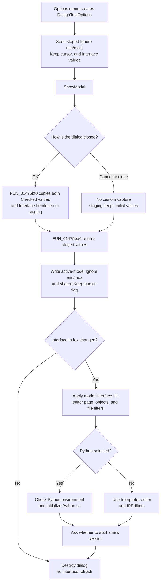

# Accept Design Tool options

> Analysis status: Reviewed from the recovered option handler, staging helpers, modal caller, settings consumers, and persistence paths.

## Control

| Property | Recovered value |
| --- | --- |
| Form | DesignToolOptions |
| Form caption | Options |
| Component path | DesignToolOptions.bOK |
| Control class | TBitBtn |
| Button kind | bkOK |
| Handler name | bOKClick |
| Handler address | 01475bf0 |
| Graph node | `resource:dfm:DesignToolOptions/DesignToolOptions.bOK` |
| Handler node | `function:01475bf0` |
| Graph layer | UI |

## What happens when clicked

The click commits three controls to dialog staging fields. It does not directly run the Design Tool, save a file, or write `TINA.INI`.

| Control | Value captured by `FUN_01475bf0` | Caller destination and effect |
| --- | --- | --- |
| `cbEnableModMinMax`, caption **Ignore min max values** | `Checked` to form byte `+0x6e0` | Active Design Tool model byte `+0x28`. When clear, later run and command paths call the min/max correction routine. When set, they skip it. |
| `cbKeepCursorPosition`, caption **Keep cursor position after run** | `Checked` to form field `+0x6e8` | Shared Keep-cursor flag at `PTR_DAT_02004808`. Later run-completion paths use it to restore or reposition the cursor. |
| `rgInterface`, caption **Interface**, items **Interpreter** and **Python** | Raw `ItemIndex` to form integer `+0x6e4` | Index 0 selects Interpreter behavior; index 1 selects Python behavior. A changed index invokes the interface apply and refresh path. |

The handler reads both checkboxes through their virtual `Checked` getters, reads the radio group's item-index field at control offset `+0x4a8`, stores the three values, and returns. It has no branch, range check, message, returned-error test, or direct persistence call.

## Staging and modal copy-back

The Options menu handler [`FUN_01499560`](../../../DecompiledSources/Tina16/functions/0000000001499560__FUN_01499560.c) creates the dialog and initializes its staged values through [`FUN_01475b20`](../../../DecompiledSources/Tina16/functions/0000000001475B20__FUN_01475b20.c):

- Keep cursor position comes from the shared global flag.
- Ignore min/max comes from byte `+0x28` of the active Design Tool model object.
- Interface is initialized to Python when either the current design model's interface bit is set or the active source name contains the Unicode suffix `.py`; otherwise it is Interpreter.

The initializer copies those values to staging fields and then sets the two checkboxes and the radio-group index. `FormCreate` only assigns help context `0x4a9`; it does not replace these option values.

The caller invokes `ShowModal`, but it does not test the returned modal result. It always calls [`FUN_01475ba0`](../../../DecompiledSources/Tina16/functions/0000000001475BA0__FUN_01475ba0.c), which copies the three staged fields to the caller destinations. This is safe for the normal Cancel path because only `bOKClick` copies the live controls back into the staged fields.

## Interface apply and refresh

The caller compares the returned interface index with the initial index. Only a changed value calls [`FUN_01499620`](../../../DecompiledSources/Tina16/functions/0000000001499620__FUN_01499620.c) with its session-reset flag set.

For index 1, the apply path:

- sets the current design model's interface bit;
- selects the Python editor page and Python-specific editor object;
- changes both open and save filters to `Python file|*.py`;
- refreshes the relevant editor and output controls;
- checks and initializes the configured Python environment, recording whether initialization succeeded;
- adds the Python prompt to the output area.

For index 0, it clears the model interface bit, selects the Interpreter page and editor, and changes both file filters to `Interpreter file (*.IPR)|*.IPR`.

After either branch, a real interface change calls [`FUN_01497120`](../../../DecompiledSources/Tina16/functions/0000000001497120__FUN_01497120.c). That function asks whether to start a new session and clears the current session only when the user confirms. Declining this later prompt does not roll back the already applied interface, editor, or filter changes.

## Validation and later option consumers

The OK handler performs no validation. Normal DFM initialization supplies radio indexes 0 or 1, but the handler accepts the raw index without checking it. The downstream apply helper treats exactly 1 as Python and every other value as the Interpreter UI branch; its lower-level model-bit helper changes the bit only for values 0 and 1. A programmatically invalid index can therefore produce inconsistent staged and display state, although the normal two-item radio group does not generate that value.

The **Ignore min max values** option controls later validation rather than this dialog. When the flag is clear, [`FUN_01499d20`](../../../DecompiledSources/Tina16/functions/0000000001499D20__FUN_01499d20.c) scans Design Tool grid rows, derives current minimum and maximum strings, replaces mismatching Min and Max cells, and reports that it changed them. Several run and command paths call this routine only when model byte `+0x28` is clear. When the option is checked, those paths skip the correction and continue with the entered values.

The **Keep cursor position after run** flag is read after Design Tool execution. [`FUN_01495d80`](../../../DecompiledSources/Tina16/functions/0000000001495D80__FUN_01495d80.c) calls its cursor restoration and centering path only when the flag is set. The parallel execution path selects between a reset helper and [`FUN_017f2b70`](../../../DecompiledSources/Tina16/functions/00000000017F2B70__FUN_017f2b70.c), which restores and centers the prior cursor position.

## Click and commit flow

## Cancel contrast

`bCancel` is a built-in `bkCancel` button with no application click handler. It returns the normal Cancel modal result. The caller ignores that number, but the staging boundary preserves Cancel behavior: checkbox and radio changes remain only in the controls, while the staged fields keep their initial values. The unconditional copy-back therefore rewrites the same values and does not call the interface refresh because the interface index compares equal.

The same result applies to a normal form close that does not run `bOKClick`. The form has no recovered `OnCloseQuery` or custom close event.

## Persistence boundaries

- Keep cursor position is loaded from `TINA.INI` by [`FUN_017e1500`](../../../DecompiledSources/Tina16/functions/00000000017E1500__FUN_017e1500.c), under section `designtool` and key `Keep cursor pos after run`. The general settings writer [`FUN_01c85f70`](../../../DecompiledSources/Tina16/functions/0000000001C85F70__FUN_01c85f70.c) saves the shared flag later. The OK path itself does not call that writer.
- The interface bit is part of the Design Tool design document. The recovered document writer stores it as `interface`, and the reader restores it through the same bit setter. The Options caller changes the live model; normal later document saving persists it.
- Ignore min/max is written to active model byte `+0x28` and immediately affects later validation gates. No serializer, file writer, or settings writer is called by this click path, and a persistent field name for this byte is not recovered.

## Error and partial-state behavior

- The handler has no local exception guard. If a virtual checkbox getter fails, earlier staged assignments can remain while later ones are not performed. No caller-owned setting changes until `ShowModal` returns and the extractor runs.
- The copy-back writes the active-model Ignore flag and shared Keep-cursor flag before any interface refresh. The interface apply helper then changes model and UI state in sequence and has no transaction or rollback. A later Python initialization, UI, allocation, or session-reset failure can leave earlier changes applied.
- Python environment initialization returns a success flag to the form state, but it does not veto dialog acceptance or restore the Interpreter selection.
- The handler does not validate min/max values. Checking Ignore min max deliberately bypasses the later correction routine; it does not erase existing Min or Max cells.

## Evidence

- Click handler: [FUN_01475bf0](../../../DecompiledSources/Tina16/functions/0000000001475BF0__FUN_01475bf0.c)
- Staging initializer: [FUN_01475b20](../../../DecompiledSources/Tina16/functions/0000000001475B20__FUN_01475b20.c)
- Staging extractor: [FUN_01475ba0](../../../DecompiledSources/Tina16/functions/0000000001475BA0__FUN_01475ba0.c)
- Options menu caller: [FUN_01499560](../../../DecompiledSources/Tina16/functions/0000000001499560__FUN_01499560.c)
- Interface apply and refresh: [FUN_01499620](../../../DecompiledSources/Tina16/functions/0000000001499620__FUN_01499620.c)
- Recovered resources: [ui-evidence.json](../../../DecompiledSources/Tina16/resources/dfm/ui-evidence.json)

The DFM supplies the form and option captions, the two Interface items, the built-in OK and Cancel kinds, and the handler binding. The OK button has no custom caption, hint, action, image-list reference, or extracted glyph. `NumGlyphs = 2` belongs to the standard `bkOK` presentation and does not add application-specific evidence.

## Analysis limits

- The original Delphi field and type names for the active model byte `+0x28`, staged fields, and shared global flag are not recovered. Their roles are established by control captions, initialization, copy-back, persistence strings, and downstream branch behavior.
- The interface selection changes editing and execution context. The OK handler does not itself execute Interpreter or Python code.
- The nearby `DesignToolConfDlg` Yes, No, and Cancel controls use separate handlers and a separate decision result. They do not share this Options staging or copy-back path.
