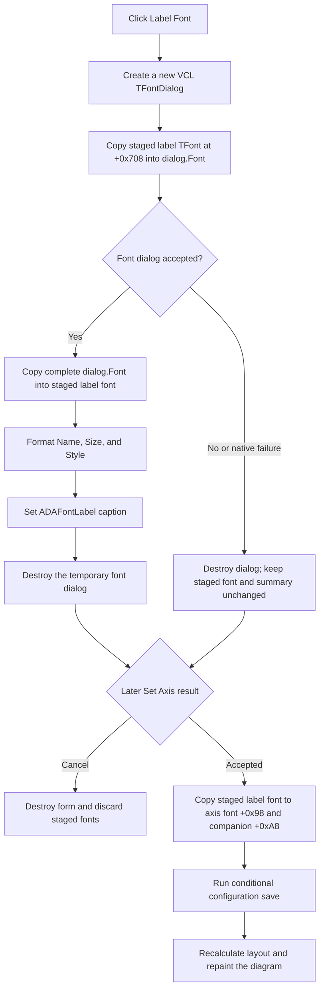

# Edit the axis-label font

> Analysis status: Reviewed against the recovered resource, handler, VCL font-dialog path, font-summary formatter, form lifecycle, and caller commit path.

## Control

| Property | Recovered value |
| --- | --- |
| Form | DFAxisCnf2Dlg (`Set Axis`) |
| Component path | DFAxisCnf2Dlg.ADFontGB.ADFontBtn |
| Parent group | `Texts` |
| Control class | TBitBtn |
| Caption | Label Font |
| Hint | Not present in the recovered resource. |
| Action or built-in kind | Not present in the recovered resource. |
| Glyph or image | Not present in the recovered resource. |
| Handler name | ADFontBtnClick |
| Handler address | 00f0d310 |
| Graph node | `resource:dfm:DFAxisCnf2Dlg/DFAxisCnf2Dlg.ADFontGB.ADFontBtn` |
| Handler node | `function:00f0d310` |
| Graph layer | UI |

## What happens when clicked

The button edits the staged font for the axis label or caption. It does not edit the separate tick-label font and it does not update the plotted axis immediately.

[FUN_00f0d310](../../../DecompiledSources/Tina16/functions/0000000000F0D310__FUN_00f0d310.c) creates a new VCL `TFontDialog` through [FUN_00725300](../../../DecompiledSources/Tina16/functions/0000000000725300__FUN_00725300.c). Before the dialog opens, the handler assigns the form-owned label font at offset `+0x708` to `TFontDialog.Font`. This makes the dialog start with the current staged label font, including its current name, size, style, color, and charset.

The handler then runs the modal font dialog:

- If the dialog returns false, the handler destroys it and leaves the staged label font and its summary text unchanged. The native common-dialog path also returns false for a native dialog failure, so this handler cannot distinguish that failure from user cancellation.
- If the dialog returns true, the handler assigns the complete accepted `TFontDialog.Font` back to the staged label font at `+0x708`. It then calls [FUN_00f05050](../../../DecompiledSources/Tina16/functions/0000000000F05050__FUN_00f05050.c) and writes the result to `ADAFontLabel` at form offset `+0x6D0`.

The adjacent `Ticks Font` button uses the paired staged font at `+0x710` and the `ADNFontLabel` summary at `+0x700`. This label-font handler does not modify either tick-font field.

## Click and commit flow

## Font properties

The handler uses whole-object `TFont` assignments in both directions. The recovered native font-dialog success path [FUN_007255d0](../../../DecompiledSources/Tina16/functions/00000000007255D0__FUN_007255d0.c) and its font updater [FUN_00725920](../../../DecompiledSources/Tina16/functions/0000000000725920__FUN_00725920.c) explicitly update these fields in the dialog font:

- face name;
- height, from which the point size is calculated;
- bold, italic, underline, and strikeout style bits;
- charset when the native charset control reports a change;
- color when the native color control reports a change.

The dialog constructor sets the Delphi `TFontDialog.Options` bitset to numeric value `4`, the `fdEffects` option. This permits the standard color and font-effect controls. Properties that the dialog does not change stay in the seeded font and pass through the complete `TFont` assignment.

The handler does not set a custom dialog title, minimum or maximum font size, or restricted font list. It uses the constructor and native dialog defaults for those values.

The summary formatter shows only `Name`, `Size`, and `Style`. It emits `Style: Normal` when no style bit is set. Otherwise, it lists `Bold`, `Italic`, `UnderLine`, and `StrikeOut` as applicable. It does not show color, charset, pitch, quality, or orientation. The DFM text `Name: Arial  Size: 12  Style: Normal` is only the design-time caption; the caller replaces it with a summary of the current axis font before the Set Axis dialog is shown.

## Staging, outer Cancel, and final commit

[FUN_00f0d510](../../../DecompiledSources/Tina16/functions/0000000000F0D510__FUN_00f0d510.c) creates two private `TFont` objects when `DFAxisCnf2Dlg` is created. [FUN_00f0d560](../../../DecompiledSources/Tina16/functions/0000000000F0D560__FUN_00f0d560.c) destroys them with the form. The caller [FUN_01ad4310](../../../DecompiledSources/Tina16/functions/0000000001AD4310__FUN_01ad4310.c) copies the current axis label font at axis offset `+0x98` into the staged font at form offset `+0x708` and copies the tick font at axis offset `+0xA0` into the staged font at form offset `+0x710` before it shows the outer Set Axis dialog.

The outer dialog has built-in `OK` and `Cancel` buttons. The caller treats modal result `2` as Cancel. On that path it destroys the form without copying either staged font back, so an accepted inner font choice is still discarded by outer Cancel.

For an outer result other than `2`, the caller copies the staged label font into axis field `+0x98`. It also creates the companion font at `+0xA8` when necessary and copies the accepted label font into it. The same outer-accept path commits the tick font from form `+0x710` to axis fields `+0xA0` and `+0xB0`. It then calls [FUN_01cd6f90](../../../DecompiledSources/Tina16/functions/0000000001CD6F90__FUN_01cd6f90.c), which conditionally saves the owning diagram configuration, and runs the diagram layout and repaint paths. Therefore, the label-font click supplies staged state and a text summary; the outer dialog acceptance is the model, persistence, and visual-update boundary.

## Preview, repeated use, and error boundaries

- The immediate preview is textual only: `ADAFontLabel.Caption` changes to the formatted summary. The handler does not apply the selected font to that label, draw an axis, recalculate layout, or repaint the diagram.
- Reopening the font dialog in the same Set Axis session starts from the current staged font. An accepted second choice replaces the first staged choice. An inner Cancel preserves the earlier staged choice.
- The temporary dialog is newly created for each click and is destroyed on both normal return paths. No dialog instance or dialog history is retained.
- The handler performs no application-specific font validation. The native font dialog supplies the available fonts and accepted values.
- The recovered handler has no user-facing error message and no rollback after the accepted font is assigned. If summary formatting or caption assignment fails after that assignment, the staged font can be newer than the visible summary.
- This click does not write a settings file, mark a document dirty, recalculate geometry, or repaint. Those actions occur only after the caller accepts the outer Set Axis dialog, and configuration saving remains conditional in the caller's persistence path.

## Resource and source evidence

- The recovered resource identifies a text-only `TBitBtn` captioned `Label Font`. It has no hint, action, built-in button kind, image reference, embedded glyph, or extracted glyph.
- `ADAFontLabel` and `ADNFontLabel` are nearby same-parent labels with design-time font summaries. Handler field use and the paired `Ticks Font` handler, not proximity alone, identify `ADAFontLabel` as this button's summary.
- [FUN_00f0d310](../../../DecompiledSources/Tina16/functions/0000000000F0D310__FUN_00f0d310.c) proves the dialog initialization, acceptance test, staged-font assignment, summary formatting, caption update, and no-change Cancel branch.
- [FUN_00725300](../../../DecompiledSources/Tina16/functions/0000000000725300__FUN_00725300.c) proves that the temporary object is a VCL font dialog with a private `TFont` and option value `4`.
- [FUN_01ad4310](../../../DecompiledSources/Tina16/functions/0000000001AD4310__FUN_01ad4310.c) proves preloading, outer Cancel discard, outer acceptance, axis-font field assignments, and the later update calls.
- Original Delphi names for private font fields are not recovered. Their responsibilities are established by the resource captions, paired handlers, form offsets, and caller data flow.
