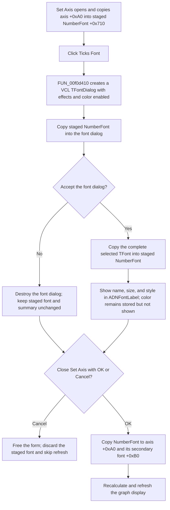

# Configure the axis tick font

> Analysis status: Reviewed from the recovered handler, Delphi class field table, VCL font-dialog path, font-summary formatter, enclosing Set Axis transaction, graph, and UI resource evidence.

## Control

| Property | Recovered value |
| --- | --- |
| Form | DFAxisCnf2Dlg |
| Form caption | Set Axis |
| Component path | DFAxisCnf2Dlg.ADFontGB.BitBtn1 |
| Parent caption | Texts |
| Control class | TBitBtn |
| Caption | Ticks Font |
| Hint | Not present in the recovered resource. |
| Kind | Not set; this is not a built-in `bkOK`, `bkCancel`, or other kind. |
| Handler name | BitBtn1Click |
| Handler address | 00f0d410 |
| Graph node | `resource:dfm:DFAxisCnf2Dlg/DFAxisCnf2Dlg.ADFontGB.BitBtn1` |
| Handler node | `function:00f0d410` |
| Graph layer | UI |

## What happens when clicked

`BitBtn1Click` edits the dialog-private `NumberFont` field at form offset `+0x710`. The recovered Delphi field table names this field `NumberFont`; its paired field at `+0x708` is `AxisFont`, which belongs to the adjacent Label Font command.

The handler creates a standard VCL `TFontDialog` and assigns the current staged `NumberFont` to the dialog before it opens. The common font-dialog constructor enables option bit 2. The recovered option-to-Win32 table maps this bit to `0x100`, the `CF_EFFECTS` flag. The dialog therefore includes font effects and color selection, in addition to the font face and size.

If the font dialog returns false, whether because the user cancels or the native common dialog fails, the handler destroys it without changing `NumberFont` or its summary label. If the user accepts it, the handler assigns the complete selected `TFont` back to `NumberFont`. This assignment retains the selected face, size, style, color, charset, pitch, and quality as one font object.

After an accepted selection, the handler formats a summary and writes it to `ADNFontLabel`. The summary displays only:

- the font name;
- the size;
- `Normal`, or the selected `Bold`, `Italic`, `UnderLine`, and `StrikeOut` style flags.

The selected color is staged in `NumberFont`, but it is not displayed in this label. The click does not repaint the axis itself.

## Defaults, reset, and staging

This command has no default-font or reset branch. Each opening starts from the current staged `NumberFont`, so a repeated click starts from the last accepted selection made while this Set Axis dialog remains open. Cancelling the nested font dialog is a no-op.

The staged font is allocated when `DFAxisCnf2Dlg` is created and destroyed with the form. The enclosing caller seeds it from the selected axis object's font at offset `+0xA0` before showing Set Axis.

The outer dialog defines the commit boundary:

- `Cancel` returns modal result `2`. The caller frees `DFAxisCnf2Dlg` without copying either staged font, the axis label text, or the resize checkbox back to the selected axis object. It also skips the post-edit refresh path.
- `OK` copies `NumberFont` to the selected axis object at `+0xA0`, creates its secondary font object at `+0xB0` when required, and copies the accepted font there too. The caller separately commits `AxisFont`, label text, and the resize setting. It then runs the common graph/layout and display refresh path.

These writes update the live in-memory axis configuration. This route does not save a file or write a persistent application setting.

## Click and commit flow

## Handler and call-path evidence

- Primary handler: [FUN_00f0d410](../../../DecompiledSources/Tina16/functions/0000000000F0D410__FUN_00f0d410.c) creates the font dialog, copies form field `+0x710` into it, tests the modal result, copies the accepted font back to `+0x710`, formats the summary, and writes it through the control pointer at `+0x700`.
- Form setup and cleanup: [FUN_00f0d510](../../../DecompiledSources/Tina16/functions/0000000000F0D510__FUN_00f0d510.c) allocates the `AxisFont` and `NumberFont` objects at `+0x708` and `+0x710`; [FUN_00f0d560](../../../DecompiledSources/Tina16/functions/0000000000F0D560__FUN_00f0d560.c) destroys both.
- Shared font-dialog constructor: [FUN_00725300](../../../DecompiledSources/Tina16/functions/0000000000725300__FUN_00725300.c) allocates the dialog's `TFont` and sets option bit 2. [FUN_007255d0](../../../DecompiledSources/Tina16/functions/00000000007255D0__FUN_007255d0.c) maps the option set into the Win32 `CHOOSEFONT` flags; the recovered table entry for bit 2 is `0x100` (`CF_EFFECTS`). The Label Font article owns the shared constructor annotation.
- Shared formatter: [FUN_00f05050](../../../DecompiledSources/Tina16/functions/0000000000F05050__FUN_00f05050.c) builds the `Name`, `Size`, and `Style` text and enumerates the four visible style flags. It does not read or format the font color. The Label Font article owns this shared helper annotation.
- Enclosing transaction: [FUN_01ad4310](../../../DecompiledSources/Tina16/functions/0000000001AD4310__FUN_01ad4310.c) constructs `TDFAxisCnf2Dlg`, seeds `AxisFont` and `NumberFont` from model offsets `+0x98` and `+0xA0`, and seeds their two summary labels. Modal result `2` exits before model writes. The accepted branch copies both staged fonts back and reaches the common refresh calls.
- Post-edit refresh: [FUN_01acfc60](../../../DecompiledSources/Tina16/functions/0000000001ACFC60__FUN_01acfc60.c) recalculates view bounds and updates attached plot objects after the accepted outer dialog. [FUN_01aceb90](../../../DecompiledSources/Tina16/functions/0000000001ACEB90__FUN_01aceb90.c) propagates the updated view to graph and related display objects when the plot bounds are valid.
- Complexity: complex; the form-specific handler has five distinct outgoing calls.

## Resource and glyph evidence

- The recovered caption is `Ticks Font`, inside the `Texts` group of the `Set Axis` dialog.
- `ADNFontLabel` starts with `Name: Arial  Size: 12  Style: Normal`. The handler call path, not label proximity, proves that this is the summary changed by the button.
- The button has no `Hint`, `Kind`, image-list reference, embedded image, or extracted glyph. There is no visual-resource evidence for a reset, default, or color-only command.
- The adjacent `Label Font` button uses the parallel `AxisFont` field. This pairing corroborates that `NumberFont` is the tick-number font selected here.

## Error and no-op behavior

- Cancelling the nested font dialog, or a native font-dialog failure that returns false, leaves all staged and model state unchanged. The handler does not call `CommDlgExtendedError`, so it cannot distinguish these two false results or report a native error code.
- Cancelling the outer Set Axis dialog discards an earlier accepted nested selection because the caller does not copy the staged `NumberFont` back to the axis object.
- The handler performs no font validation, confirmation, message display, or local retry. It relies only on the VCL font dialog's Boolean result.
- The recovered handler and caller contain no local exception-recovery or rollback branch. A failure during creation, font assignment, summary formatting, model assignment, or display refresh is not converted into a user-facing result by this path.

## Analysis limits

- The recovered caller identifies the axis configuration by a numeric type code (`3`). It does not expose a stable friendly name for the specific X, Y, or other axis being edited.
- The source proves the in-memory commit and display refresh. It does not show when another workflow later serializes the owning graph or document.
