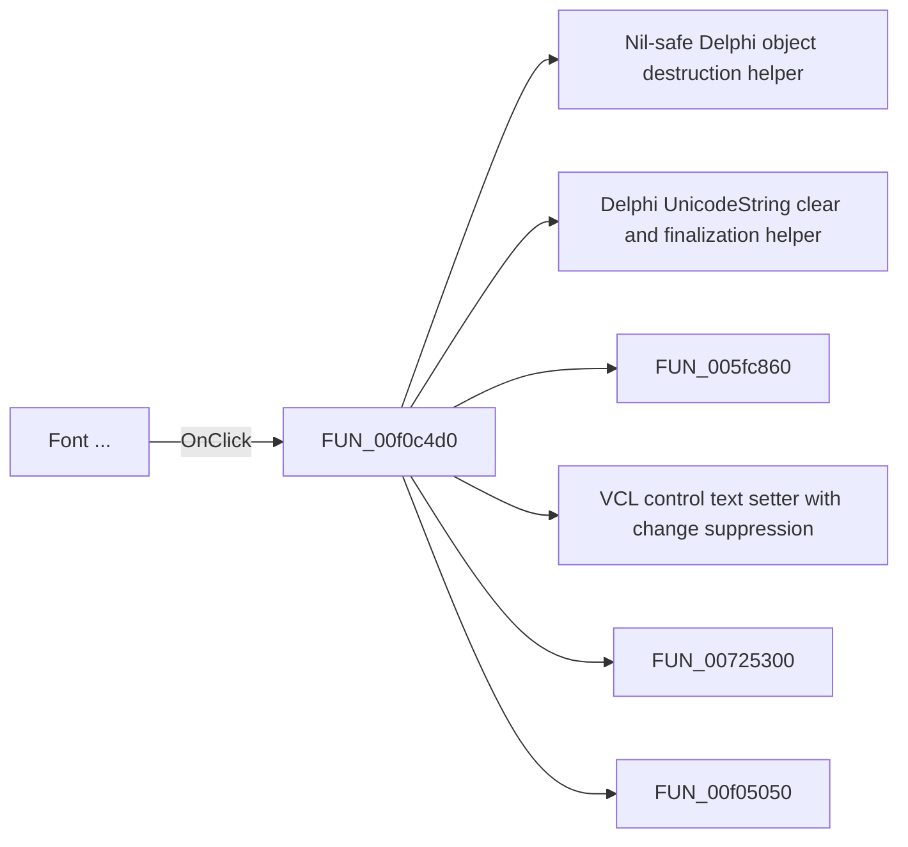

# Font ...

> Analysis status: Pending individual source review.

## Control

| Property | Recovered value |
| --- | --- |
| Form | DFAxisCnfDlg |
| Component path | DFAxisCnfDlg.ADFontGB.ADFontBtn |
| Control class | TBitBtn |
| Caption | Font ... |
| Hint | Not present in the recovered resource. |
| Text | Not present in the recovered resource. |
| Handler name | ADFontBtnClick |
| Handler address | 00f0c4d0 |
| Graph node | `resource:dfm:DFAxisCnfDlg/DFAxisCnfDlg.ADFontGB.ADFontBtn` |
| Handler node | `function:00f0c4d0` |
| Graph layer | UI |

## What happens when clicked

Pending individual analysis. An agent must read the recovered handler source and its relevant callees before it replaces this text.

## Click flow

## Handler evidence

- Source: [DecompiledSources/Tina16/functions/0000000000F0C4D0__FUN_00f0c4d0.c](../../../DecompiledSources/Tina16/functions/0000000000F0C4D0__FUN_00f0c4d0.c)
- Recovered role: Not present in the recovered resource.
- Current graph summary: Handles 1 Delphi UI event: DFAxisCnfDlg.ADFontGB.ADFontBtn.OnClick.
- Current graph behavior: Not present in the recovered resource.
- Current graph evidence: Not present in the recovered resource.
- Complexity: complex
- Distinct outgoing calls: 8

## Direct calls

- `function:00410f20` — Nil-safe Delphi object destruction helper
- `function:00414480` — Delphi UnicodeString clear and finalization helper
- `function:005fc860` — FUN_005fc860
- `function:0064de00` — VCL control text setter with change suppression
- `function:00725300` — FUN_00725300
- `function:00f05050` — FUN_00f05050
- `function:01a90ee0` — FUN_01a90ee0
- `function:01acff30` — FUN_01acff30

## Resource evidence

- Kind: Not present in the recovered resource.
- Modal result: Not present in the recovered resource.
- Checked state: Not present in the recovered resource.
- List items: Not present in the recovered resource.
- Image reference: Not present in the recovered resource.
- Extracted glyph: None.

## Nearby label candidates

Nearby labels are layout candidates only. They are not proof of behavior.

- Rank 1: Text: at distance 19.
- Rank 2: Name: Arial  Size: 12  Style: Normal at distance 68.

## Analysis limits

- Do not infer behavior from the control class, caption, hint, glyph, or nearby label alone.
- Do not replace the pending status until the handler source and relevant call path provide enough evidence.
