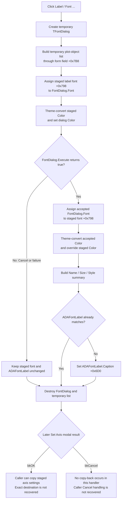

# Axis label font

> Analysis status: Recovered resource, click handler, VCL FontDialog construction and execution, staged font assignment, theme-aware color handling, summary update, outer OK and Cancel boundary, and the related DFAxisCnf2Dlg handler reviewed.

## Control

| Property | Recovered value |
| --- | --- |
| Form | DFAxisCnfDlg |
| Form caption | Set Axis |
| Component path | DFAxisCnfDlg.ADFontGB.ADFontBtn |
| Parent group | Label |
| Control class | TBitBtn |
| Caption | Font ... |
| Hint | Not present in the recovered resource. |
| Handler name | ADFontBtnClick |
| Handler address | 00f0c4d0 |
| Graph node | `resource:dfm:DFAxisCnfDlg/DFAxisCnfDlg.ADFontGB.ADFontBtn` |
| Handler node | `function:00f0c4d0` |
| Graph layer | UI |

## What happens when clicked

`TDFAxisCnfDlg.ADFontBtnClick` opens a temporary VCL `TFontDialog` for the
axis-label font that the Set Axis form stages at offset `+0x798`.

Before it displays the dialog, the handler:

1. Creates the `TFontDialog` with the application object as owner. The VCL
   constructor creates its internal `TFont` and initializes the option mask to
   `0x0004`, the recovered Effects option that permits font color and style
   effects in the native chooser.
2. Calls the shared plot-object enumerator for the plot held through form field
   `+0x7B8` and keeps its temporary list until the font dialog closes. The
   handler does not use the returned flags or list items to set a font option.
3. Assigns the complete staged font at `+0x798` to `FontDialog.Font`.
4. Reads the staged font's `Color` at offset `+0x28`, passes it through the
   application's theme-aware color converter, and assigns the result to the
   dialog font.
5. Executes the modal font dialog. The handler does not set a minimum or
   maximum size, a device context, an Apply callback, or another dialog option.

The color converter returns the original color when the application's color
conversion mode is off. When that mode is on, it first uses an existing color
mapping when available. Otherwise, it converts the color, adjusts its
luminance for the active mode, and constructs the converted color. Thus, the
color initially shown by the Windows font dialog can be a theme-adjusted form
of the staged color.

## Font-dialog OK

When `TFontDialog.Execute` returns true, the handler performs these operations:

1. It assigns the complete accepted `FontDialog.Font` to the staged font at
   form offset `+0x798`.
2. It passes the accepted color through the same theme-aware converter and
   writes the converted color back to the staged font with the VCL color
   setter.
3. It builds a summary string from the accepted font.
4. It changes `ADAFontLabel.Caption` at form field `+0x6D0` only when the new
   summary differs from the current caption.
5. It destroys the temporary font dialog and plot-object list.

The VCL font assignment copies the font as one object. Therefore the accepted
font family or name, size, style set, character set, pitch or quality data, and
other `TFont` state become part of the staged font. The explicit post-copy
color step is the only recovered property override in this handler.

The summary has the form `Name: <name>  Size: <size>  Style: <styles>`. The
style list can contain Bold, Italic, UnderLine, and StrikeOut; when no style bit
is set, it shows Normal. The summary does not display color, character set,
pitch, or quality. It is a text status summary, not a sample of the axis label
rendered in the chosen font.

## Font-dialog Cancel and failure return

When `TFontDialog.Execute` returns false, the handler destroys the temporary
list and dialog without assigning `FontDialog.Font` back to form offset
`+0x798`. It also does not update `ADAFontLabel.Caption`. The staged axis-label
font and its summary therefore stay as they were before the click.

The recovered VCL Execute result does not distinguish a user Cancel action
from a native font-dialog failure. Both take this false-result path. The
handler has no error message, retry loop, error return, or local exception
recovery.

## Staging, outer preview, and caller ownership

`FormCreate` allocates two independent `TFont` objects:

- form `+0x798` is used by this Label font handler;
- form `+0x7A0` is used by the separate Numbers font handler.

The accepted font remains in the Set Axis form's `+0x798` staging object. The
only immediate visible update is the `ADAFontLabel` text summary. This click
does not assign the selected font to a live axis object, redraw a plot, mark a
document as modified, save a setting, or write a file or registry value.

The outer form has built-in `bkOK` and `bkCancel` buttons. They define the
transaction boundary for the staged font together with the label text, number
font, scale, limits, and related axis options. This handler neither processes
that outer modal result nor copies the staged font to its final owner. The
recovered direct call graph does not identify a unique outer caller that reads
`+0x798`, so the final axis destination, redraw, and dirty-state actions are
not proven in this article. What is proven is that caller-side copy-back can
only occur after this handler returns: Font-dialog OK updates staging, while
Font-dialog Cancel does not.

If the user accepts the font dialog and then cancels the outer Set Axis form,
the selected font remains in this form instance's staging object until the
form is reused or destroyed. The click path itself performs no rollback. The
outer caller must use the Set Axis modal result to decide whether to copy or
ignore that staged value.

`FormDestroy` destroys both staged font objects. This limits uncommitted font
state to the Set Axis form lifetime.

## Difference from DFAxisCnf2Dlg

The related `DFAxisCnf2Dlg.ADFontBtnClick` follows the same central pattern:
copy a staged font into a `TFontDialog`, execute it, copy accepted state back,
and refresh a summary label.

The handlers are not identical. `DFAxisCnfDlg.ADFontBtnClick` additionally
builds the temporary plot-object list and explicitly runs color conversion
before and after the dialog. The reviewed DFAxisCnf2Dlg handler does neither
in its recovered source. This article therefore does not transfer those
form-specific effects from one dialog to the other.

## Click flow

## Handler and call-path evidence

- Click handler: [FUN_00f0c4d0](../../../DecompiledSources/Tina16/functions/0000000000F0C4D0__FUN_00f0c4d0.c)
- VCL FontDialog constructor: [FUN_00725300](../../../DecompiledSources/Tina16/functions/0000000000725300__FUN_00725300.c)
- VCL font assignment: [FUN_005fc6d0](../../../DecompiledSources/Tina16/functions/00000000005FC6D0__FUN_005fc6d0.c)
- VCL font color setter: [FUN_005fc860](../../../DecompiledSources/Tina16/functions/00000000005FC860__FUN_005fc860.c)
- Theme-aware color converter: [FUN_01a90ee0](../../../DecompiledSources/Tina16/functions/0000000001A90EE0__FUN_01a90ee0.c)
- Plot-object enumeration: [FUN_01acff30](../../../DecompiledSources/Tina16/functions/0000000001ACFF30__FUN_01acff30.c)
- Font summary builder: [FUN_00f05050](../../../DecompiledSources/Tina16/functions/0000000000F05050__FUN_00f05050.c)
- Change-suppressing caption setter: [FUN_0064de00](../../../DecompiledSources/Tina16/functions/000000000064DE00__FUN_0064de00.c)
- Form font allocation: [FUN_00f0c750](../../../DecompiledSources/Tina16/functions/0000000000F0C750__FUN_00f0c750.c)
- Form font cleanup: [FUN_00f0c7b0](../../../DecompiledSources/Tina16/functions/0000000000F0C7B0__FUN_00f0c7b0.c)
- Separate Numbers font handler: [FUN_00f0c630](../../../DecompiledSources/Tina16/functions/0000000000F0C630__FUN_00f0c630.c)
- Related DFAxisCnf2Dlg handler: [FUN_00f0d310](../../../DecompiledSources/Tina16/functions/0000000000F0D310__FUN_00f0d310.c)
- Recovered form evidence: [ui-evidence.json](../../../DecompiledSources/Tina16/resources/dfm/ui-evidence.json)

## Direct calls

- `FUN_00725300` - Creates the VCL FontDialog.
- `FUN_01acff30` - Builds the temporary plot-object list.
- `FUN_01a90ee0` and `FUN_005fc860` - Convert and set the initial and accepted
  font color.
- `FUN_00f05050` - Builds the accepted font's Name, Size, and Style summary.
- `FUN_0064de00` - Updates the summary caption only when it differs.
- `FUN_00410f20` and `FUN_00414480` - Release temporary Delphi objects and
  strings.

## Resource evidence

- The control is a 51-by-19 `TBitBtn` with caption `Font ...` in the `Label`
  group.
- The same group contains `ADLabelEB`, initially `Time (%s)`, and the summary
  label `ADAFontLabel`, initially `Name: Arial  Size: 12  Style: Normal`.
- The group and summary are direct context for an axis-label font. The handler's
  use of form font `+0x798` and summary label `+0x6D0` proves the connection.
- The control has no recovered hint, action, built-in button kind, image-list
  reference, embedded glyph, picture, or image data.
- The nearby `Text:` label belongs to `ADLabelEB`. It is contextual evidence,
  but it does not by itself define the Font button's behavior.

## Analysis limits

- The exact Delphi property name for form field `+0x798` is not recovered. Its
  separation from the Numbers font at `+0x7A0`, its handler data flow, and the
  Label group establish its axis-label staging role.
- The plot-object enumerator's returned list and flags are not consumed by this
  handler. This article does not invent a font-option or target-selection role
  for them.
- The unique outer caller and final axis-font destination are not represented
  by a direct recovered edge. The article keeps that commit boundary explicit.
- Shared FontDialog and summary helpers are evidence here, but their canonical
  graph annotations belong to the coordinated DFAxisCnf2Dlg analysis.
