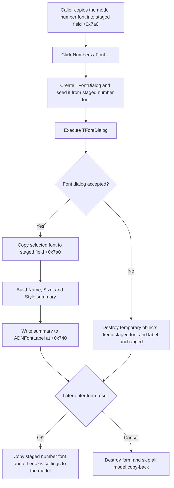

# Choose the axis-number font

> Analysis status: Evidence-backed source review complete.

## Control

| Property | Recovered value |
| --- | --- |
| Form | DFAxisCnfDlg (`Set Axis`) |
| Component path | DFAxisCnfDlg.ADNumGB.ADNumBtn |
| Parent group | Numbers |
| Control class | TBitBtn |
| Caption | Font ... |
| Hint | Not present in the recovered resource. |
| Text | Not present in the recovered resource. |
| Handler name | ADNumBtnClick |
| Handler address | 00f0c630 |
| Graph node | `resource:dfm:DFAxisCnfDlg/DFAxisCnfDlg.ADNumGB.ADNumBtn` |
| Handler node | `function:00f0c630` |
| Graph layer | UI |

## What happens when clicked

`FUN_00f0c630` creates a temporary `TFontDialog`. It copies the form's staged number font at offset `+0x7a0` into the dialog font and then executes the dialog. Thus, each click starts from the number font that is currently staged in `DFAxisCnfDlg`, including a font accepted by an earlier click while the form remained open.

If `TFontDialog.Execute` returns false, the handler destroys its temporary objects and returns. This is the normal Cancel path. The recovered handler cannot distinguish Cancel from any other false result. It does not change the staged number font or the preview label.

If the user accepts the font dialog, the handler copies the selected font back into the staged font at `+0x7a0`. It then calls `FUN_00f05050` to build a summary with the font name, size, and style. The style text can contain Bold, Italic, UnderLine, and StrikeOut. `FUN_0064de00` writes this summary to `ADNFontLabel` at form offset `+0x740`. This label is the recovered `Name: Arial  Size: 12  Style: Nomal` resource placeholder. The spelling `Nomal` occurs only in the resource placeholder; the summary helper emits `Style: Normal` when no style bit is set.

The click does not read or change `ADNumFormCB`, `ADDivByFE`, or `ADPrecSE`. Therefore, it does not change the decimal, engineering, or scientific representation, the divide factor, or the precision. Their nearby labels describe separate controls in the same Numbers group.

## Staged and committed state

`FUN_01ad4310` is the recovered caller that opens this axis configuration form. Before `ShowModal`, it copies the current model's number font at model offset `+0xa0` into the form's staged number font at `+0x7a0`. It also initializes the number-font summary label.

The form uses built-in `bkOK` and `bkCancel` buttons. If `ShowModal` returns `mrCancel` (`2`), the caller destroys the form and skips every copy-back operation. This discards a font that the user accepted and previewed inside the form. On an accepted outer result, the caller copies the staged number font back to the model at `+0xa0` and makes the model's secondary font copy at `+0xb0` agree. The same accepted branch reads the separate format, divide-factor, and precision controls and commits the other axis settings.

ADNumBtn does not close the outer form and does not persist a file, registry value, or application setting by itself. The recovered caller updates the live axis model only after the outer OK result. Later document or settings persistence is outside this recovered path.

## Click flow

## Handler evidence

- Source: [FUN_00f0c630](../../../DecompiledSources/Tina16/functions/0000000000F0C630__FUN_00f0c630.c)
- Recovered role: Opens a font dialog for the staged axis-number font, applies an accepted font, and refreshes the number-font summary label.
- Input: The form's staged number font at `+0x7a0`.
- Decision: The `TFontDialog.Execute` Boolean result controls both the font assignment and the label update.
- State change: On acceptance only, replaces the staged number font and changes `ADNFontLabel` at `+0x740`.
- Output: A text preview of the selected font's name, size, and style. There is no axis redraw or model copy-back in this handler.
- Complexity: complex
- Distinct outgoing calls: 6 recovered direct calls. Font assignment and dialog execution are virtual calls and are not separate graph edges.

## Direct and related calls

- `function:00725300` - [FUN_00725300](../../../DecompiledSources/Tina16/functions/0000000000725300__FUN_00725300.c), the shared `TFontDialog` constructor.
- `function:00f05050` - [FUN_00f05050](../../../DecompiledSources/Tina16/functions/0000000000F05050__FUN_00f05050.c), the shared font-summary builder.
- `function:0064de00` - Writes the generated summary to `ADNFontLabel` with VCL change suppression.
- `function:01acff30` - [FUN_01acff30](../../../DecompiledSources/Tina16/functions/0000000001ACFF30__FUN_01acff30.c) prepares an owner-derived temporary collection before the font dialog runs. The handler does not inspect this collection and destroys it on both dialog-result paths, so its specific purpose is not established here.
- `function:00410f20` and `function:00414480` - Release the temporary Delphi objects and UnicodeString.
- [FUN_01ad4310](../../../DecompiledSources/Tina16/functions/0000000001AD4310__FUN_01ad4310.c) stages the axis model in `DFAxisCnfDlg`, shows the form, rejects `mrCancel`, and copies accepted settings back to the model.
- [FUN_00f0c750](../../../DecompiledSources/Tina16/functions/0000000000F0C750__FUN_00f0c750.c) creates the form's separate label-font and number-font staging objects.
- [FUN_00f0c7b0](../../../DecompiledSources/Tina16/functions/0000000000F0C7B0__FUN_00f0c7b0.c) destroys both staging objects when the form is destroyed.

## Resource and glyph evidence

- The recovered form caption is `Set Axis`.
- `ADNumGB` has caption `Numbers`, and this button has caption `Font ...`.
- `ADNFontLabel` has the placeholder `Name: Arial  Size: 12  Style: Nomal`. The accepted branch's summary construction and write to this exact label prove the font purpose.
- The button has no hint, image-list reference, or embedded glyph. The glyph manifest has no extracted image for it.
- The closest labels, `Divide by factor:`, `Format:`, and `Precision:`, are layout candidates only. The source proves that this handler does not access their controls.

## Cancel, invalid-value, and error boundaries

- A false font-dialog result, including normal Cancel, is a no-op for the staged font and its label.
- Outer Cancel discards all staged changes because `FUN_01ad4310` skips copy-back when the modal result is `2`.
- This click performs no numeric conversion or range check. Invalid format, factor, precision, or axis-range values are outside this handler.
- The handler has no control-specific validation message, exception handler, or rollback. It assigns the selected font before it builds and writes the label summary. The recovered code does not show rollback if a later assignment or text operation fails.
- The VCL font dialog's internal validation and platform-specific error behavior are not visible in the recovered source.
