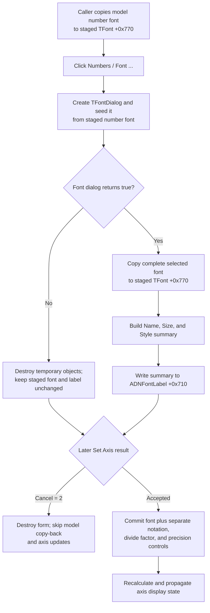

# Choose the axis-number font

> Analysis status: Evidence-backed source review complete.

## Control

| Property | Recovered value |
| --- | --- |
| Form | DFPAxisCnfDlg (`Set Axis`) |
| Component path | DFPAxisCnfDlg.ADNumGB.ADNumBtn |
| Parent group | Numbers |
| Control class | TBitBtn |
| Caption | Font ... |
| Hint | Not present in the recovered resource. |
| Handler name | ADNumBtnClick |
| Handler address | 01ac5b60 |
| Graph node | `resource:dfm:DFPAxisCnfDlg/DFPAxisCnfDlg.ADNumGB.ADNumBtn` |
| Handler node | `function:01ac5b60` |
| Graph layer | UI |

## What happens when clicked

`FUN_01ac5b60` creates a temporary VCL `TFontDialog` with the application object as its owner. The dialog constructor creates its private `TFont` and enables the standard font-effects option. The handler assigns the form's staged number font at offset `+0x770` to the dialog font before it executes the dialog. A second click while the outer form remains open therefore starts with the last accepted staged font.

If the font dialog returns false, the handler destroys its temporary objects and returns. The staged number font and the summary label stay unchanged.

If the font dialog returns true, the handler assigns the complete selected font to the staged font at `+0x770`. This assignment includes properties such as face, size, style, color, and charset. It then calls `FUN_00f05050` to make a text summary of the face name, point size, and style. `FUN_0064de00` writes that summary to `ADNFontLabel` at form offset `+0x710`. The style text is `Normal` for an empty style set or lists the active Bold, Italic, UnderLine, and StrikeOut flags. The label is a textual summary; the handler does not redraw an axis.

## Number format and precision are separate

Despite its `ADNumBtn` component name and its position in the Numbers group, this button edits only the number font. It does not access these adjacent staged controls:

- `ADNumFormCB` at `+0x728`, whose recovered items are `Decimal: 1000`, `Engineering: 1k`, and `Scientific: 1E3`;
- `ADDivByFE` at `+0x738`, which holds the divide factor; or
- `ADPrecSE` at `+0x748`, which holds the precision.

Thus, accepting this font dialog does not change notation, division, or precision. Those values can change independently while the outer `Set Axis` form remains open.

## Staged and committed state

`FUN_01ac5c80`, the recovered form-create handler, creates separate staged axis-font and number-font objects at `+0x768` and `+0x770`. `FUN_01ad4310` initializes this form for the applicable axis kinds. Before it shows the form, it copies the live axis model's number font at `+0xa0` into staged field `+0x770` and writes its summary to `ADNFontLabel`. It also initializes the separate notation, divide-factor, and precision controls from the model.

The outer form has built-in `bkOK` and `bkCancel` buttons. If `ShowModal` returns modal result `2`, the caller destroys the form and skips all model copy-back and the later axis-update calls. This discards a font that was accepted and shown in `ADNFontLabel` during the current form session.

For an accepted outer result, the caller copies staged font `+0x770` to the live model font at `+0xa0`. It also creates or updates the model's secondary font copy at `+0xb0`. In the same accepted branch, it commits notation from `+0x728`, divide factor from `+0x738`, and precision from `+0x748`. It then runs the shared axis recalculation and display-propagation path. The button itself does not close the outer form, update the live model, or persist a file, registry value, or application setting.

## Click flow

## Recovered evidence

- [`FUN_01ac5b60`](../../../DecompiledSources/Tina16/functions/0000000001AC5B60__FUN_01ac5b60.c) is the DFM-bound click handler. It seeds, executes, and branches on a temporary font dialog. Only the true branch assigns the staged font and updates `ADNFontLabel`.
- [`FUN_00725300`](../../../DecompiledSources/Tina16/functions/0000000000725300__FUN_00725300.c) constructs the shared `TFontDialog`, creates its private font at `+0xd0`, and sets its options value to `4`, the recovered font-effects option.
- [`FUN_00f05050`](../../../DecompiledSources/Tina16/functions/0000000000F05050__FUN_00f05050.c) formats the accepted font's name, point size, and style flags.
- [`FUN_0064de00`](../../../DecompiledSources/Tina16/functions/000000000064DE00__FUN_0064de00.c) changes the label text only when the new summary differs from the current text.
- [`FUN_01ac5c80`](../../../DecompiledSources/Tina16/functions/0000000001AC5C80__FUN_01ac5c80.c) creates the two form-owned staging fonts. [`FUN_01ac5ce0`](../../../DecompiledSources/Tina16/functions/0000000001AC5CE0__FUN_01ac5ce0.c) destroys them with the form.
- [`FUN_01ad4310`](../../../DecompiledSources/Tina16/functions/0000000001AD4310__FUN_01ad4310.c) initializes this form from the selected axis model, distinguishes modal result `2`, commits all accepted axis controls, and calls the later update path.
- `FUN_01acff30` prepares an owner-derived temporary collection before the font dialog runs. The handler does not inspect that collection and destroys it on both result paths, so its specific purpose is not established here.

## Resource and glyph evidence

- The form caption is `Set Axis`; the parent group caption is `Numbers`; and the button caption is `Font ...`.
- `ADNFontLabel` has the placeholder `Name: Arial  Size: 12  Style: Nomal`. The resource contains the spelling `Nomal`, while the runtime summary helper emits `Style: Normal` for a font without style flags.
- The button has no hint, action, image-list reference, embedded glyph, or extracted glyph file.
- The nearby `Divide by factor:`, `Format:`, and `Precision:` labels belong to separate controls. Their proximity is not evidence that this click changes those values; the source proves that it does not access them.

## Cancel, invalid-value, and error boundaries

- Font-dialog Cancel and a false dialog result use the same no-change branch.
- Outer Cancel discards all staged values and skips the caller's axis-update path.
- This click performs no numeric conversion or range check. It cannot validate notation, divide factor, precision, or axis limits because it does not read those controls.
- The handler has no control-specific error message, exception handler, or rollback. It assigns the accepted font before it formats and writes the summary, so the recovered code does not show rollback if a later operation fails.
- The VCL font dialog's native validation and error behavior are outside the recovered handler.
