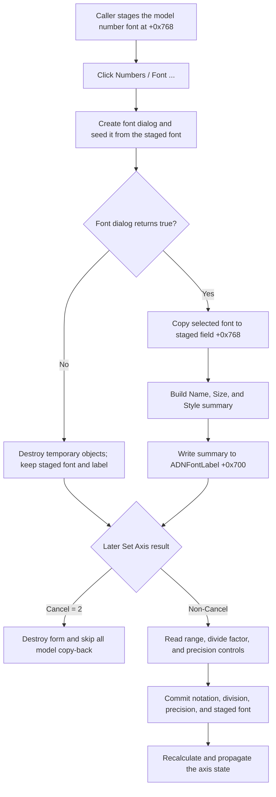

# Choose the DFS axis-number font

> Analysis status: Evidence-backed source review complete.

## Control

| Property | Recovered value |
| --- | --- |
| Form | DFSAxisCnfDlg (`Set Axis`) |
| Component path | DFSAxisCnfDlg.ADNumGB.ADNumBtn |
| Parent group | Numbers |
| Control class | TBitBtn |
| Caption | Font ... |
| Hint | Not present in the recovered resource. |
| Handler name | ADNumBtnClick |
| Handler address | 01ac5000 |
| Graph node | `resource:dfm:DFSAxisCnfDlg/DFSAxisCnfDlg.ADNumGB.ADNumBtn` |
| Handler node | `function:01ac5000` |
| Graph layer | UI |

## What happens when clicked

`FUN_01ac5000` creates a temporary VCL font-selection dialog. It copies the form's staged axis-number font at offset `+0x768` into the dialog font before it executes the dialog. A second click while the outer form remains open therefore starts with the last font that the user accepted in this form session.

If the font dialog returns false, the handler destroys its temporary objects and returns. The staged font and its summary label stay unchanged. The recovered handler uses this same no-change path for Cancel and any other false result.

If the font dialog returns true, the handler copies the selected font into staged field `+0x768`. It then calls `FUN_00f05050` to make a summary of the font name, point size, and style. `FUN_0064de00` writes that summary to `ADNFontLabel` at form offset `+0x700`. The style summary is `Normal` for an empty style set. Otherwise, it can list Bold, Italic, UnderLine, and StrikeOut. This label is a text summary. The handler does not redraw an axis or show formatted axis values.

## Number format, division, and precision

The resource places three separate controls in the same Numbers group:

- `ADNumFormCB` at recovered form offset `+0x718` selects `Decimal: 1000`, `Engineering: 1k`, or `Scientific: 1E3`;
- `ADDivByFE` at `+0x728` holds the divide factor;
- `ADPrecSE` at `+0x738` holds the precision.

`ADNumBtnClick` does not read or change these controls. Thus, accepting the font dialog does not change notation, division, or precision.

The outer caller `FUN_01ad4310` stages these values before it shows `DFSAxisCnfDlg`. It maps the model's notation byte at `+0x80` to the three-item combo index, copies divide factor `+0x88`, and initializes the precision control from `FUN_01cd66b0`. That helper keeps the stored precision at model offset `+0x90` unless the current axis range requires a larger minimum. These are form-initialization effects. They are not effects of the Font button.

## Staged and committed state

`FUN_01ac5120`, the form-create handler, creates two form-owned font objects at `+0x760` and `+0x768`. The Font button uses the second object as the staged number font. Before `ShowModal`, `FUN_01ad4310` copies the live axis model's number font at model offset `+0xa0` into this staged font. It also initializes `ADNFontLabel` with the current font summary.

The outer form has built-in `bkOK` and `bkCancel` buttons. If `ShowModal` returns modal result `2`, the caller destroys the form and skips all copy-back. This discards a font that the user accepted in the inner font dialog. It also discards staged notation, divide-factor, and precision changes.

For a non-Cancel outer result, the caller reads the numeric controls and commits them in sequence. It maps the selected notation index back to the model byte at `+0x80`, copies the divide factor to `+0x88`, and copies precision to `+0x90`. It then copies staged font `+0x768` to the live model font at `+0xa0` and creates or updates the model's secondary font copy at `+0xb0`. Later calls recalculate and propagate the axis state. `ADNumBtnClick` itself does not close the outer form, update the live axis model, or persist a file, registry value, or application setting.

## Click flow

## Recovered evidence

- [FUN_01ac5000](../../../DecompiledSources/Tina16/functions/0000000001AC5000__FUN_01ac5000.c) is the DFM-bound click handler. It seeds and executes the temporary font dialog. Only the true branch assigns the staged font and updates `ADNFontLabel`.
- [FUN_00725300](../../../DecompiledSources/Tina16/functions/0000000000725300__FUN_00725300.c) constructs the shared font dialog and its private font object.
- [FUN_00f05050](../../../DecompiledSources/Tina16/functions/0000000000F05050__FUN_00f05050.c) formats the font name, point size, and style flags.
- [FUN_0064de00](../../../DecompiledSources/Tina16/functions/000000000064DE00__FUN_0064de00.c) changes the label text only when the new summary differs from the current text.
- [FUN_01ac5120](../../../DecompiledSources/Tina16/functions/0000000001AC5120__FUN_01ac5120.c) creates the two staged fonts. [FUN_01ac5180](../../../DecompiledSources/Tina16/functions/0000000001AC5180__FUN_01ac5180.c) destroys them with the form.
- [FUN_01ad4310](../../../DecompiledSources/Tina16/functions/0000000001AD4310__FUN_01ad4310.c) initializes the DFS axis form, tests the outer result for modal result `2`, commits accepted values, and calls the later update path.
- [FUN_01cd66b0](../../../DecompiledSources/Tina16/functions/0000000001CD66B0__FUN_01cd66b0.c) calculates the initial precision that the outer caller places in `ADPrecSE`.
- `FUN_01acff30` prepares an owner-derived temporary collection before the font dialog runs. The handler does not inspect the collection and destroys it on both result paths. Its specific purpose is not established here.

## Resource and glyph evidence

- The form caption is `Set Axis`, the parent group caption is `Numbers`, and the button caption is `Font ...`.
- `ADNFontLabel` has the resource placeholder `Name: Arial  Size: 12  Style: Nomal`. The resource contains `Nomal`, but the runtime formatter emits `Style: Normal` for a font with no style flags.
- The button has no hint, action, image-list reference, embedded glyph, or extracted glyph file.
- The nearby `Divide by factor:`, `Format:`, and `Precision:` labels describe separate controls. Their location does not prove a Font-button effect. The handler source proves that it does not access them.

## Cancel, invalid-value, and error boundaries

- Font-dialog Cancel and any false font-dialog result leave the staged font and summary label unchanged.
- Outer Cancel discards all staged values and skips the caller's axis-update path.
- This click performs no numeric conversion or range check. It cannot reject a notation, divide factor, precision, or range value because it does not read those controls.
- On outer acceptance, the caller reads and validates floating-point controls in sequence. The float reader rejects values outside its recovered range and can call a control-specific validation callback. The caller has no transaction around these writes. If a later read fails, an earlier model field can already contain its new value. The staged font is copied late in this branch, after the numeric reads.
- The click handler has no control-specific error message, exception handler, or rollback. It assigns the accepted font before it formats and writes the summary. A later failure can therefore leave the staged font changed while the old summary remains.
- The VCL font dialog's internal validation and platform-specific errors are outside the recovered handler.

## Comparison with the related forms

The DFAxis and DFPAxis Font handlers use the same dialog, summary, and text-setter helpers. Their staged font and label offsets differ because the forms contain different component sets. The DFS-specific source proves `+0x768` for the staged number font and `+0x700` for its label. This article does not transfer an offset or a control effect from either related form.
