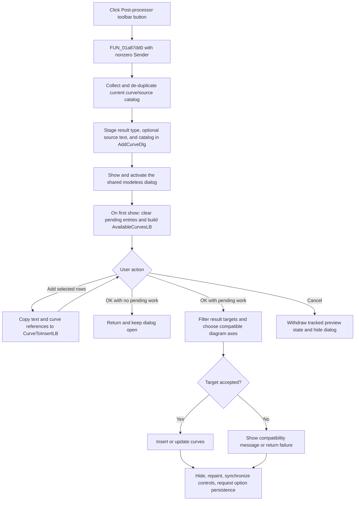

# Open the Post-processor curve dialog from the toolbar

> Analysis status: Evidence-backed source review complete.

## Control

| Property | Recovered value |
| --- | --- |
| Form | DFWindow |
| Component path | DFWindow.DFToolPanel.ToolNoteBook.Diagram.AddCurvesBtn |
| Control class | TSpeedButton |
| Caption | Not present in the recovered resource. |
| Hint | Post-processor |
| Text | Not present in the recovered resource. |
| Handler name | AddMoreCurvesMnuClick |
| Handler address | 01a87dd0 |
| Graph node | `resource:dfm:DFWindow/DFWindow.DFToolPanel.ToolNoteBook.Diagram.AddCurvesBtn` |
| Handler node | `function:01a87dd0` |
| Graph layer | UI |

## What happens when clicked

`AddCurvesBtn` opens the shared `AddCurveDlg` Post-processor form with a catalog of curves from the current application result and source registries. It shares `FUN_01a87dd0` with the **Post-processor...** main-menu item. A toolbar click supplies a nonzero `Sender`, so this control always takes the handler's normal modeless-show branch.

The handler performs these operations:

1. It creates a temporary Delphi string/object list and calls `FUN_00f1e090` to collect current curve/source entries.
2. The collector keeps entries with a nonempty recovered name and a positive object field at offset `0x2c`. Its lower enumerator compares normalized display text before adding an entry. The first object found for one display text wins; later entries with the same text are not added.
3. It copies the active result-type byte to `AddCurveDlg` field `+0x93c`. In two recovered result contexts, it also copies source text to field `+0x940`. Their Delphi field names are not recovered.
4. `FUN_013ca610` clears the dialog's master catalog at `+0x878` and copies the collected display-text and object-reference pairs into it in source order. The temporary list is then destroyed.
5. If the recovered editor context at global `020027c0` exists, the handler replaces a related editor controller with the class used for a nonzero `Sender`. Its more specific purpose is not recovered.
6. `FUN_008059a0` sets the shared form visible and activates it. On a hidden-to-visible transition, DFM-bound `OnShow` handler `FUN_013cbd70` clears the pending insertion list, creates temporary dialog state, applies the category and text filters, and rebuilds `AvailableCurvesLB`.

If the form is already visible, the VCL visibility setter does not cause another hidden-to-visible transition. The opening handler still replaces the master catalog and activates the existing form. The recovered source does not show a second explicit available-list rebuild in that branch.

## Selection, pending curves, and axis context

The opening handler does not inspect DFWindow's selected objects, select a curve, choose an axis, or capture the pointer location. Its first parameter is unused. The only control-specific distinction is the nonzero `Sender`, which selects the normal modeless-show and editor-controller path.

The dialog then uses three collections:

- The master catalog at `+0x878` contains the collected curve names and object references.
- `AvailableCurvesLB` is a filtered view of that catalog. It excludes objects already in the pending list.
- `CurveToInsertLB` is the pending request. **Add >>** copies each selected available row, including its curve-object reference, to this list and then rebuilds the available list.

The opener does not preload the pending list from the curves already plotted in the current diagram. `AvailableCurvesLB` must therefore not be described as an "unplotted curves" list. During later insertion, `FUN_00f1c5c0` searches the chosen coordinate system for an existing plotted entry. It updates or reuses a match instead of creating a duplicate plotted entry.

Axis choice is also deferred. The accepted insertion path first tries a stored diagram and otherwise scans compatible coordinate systems and their axes. The toolbar click has no axis-selection dialog and does not change the current active coordinate system.

## Accepted insertion, redraw, and persistence

The user must move one or more entries under **Curves to insert:** and then click the dialog's **OK** button. That later handler filters the pending entries for each recovered result target and submits each target-specific list through `FUN_013e2500`.

For an accepted target, the lower path reuses a stored diagram or inserts/updates the curves in a compatible coordinate system. The direct insertion path cycles curve colors. After all target groups, the OK handler clears its new-curve tracking list, hides a visible dialog, repaints the current diagram through `FUN_01aceb90`, and calls `FUN_01ae4310` to synchronize the active coordinate-system state and main-window controls.

It then requests diagram-option persistence through `FUN_01add6f0`. That helper serializes coordinate-system, axis, curve, and figure options only when `Diagram Page Setup/ManualScale` is enabled in `TINA.INI`. This is not a general project-save command, and the toolbar click itself performs no serialization or file write.

If both `CurveToInsertLB` and the dialog's new-curve tracking list are empty, OK returns immediately. It does not hide the dialog, repaint, synchronize controls, or request option persistence.

## Cancel, no-op, and error boundaries

**Cancel** clears tracked preview state and hides the modeless form. When preview objects exist, it clears their recovered display-state byte, refreshes compatible result objects, and redraws the current result view before hiding. It does not undo a user-defined curve definition already committed by the dialog's separate **Create** command. `OnHide` releases the temporary dialog state.

An incompatible nonempty target list can show a message whose recovered text contains **curves cannot be inserted into this coordinate system** and **Please select another diagram!**. The OK handler ignores the false result, continues with later targets, and then runs its normal cleanup, repaint, synchronization, and persistence-request sequence. A null diagram manager also returns failure without insertion, and the OK handler ignores that result. A selected object that matches none of the processed result targets produces no insertion message because each target-specific list is empty.

The opener, list operations, insertion, redraw, and persistence paths have no recovered local exception handler or transaction rollback. Allocation, catalog, VCL, list-box, insertion, or drawing errors can propagate to higher-level Delphi handling. If an earlier target accepts curves and a later target fails, the earlier model changes remain.

The shared main-menu command can be disabled by DFWindow's command-state updater. The recovered `AddCurvesBtn` resource does not contain an explicit disabled state, and `FUN_01a87dd0` has no local active-diagram, enabled-state, or selection guard. This article therefore does not claim that the toolbar itself prevents every invalid direct call.

## Toolbar and dialog flow

## Handler and downstream evidence

- Shared toolbar/menu handler: [FUN_01a87dd0](../../../DecompiledSources/Tina16/functions/0000000001A87DD0__FUN_01a87dd0.c)
- Curve/source catalog collector: [FUN_00f1e090](../../../DecompiledSources/Tina16/functions/0000000000F1E090__FUN_00f1e090.c)
- Dialog catalog replacement: [FUN_013ca610](../../../DecompiledSources/Tina16/functions/00000000013CA610__FUN_013ca610.c)
- Modeless form show and activation: [FUN_008059a0](../../../DecompiledSources/Tina16/functions/00000000008059A0__FUN_008059a0.c)
- Hidden-to-visible dialog setup: [FUN_013cbd70](../../../DecompiledSources/Tina16/functions/00000000013CBD70__FUN_013cbd70.c)
- [Add &gt;&gt;](../addcurvedlg/addbtn-74addd7ef3.md) documents the pending-list transfer.
- [Add Curve OK](../addcurvedlg/okbtn-5bd06272ec.md) documents target filtering, insertion, redraw, coordinate-system synchronization, and conditional option persistence.
- [Add Curve Cancel](../addcurvedlg/cancelbtn-6c0826faf9.md) documents preview withdrawal and dialog hiding.
- [Post-processor main-menu item](addmorecurvesmnu-32eb66c525.md) is the canonical analysis and annotation owner for the shared handler.
- Recovered control resources: [ui-evidence.json](../../../DecompiledSources/Tina16/resources/dfm/ui-evidence.json)

## Resource and annotation limits

- `AddCurvesBtn` is a `TSpeedButton` with hint **Post-processor**. It has no recovered caption, action, group index, explicit enabled value, or same-parent label candidate.
- [The 20 by 20 pixel toolbar glyph](../../../glyph/0105_DFWindow_DFWindow_DFToolPanel_ToolNoteBook_Diagram_AddCurvesBtn_Glyph_Data.png) shows a plus sign with colored and gray curve traces. It supports the add/show-curves intent. The handler and dialog data flow, not the image alone, prove the behavior.
- The recovered source does not supply Delphi names for the global result pointers, dialog fields `+0x878`, `+0x93c`, and `+0x940`, or the optional editor-controller classes.
- This fragment repeats the canonical `FUN_01a87dd0` fields from Bead `.273` exactly because the toolbar and menu share one DFM handler. Downstream dialog, collection, insertion, axis, redraw, and persistence helpers remain evidence only in this Bead.
