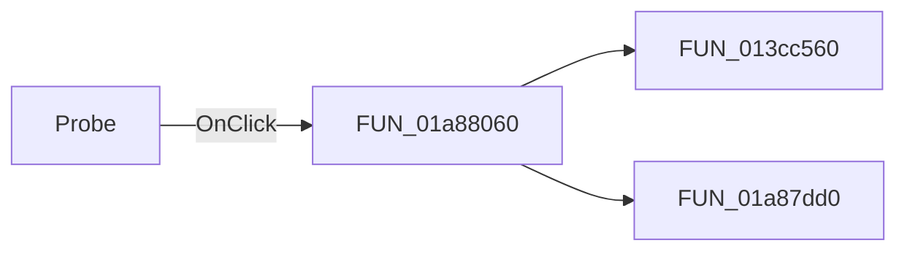

# Probe

> Analysis status: Pending individual source review.

## Control

| Property | Recovered value |
| --- | --- |
| Form | DFWindow |
| Component path | DFWindow.DFToolPanel.ToolNoteBook.Diagram.AddCurvesExBtn |
| Control class | TSpeedButton |
| Caption | Not present in the recovered resource. |
| Hint | Probe |
| Text | Not present in the recovered resource. |
| Handler name | AddCurvesExBtnClick |
| Handler address | 01a88060 |
| Graph node | `resource:dfm:DFWindow/DFWindow.DFToolPanel.ToolNoteBook.Diagram.AddCurvesExBtn` |
| Handler node | `function:01a88060` |
| Graph layer | UI |

## What happens when clicked

Pending individual analysis. An agent must read the recovered handler source and its relevant callees before it replaces this text.

## Click flow

## Handler evidence

- Source: [DecompiledSources/Tina16/functions/0000000001A88060__FUN_01a88060.c](../../../DecompiledSources/Tina16/functions/0000000001A88060__FUN_01a88060.c)
- Recovered role: Not present in the recovered resource.
- Current graph summary: Handles 1 Delphi UI event: DFWindow.DFToolPanel.ToolNoteBook.Diagram.AddCurvesExBtn.OnClick.
- Current graph behavior: Not present in the recovered resource.
- Current graph evidence: Not present in the recovered resource.
- Complexity: moderate
- Distinct outgoing calls: 2

## Direct calls

- `function:013cc560` — Handles 1 Delphi UI event: AddCurveDlg.OnHide.
- `function:01a87dd0` — Handles 2 Delphi UI events: DFWindow.DFToolPanel.ToolNoteBook.Diagram.AddCurvesBtn.OnClick, DFWindow.DFMainMenu.DFEditMnu.AddmorecurvesMnu.OnClick.

## Resource evidence

- Kind: Not present in the recovered resource.
- Modal result: Not present in the recovered resource.
- Checked state: Not present in the recovered resource.
- List items: Not present in the recovered resource.
- Image reference: Not present in the recovered resource.
- Extracted glyph: [`0106_DFWindow_DFWindow_DFToolPanel_ToolNoteBook_Diagram_AddCurvesExBtn_Glyph_Data.png`](../../../glyph/0106_DFWindow_DFWindow_DFToolPanel_ToolNoteBook_Diagram_AddCurvesExBtn_Glyph_Data.png)

## Nearby label candidates

Nearby labels are layout candidates only. They are not proof of behavior.

- No same-parent label candidate is available.

## Analysis limits

- Do not infer behavior from the control class, caption, hint, glyph, or nearby label alone.
- Do not replace the pending status until the handler source and relevant call path provide enough evidence.
