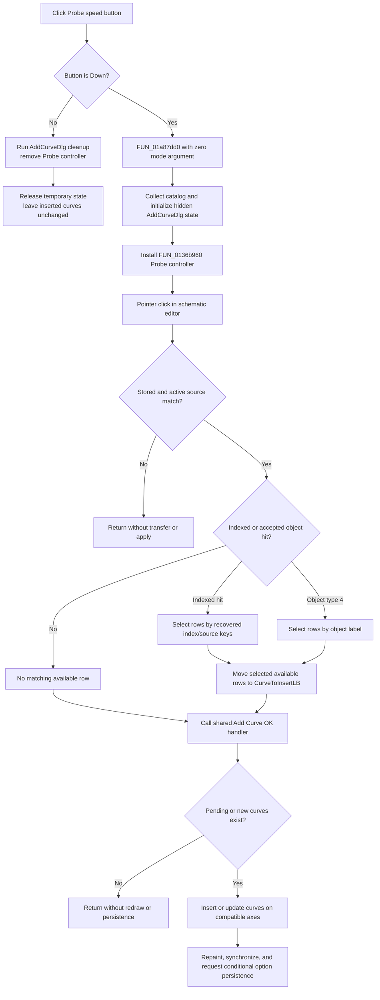

# Probe curves from the schematic into the diagram

> Analysis status: Source reviewed through mode activation, editor hit testing,
> curve selection, insertion, cleanup, redraw, and persistence boundaries.

## Control

| Property | Recovered value |
| --- | --- |
| Form | DFWindow |
| Component path | DFWindow.DFToolPanel.ToolNoteBook.Diagram.AddCurvesExBtn |
| Control class | TSpeedButton |
| Caption | Not present in the recovered resource. |
| Hint | Probe |
| Text | Not present in the recovered resource. |
| Handler name | AddCurvesExBtnClick |
| Handler address | 01a88060 |
| Graph node | `resource:dfm:DFWindow/DFWindow.DFToolPanel.ToolNoteBook.Diagram.AddCurvesExBtn` |
| Handler node | `function:01a88060` |
| Graph layer | UI |

## What happens when clicked

`AddCurvesExBtn` is a two-state Probe tool. Its DFM resource has
`AllowAllUp = true` and `GroupIndex = 4`. `FUN_01a88060` reads the button's
current Down state after the click and selects one of two paths.

When the button is down, the handler calls the shared Post-processor opener
with a zero second argument. This route:

1. Collects and de-duplicates the current curve/source catalog.
2. Replaces the shared `AddCurveDlg` master catalog and stages the active
   result type and available source text.
3. Replaces the current editor interaction controller with the controller
   constructed by `FUN_0136b960`, when the required editor context exists.
4. Forces the dialog out of its expanded More state, if required, and calls
   the dialog's `OnShow` initializer directly. The initializer clears
   `CurveToInsertLB`, rebuilds `AvailableCurvesLB`, and creates temporary
   working state.

The zero-argument route does not call the VCL show-and-activate helper. The
shared form therefore works as background state for Probe mode. If the form
was already visible, this route does not explicitly hide it before it runs the
initializer.

When the button is up, `FUN_01a88060` calls the shared `AddCurveDlg.OnHide`
cleanup routine directly. The cleanup releases the temporary dialog model and
working objects, clears its working flags and source string, removes an
installed editor controller, refreshes the editor, and makes the Probe button
up. Destruction of the Probe controller also hides a visible `AddCurveDlg`.
The direct handler does not assign a modal result.

## How an active Probe click selects curves

The installed controller's pointer-hit method is `FUN_0136bb20`. It first
checks that the active editor source matches the source context stored for the
Probe session. For a matching context, it converts the pointer coordinates to
schematic coordinates and performs a hit test.

Two recovered hit forms can select catalog entries:

- An indexed hit is passed to `FUN_013ccc70`. That helper builds recovered
  index/source keys and selects matching rows in both the available and
  pending list boxes.
- If there is no indexed hit, the method looks for an object at the pointer.
  It accepts only the recovered object type value `4`, reads its label, and
  uses a generated `no_label_` value when the label is empty.
  `FUN_013cca60` then selects rows whose displayed text contains that label.

The recovered class name for object type `4` is not available, so this article
does not give it a Delphi type name. A label can match more than one available
row. The next helper moves every selected available text/object pair to
`CurveToInsertLB`, removes those rows from the available view, and rebuilds the
filtered available list.

The pointer-hit method then calls the normal Add Curve OK handler immediately.
There is no separate confirmation dialog and no axis-selection dialog in the
Probe path. If the source context does not match, the method only runs its
sentinel selection updates and returns without the transfer or OK calls. If a
matching context has no accepted hit, the method does not select a new row. It
still calls OK. OK returns when both input collections are empty, but it can
resubmit pending rows retained from an earlier Probe hit.

## Insertion, axes, range, and retained state

The shared OK handler filters the pending text/object pairs for each recovered
result target. Its lower insertion path first tries a stored diagram and then
uses compatible coordinate systems and their axes. It updates or reuses an
existing plotted curve when it finds a match; otherwise it creates a plotted
curve and cycles its display color in the direct-insertion path.

Probe mode does not choose a named axis, change an axis range directly, or
write a manual range in the recovered handler chain. After a nonempty apply,
the shared OK handler repaints the diagram and synchronizes active
coordinate-system and main-window state. It then requests diagram-option
persistence. The lower persistence helper stores coordinate-system, axis,
curve, and figure settings only when `Diagram Page Setup/ManualScale` is
enabled in `TINA.INI`. This is not a project-save command.

`CurveToInsertLB` is cleared when Probe mode starts, but the OK handler does
not clear that list after an apply. It clears only the separate new-curve
tracking list. Probe hits can therefore add to the pending list during one
active session and can resubmit earlier pending entries. The insertion path's
matching logic reuses or updates existing plotted curves instead of creating a
second plotted entry for the same curve. Turning Probe off releases the
temporary working state; the next activation clears the pending list during
background initialization.

## Cancellation, errors, and partial changes

Pressing the Probe button again is the recovered mode-cancel path. It removes
the interaction controller and releases temporary dialog state. It does not
undo curves that earlier Probe hits already inserted.

For an unaccepted pointer hit in an otherwise valid source context, the
controller calls an unresolved routine with value `0xffff` before it continues
to the transfer and OK calls. The recovered source does not establish whether
this is audible, visual, or another form of feedback, so this article does not
name the effect.

An incompatible nonempty target list can show the recovered message
**curves cannot be inserted into this coordinate system! Please select another
diagram!**. The OK handler ignores the false result, continues with later
targets, and then performs cleanup, repaint, synchronization, and its
persistence request. A null diagram manager also returns failure without an
insertion, and the OK handler ignores it.

The opener, hit-test, list, insertion, redraw, and persistence paths have no
recovered local exception handler or transaction rollback. An earlier target
can remain changed if a later target rejects its curves or an exception stops
the sequence. A failed apply can also leave pending rows available for a later
Probe hit until the mode is reinitialized.

## Probe flow

## Handler and downstream evidence

- [Direct Probe toggle handler](../../../DecompiledSources/Tina16/functions/0000000001A88060__FUN_01a88060.c)
  reads the speed-button state and selects activation or cleanup.
- [Shared Post-processor opener](../../../DecompiledSources/Tina16/functions/0000000001A87DD0__FUN_01a87dd0.c)
  owns catalog collection and the zero-mode setup branch. The
  [Post-processor menu article](addmorecurvesmnu-32eb66c525.md) is the canonical
  annotation owner for this shared function.
- [Probe controller constructor](../../../DecompiledSources/Tina16/functions/000000000136B960__FUN_0136b960.c)
  constructs the zero-mode editor controller before it is installed.
- [Probe pointer-hit method](../../../DecompiledSources/Tina16/functions/000000000136BB20__FUN_0136bb20.c)
  validates source context, maps pointer coordinates, resolves the hit, stages
  selected curves, and calls the OK handler.
- [`FUN_013cca60`](../../../DecompiledSources/Tina16/functions/00000000013CCA60__FUN_013cca60.c)
  selects available and pending rows from an object label.
- [`FUN_013ccc70`](../../../DecompiledSources/Tina16/functions/00000000013CCC70__FUN_013ccc70.c)
  selects rows from recovered indexed-hit and source keys.
- [`FUN_013ca310`](../../../DecompiledSources/Tina16/functions/00000000013CA310__FUN_013ca310.c)
  moves selected available rows to the pending insertion list.
- [Add Curve OK](../addcurvedlg/okbtn-5bd06272ec.md) documents target filtering,
  compatible-axis insertion, partial failures, redraw, and conditional option
  persistence.
- [`FUN_013cc560`](../../../DecompiledSources/Tina16/functions/00000000013CC560__FUN_013cc560.c)
  releases the shared dialog's temporary state and removes the interaction
  controller.

## Resource and glyph evidence

- The control is a `TSpeedButton` with hint **Probe**, `AllowAllUp = true`, and
  `GroupIndex = 4`. These values support its retained tool-mode behavior.
- [The extracted 21 by 21 pixel glyph](../../../glyph/0106_DFWindow_DFWindow_DFToolPanel_ToolNoteBook_Diagram_AddCurvesExBtn_Glyph_Data.png)
  shows a black probe tip beside a red cross. The image supports a point-pick
  intent. The installed controller and hit-test data flow prove the behavior.
- The resource has no recovered caption, action, checked value, modal result,
  or same-parent label candidate.

## Analysis limits

- The recovered source does not provide Delphi names for the Probe controller
  class, the schematic object type value `4`, dialog fields, or global result
  pointers.
- The literal syntax of the indexed source keys built by `FUN_013ccc70` is not
  recovered well enough to name. Their comparisons and list-selection effects
  are clear.
- The source proves compatible coordinate-system and axis use below the OK
  handler. It does not prove a user-facing axis name or a Probe-specific range
  calculation.
- `FUN_01a87dd0` and the shared Add Curve helpers remain evidence only here.
  Their canonical annotations belong to their existing control articles.
