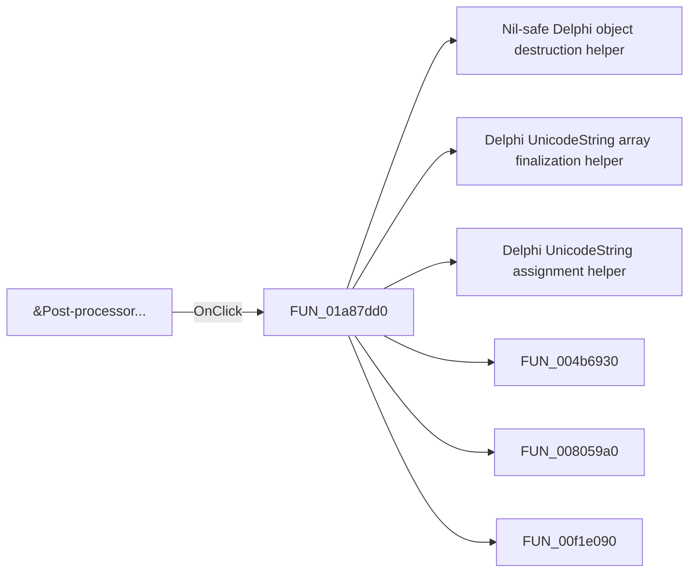

# &Post-processor...

> Analysis status: Pending individual source review.

## Control

| Property | Recovered value |
| --- | --- |
| Form | DFWindow |
| Component path | DFWindow.DFMainMenu.DFEditMnu.AddmorecurvesMnu |
| Control class | TMenuItem |
| Caption | &Post-processor... |
| Hint | Not present in the recovered resource. |
| Text | Not present in the recovered resource. |
| Handler name | AddMoreCurvesMnuClick |
| Handler address | 01a87dd0 |
| Graph node | `resource:dfm:DFWindow/DFWindow.DFMainMenu.DFEditMnu.AddmorecurvesMnu` |
| Handler node | `function:01a87dd0` |
| Graph layer | UI |

## What happens when clicked

Pending individual analysis. An agent must read the recovered handler source and its relevant callees before it replaces this text.

## Click flow

## Handler evidence

- Source: [DecompiledSources/Tina16/functions/0000000001A87DD0__FUN_01a87dd0.c](../../../DecompiledSources/Tina16/functions/0000000001A87DD0__FUN_01a87dd0.c)
- Recovered role: Not present in the recovered resource.
- Current graph summary: Handles 2 Delphi UI events: DFWindow.DFToolPanel.ToolNoteBook.Diagram.AddCurvesBtn.OnClick, DFWindow.DFMainMenu.DFEditMnu.AddmorecurvesMnu.OnClick.
- Current graph behavior: Not present in the recovered resource.
- Current graph evidence: Not present in the recovered resource.
- Complexity: complex
- Distinct outgoing calls: 14

## Direct calls

- `function:00410f20` — Nil-safe Delphi object destruction helper
- `function:00414560` — Delphi UnicodeString array finalization helper
- `function:00414ad0` — Delphi UnicodeString assignment helper
- `function:004b6930` — FUN_004b6930
- `function:008059a0` — FUN_008059a0
- `function:00f1e090` — FUN_00f1e090
- `function:01364e80` — FUN_01364e80
- `function:0136b960` — FUN_0136b960
- `function:013ca610` — FUN_013ca610
- `function:013cbd70` — Handles 1 Delphi UI event: AddCurveDlg.OnShow.
- `function:013cf760` — Handles 1 Delphi UI event: AddCurveDlg.UpperPl.Panel3.MoreBtn.OnClick.
- `function:01c6cee0` — FUN_01c6cee0
- `function:01c6cf20` — FUN_01c6cf20
- `function:01cc37d0` — FUN_01cc37d0

## Resource evidence

- Kind: Not present in the recovered resource.
- Modal result: Not present in the recovered resource.
- Checked state: Not present in the recovered resource.
- List items: Not present in the recovered resource.
- Image reference: Not present in the recovered resource.
- Extracted glyph: None.

## Nearby label candidates

Nearby labels are layout candidates only. They are not proof of behavior.

- No same-parent label candidate is available.

## Analysis limits

- Do not infer behavior from the control class, caption, hint, glyph, or nearby label alone.
- Do not replace the pending status until the handler source and relevant call path provide enough evidence.
