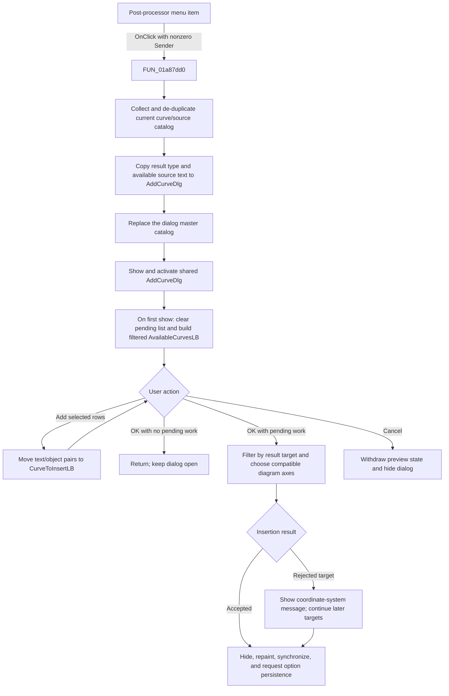

# Open the Post-processor curve dialog

> Analysis status: Source reviewed through catalog collection, dialog setup,
> selection, insertion, refresh, cancellation, and error boundaries.

## Control

| Property | Recovered value |
| --- | --- |
| Form | DFWindow |
| Component path | DFWindow.DFMainMenu.DFEditMnu.AddmorecurvesMnu |
| Control class | TMenuItem |
| Caption | &Post-processor... |
| Hint | Not present in the recovered resource. |
| Text | Not present in the recovered resource. |
| Handler name | AddMoreCurvesMnuClick |
| Handler address | 01a87dd0 |
| Graph node | `resource:dfm:DFWindow/DFWindow.DFMainMenu.DFEditMnu.AddmorecurvesMnu` |
| Handler node | `function:01a87dd0` |
| Graph layer | UI |

## What happens when clicked

The command prepares the shared `AddCurveDlg` Post-processor form with curves
from the current result sources and opens it as a modeless window. It does not
insert a curve, select an axis, redraw a diagram, or save diagram options in
this handler.

Before the menu opens, the shared DFWindow command-state updater can disable
**Post-processor...** from the current diagram context. The menu therefore
normally prevents an invalid click. `FUN_01a87dd0` has no second local enabled
or context guard when it is called directly.

For a normal menu click, the handler performs these operations:

1. It creates a temporary Delphi string/object list and calls
   `FUN_00f1e090` to collect curves from the current application result and
   source registries.
2. The collector keeps only entries with a nonempty recovered name and a
   positive curve field at offset `0x2c`. Its lower enumerator searches the
   temporary list by normalized display text before it adds an entry. The
   first object found for one display text therefore wins, and later entries
   with the same display text are not added.
3. The handler copies the active result-type byte to `AddCurveDlg` offset
   `0x93c`. For two recovered result contexts, it also copies source text to
   offset `0x940`. The Delphi field names are not recovered.
4. `FUN_013ca610` clears the dialog's master catalog at offset `0x878` and
   copies the collected display-text and object-reference pairs into it in
   source order. The temporary list is then destroyed.
5. When the recovered editor context at global `020027c0` exists, the handler
   replaces a related editor controller. The selected controller class depends
   on whether the second handler argument is zero. The class purpose is not
   sufficiently recovered to name it more precisely.
6. A UI click supplies a nonzero `Sender`, so `FUN_008059a0` sets the shared
   form visible and activates it. When the form changes from hidden to visible,
   its DFM-bound `OnShow` handler clears the pending insertion list, applies
   category and text filters, rebuilds `AvailableCurvesLB`, and creates the
   dialog's temporary working state. If the form is already visible, the VCL
   visibility setter does not perform another hidden-to-visible transition;
   the handler still replaces the master catalog and activates the form.

There is also an internal zero-`Sender` route. `FUN_01a88060` calls
`FUN_01a87dd0(..., 0)` from a separate Probe command. That route directly runs
the dialog's More and OnShow logic instead of calling the modeless-show helper.
It is not the path produced by this menu item.

## Available, pending, and existing curves

The dialog uses three different collections:

- The master catalog at offset `0x878` contains the collected curve names and
  object references.
- `AvailableCurvesLB` is a filtered view of that catalog. `FUN_013cab80`
  excludes an object that is already in `CurveToInsertLB` and applies the
  current type and text filters.
- `CurveToInsertLB` is the pending request. A fresh `OnShow` clears it.
  **Add >>** copies every selected available row, including its attached curve
  object, to this list and then rebuilds the available list.

The normal UI path prevents the same object from being selected twice because
an object already in the pending list no longer appears in the available list.
This is separate from the catalog's display-name de-duplication. The opening
handler does not preload the pending list with curves that are already plotted,
so the article does not describe `AvailableCurvesLB` as an "unplotted curves"
list.

During later diagram insertion, `FUN_00f1c5c0` searches the selected coordinate
system for a matching plotted-curve entry. It updates or reuses a match instead
of creating a second plotted entry. Otherwise, the insertion path creates a
new curve in a compatible coordinate system.

## Apply, axis assignment, and persistence

The user must select one or more available curves, move them under **Curves to
insert:**, and click the dialog's **OK** button. That later handler:

1. filters the pending list separately for each recovered result target;
2. first tries to reuse a stored diagram and otherwise scans compatible
   coordinate systems;
3. inserts or updates accepted curves, with automatic color cycling in the
   direct-insertion path;
4. clears the new-curve tracking list and hides the visible dialog;
5. repaints the diagram and synchronizes the active coordinate-system and main
   window controls; and
6. requests diagram-option persistence. The persistence helper writes the
   coordinate-system, axis, curve, and figure settings only when
   `Diagram Page Setup/ManualScale` is enabled in `TINA.INI`.

The recovered path assigns curves through compatible coordinate systems and
their axes. This menu handler does not select an axis, and the source does not
show a separate axis choice in the opening path.

If the pending insertion list and the dialog's new-curve tracking list are both
empty, **OK** returns without hiding the dialog, refreshing the graph, or
storing options.

## Cancel, errors, and partial changes

**Cancel** withdraws tracked preview objects, redraws only when a preview was
active, and hides the form. The form's `OnHide` path releases temporary dialog
state. Cancel does not undo a user-defined curve definition that the dialog's
**Create** command already committed.

The opener has no recovered exception handler. Allocation, catalog collection,
context setup, or VCL show errors propagate and can leave the shared dialog's
catalog or context fields partly updated.

The later **OK** path also has no transaction rollback. If one result target
accepts curves and a later target rejects them, the earlier changes remain. An
incompatible target can show **curves cannot be inserted into this coordinate
system! Please select another diagram!**. The OK handler ignores the returned
failure and continues its cleanup, repaint, synchronization, and persistence
request. A null diagram manager also returns failure without insertion, and
the OK handler ignores that result.

## Click flow

## Handler evidence

- Source: [DecompiledSources/Tina16/functions/0000000001A87DD0__FUN_01a87dd0.c](../../../DecompiledSources/Tina16/functions/0000000001A87DD0__FUN_01a87dd0.c)
- Recovered role: Opens the shared Add Curve Post-processor with the current
  curve-source catalog.
- Current graph summary: Handles two Delphi UI events:
  `DFWindow.DFMainMenu.DFEditMnu.AddmorecurvesMnu.OnClick` and
  `DFWindow.DFToolPanel.ToolNoteBook.Diagram.AddCurvesBtn.OnClick`.
- Input evidence: The handler reads the current global result/source pointers,
  the active result-type byte, an optional source string, and the nonzero UI
  `Sender` value.
- State evidence: It replaces `AddCurveDlg`'s catalog and context fields and
  can replace a related editor controller before it shows the form.
- Output boundary: No insertion, diagram repaint, or persistence helper is
  called by `FUN_01a87dd0`.
- Complexity: complex
- Distinct outgoing calls: 14

## Relevant calls

- [`FUN_00f1e090`](../../../DecompiledSources/Tina16/functions/0000000000F1E090__FUN_00f1e090.c)
  collects entries from the current application result and source registries.
  Its enumerator de-duplicates accepted entries by normalized display text.
- [`FUN_013ca610`](../../../DecompiledSources/Tina16/functions/00000000013CA610__FUN_013ca610.c)
  replaces the Add Curve dialog's master catalog.
- [`FUN_008059a0`](../../../DecompiledSources/Tina16/functions/00000000008059A0__FUN_008059a0.c)
  sets the shared form visible and activates it.
- [`FUN_013cbd70`](../../../DecompiledSources/Tina16/functions/00000000013CBD70__FUN_013cbd70.c)
  is the dialog's `OnShow` handler. It clears the pending list and rebuilds the
  filtered available list during a hidden-to-visible show.
- [Add &gt;&gt;](../addcurvedlg/addbtn-74addd7ef3.md) documents selection transfer
  from `AvailableCurvesLB` to `CurveToInsertLB`.
- [Add Curve OK](../addcurvedlg/okbtn-5bd06272ec.md) documents target filtering,
  coordinate-system insertion, diagram refresh, and conditional option
  persistence.
- [Add Curve Cancel](../addcurvedlg/cancelbtn-6c0826faf9.md) documents preview
  withdrawal and the nontransactional cancel boundary.
- [DFWindow Edit menu](dfeditmnu-acd28845e8.md) documents the shared command
  state updater that can disable this item. That helper does not execute the
  command.

## Resource and glyph evidence

- The menu item has caption **Post-processor...**. It has no recovered hint,
  action, image reference, or embedded glyph.
- The toolbar speed button `AddCurvesBtn` resolves to the same handler. Its
  hint is **Post-processor**.
- [The toolbar glyph](../../../glyph/0105_DFWindow_DFWindow_DFToolPanel_ToolNoteBook_Diagram_AddCurvesBtn_Glyph_Data.png)
  shows a plus sign over colored curves beside gray curve traces. This supports
  the add/show-curves intent. The handler and dialog data flow, not the image
  alone, establish the command behavior.

## Analysis limits

- The recovered source does not provide Delphi names for the global result
  pointers, form fields at offsets `0x878`, `0x93c`, and `0x940`, or the
  optional editor-controller classes.
- The display-name normalizer called by the catalog enumerator removes an
  unresolved literal. Its exact prefix or token is not named here.
- This command opens `AddCurveDlg`. It is distinct from the Curve List window's
  live checklist workflow and does not call that window's singleton opener.
- Source evidence proves the insertion compatibility checks and later
  consumers. It does not prove user-facing names for each coordinate-system
  type or recovered global result target.
