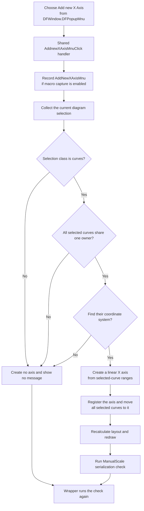

# Add a new X axis from the DFWindow popup menu

> Analysis status: Evidence-backed from the recovered popup resource, shared handler, selection collector, X-axis creation helper, redraw path, macro recorder, and manual-scale serializer.

## Control

| Property | Recovered value |
| --- | --- |
| Form | DFWindow |
| Popup path | DFPopupMnu > Add new X Axis |
| Component path | DFWindow.DFPopupMnu.AddnewXAxisMnu |
| Control class | TMenuItem |
| Caption | Add new X Axis |
| Hint | Not present in the recovered resource. |
| Text | Not present in the recovered resource. |
| Handler name | AddnewXAxisMnuClick |
| Handler address | `01a79260` |
| Graph node | `resource:dfm:DFWindow/DFWindow.DFPopupMnu.AddnewXAxisMnu` |
| Handler node | `function:01a79260` |
| Handler graph layer | UI |

## Popup-specific route

The recovered form resource places this item directly under `DFWindow.DFPopupMnu`. Choosing it calls [`FUN_01a79260`](../../../DecompiledSources/Tina16/functions/0000000001A79260__FUN_01a79260.c), the same handler used by `Edit > Add new X axis` in the main menu.

The handler does not inspect `Sender`, popup coordinates, a clicked object, or the menu-item instance. The popup route therefore does not pass a target axis or curve directly. The diagram's selection state at the time of the click supplies the curves to process. The recovered resource does not identify which visual surface opens `DFPopupMnu`, so this article does not assign the popup to a specific canvas or mouse button.

## What happens when clicked

The handler performs these steps in order:

1. It formats the macro command name `AddNewXAxisMnu` and sends the event to the optional macro recorder.
2. It calls [`FUN_01ad78b0`](../../../DecompiledSources/Tina16/functions/0000000001AD78B0__FUN_01ad78b0.c) for the diagram model at DFWindow offset `+0x798`, with redraw enabled.
3. It calls [`FUN_01add6f0`](../../../DecompiledSources/Tina16/functions/0000000001ADD6F0__FUN_01add6f0.c) to run the manual-scale serialization check.

The handler does not open an axis dialog. It does not request a name, scale, range, or confirmation, and it has no user cancel path.

## Selection and creation guards

The `.271`-owned X-axis helper calls [`FUN_01acff30`](../../../DecompiledSources/Tina16/functions/0000000001ACFF30__FUN_01acff30.c) and continues only when the returned selection class is `2`. The later field use proves that this accepted class contains selected curves.

The helper also requires:

- all selected curves to have the same owner pointer at curve offset `+0x78`;
- the first selected curve to belong to one coordinate system in the diagram.

If the selection is empty, contains another object class, mixes curve owners, or cannot be resolved to a coordinate system, the helper destroys its temporary list and returns. It creates no axis and shows no message. The earlier macro-event attempt remains, and the wrapper still runs its final manual-scale serialization check because the helper returns no success value.

The source shows no recovered maximum selection count, maximum X-axis count, or duplicate-name check.

## Axis state and curve reassignment

On the accepted path, the helper constructs a new X-axis object with axis-kind value `0` and scale-mode value `0`. The parallel Y-axis path and recovered scale items support the roles X axis and linear scale for these values.

The helper derives the initial X range from the selected curve data. For one coordinate-system mode it reads the first selected curve's X provider. For the alternate mode it calculates the minimum lower X value and maximum upper X value across all selected curves. It copies this range to the base and current limits, calculates the default scale divisions, derives spacing from the plot rectangle, and applies the coordinate-system color to the axis fonts.

It then registers the new axis in the coordinate system's X-axis collection. For each selected curve, it removes the curve from its old X-axis list, updates the curve's X-axis pointer, and adds it to the new axis's curve list. Existing unselected curves and their X-axis assignments are not changed.

## Layout, redraw, and repeated clicks

The helper clears the diagram layout byte at `+0x10d`. Because the handler enables refresh, the helper then recalculates coordinate-system axes, queues the coordinate system for drawing, processes the redraw queue, and repaints the changed diagram.

A repeated click can create another X axis and move the same still-selected curves to it. This path removes the curves from the previous axis's curve list but does not delete that axis object. The source does not show empty-axis cleanup in this click path.

## Macro and persistence effects

[`FUN_01aee720`](../../../DecompiledSources/Tina16/functions/0000000001AEE720__FUN_01aee720.c) formats the `AddNewXAxisMnu` macro payload. [`FUN_01aed550`](../../../DecompiledSources/Tina16/functions/0000000001AED550__FUN_01aed550.c) sends it only when macro recording is enabled. This recording happens before selection validation, so a rejected popup command can still be recorded as an attempted command. Macro recording is not an undo operation.

The successful creation helper calls the manual-scale serializer after redraw, and the click wrapper calls it again after the helper returns. When `Diagram Page Setup / ManualScale` is false, the serializer makes no diagram-option copy. When it is true, it writes curve, coordinate-system, X-axis, Y-axis, and figure options through the temporary `DiagOpt.tmp` store into the associated diagram-data object. A rejected selection reaches only the wrapper's final check and can rewrite the unchanged manual-scale state.

The click changes the live diagram immediately. It does not call the normal document Save command and does not push a recovered undo record.

## Click flow

## Handler and helper evidence

- Shared click handler: [FUN_01a79260](../../../DecompiledSources/Tina16/functions/0000000001A79260__FUN_01a79260.c)
- X-axis creation and curve reassignment: [FUN_01ad78b0](../../../DecompiledSources/Tina16/functions/0000000001AD78B0__FUN_01ad78b0.c). Bead `TIARA-diz.6.7.271` owns its canonical annotation.
- Selection collector: [FUN_01acff30](../../../DecompiledSources/Tina16/functions/0000000001ACFF30__FUN_01acff30.c)
- Coordinate-system layout: [FUN_01ce4cd0](../../../DecompiledSources/Tina16/functions/0000000001CE4CD0__FUN_01ce4cd0.c)
- Redraw-list insertion and processing: [FUN_01a8dee0](../../../DecompiledSources/Tina16/functions/0000000001A8DEE0__FUN_01a8dee0.c) and [FUN_01ae5650](../../../DecompiledSources/Tina16/functions/0000000001AE5650__FUN_01ae5650.c)
- Manual-scale serialization: [FUN_01add6f0](../../../DecompiledSources/Tina16/functions/0000000001ADD6F0__FUN_01add6f0.c)
- Macro formatting and recording: [FUN_01aee720](../../../DecompiledSources/Tina16/functions/0000000001AEE720__FUN_01aee720.c) and [FUN_01aed550](../../../DecompiledSources/Tina16/functions/0000000001AED550__FUN_01aed550.c)
- Recovered component tree: [ui-evidence.json](../../../DecompiledSources/Tina16/resources/dfm/ui-evidence.json)

## Error and partial-state boundaries

- Guard failures are silent no-ops for axis creation. The wrapper cannot distinguish them from success.
- There is no local exception handler, retry, rollback, or user-facing error message.
- An exception after the new axis is registered or during the per-curve move can leave a new axis with only part of the selected set reassigned.
- An exception during layout, redraw, or manual-scale serialization can occur after the live diagram has changed.
- The macro-event attempt occurs first and is not rolled back when a later step fails.

## Resource evidence and limits

- `DFWindow.DFPopupMnu.AddnewXAxisMnu` has caption `Add new X Axis` and binds `OnClick` to `AddnewXAxisMnuClick` at `01a79260`.
- The main Edit-menu item has caption `Add new X axis` and resolves to the same handler address.
- The popup item has no recovered hint, action, checked state, image reference, or extracted glyph. Menu items also have no same-parent label candidates.
- The popup resource has no recovered `OnPopup` handler. The available evidence does not prove whether other code changes this item's enabled or visible state before display.
- No live UI test was performed. The result uses the DFM binding, read-only graph, handler, selection collector, creation helper, redraw path, macro recorder, and serializer.
