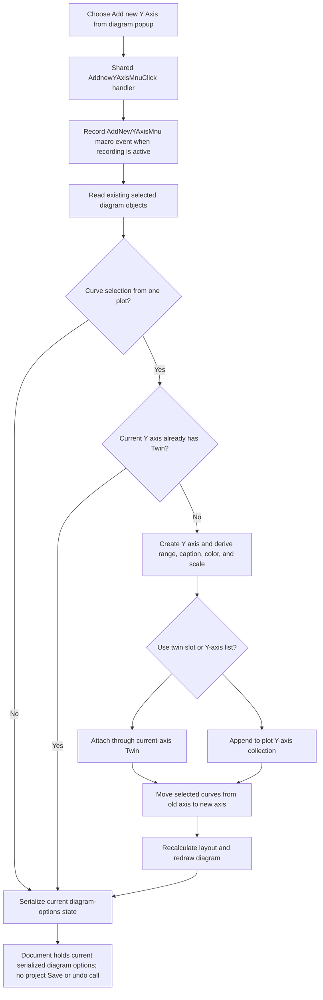

# Add a Y axis from the diagram popup menu

> Analysis status: Reviewed from the recovered popup binding, shared handler, selected-curve guards, Y-axis creation, curve reassignment, layout, redraw, macro, and diagram-options serialization evidence.

## Control

| Property | Recovered value |
| --- | --- |
| Form | DFWindow |
| Component path | DFWindow.DFPopupMnu.AddnewYAxisMnu |
| Control class | TMenuItem |
| Caption | Add new Y Axis |
| Hint | Not present in the recovered resource. |
| Text | Not present in the recovered resource. |
| Handler name | AddnewYAxisMnuClick |
| Handler address | 01a79190 |
| Other binding | DFWindow.DFMainMenu.DFEditMnu.AddYAxisMnu, caption `Add new Y axis` |
| Graph node | `resource:dfm:DFWindow/DFWindow.DFPopupMnu.AddnewYAxisMnu` |
| Handler node | `function:01a79190` |
| Graph layer | UI |

## Popup-specific route

The diagram popup item and the Edit-menu item resolve to the same `TDFWindow.AddnewYAxisMnuClick` handler. The popup route does not pass a diagram point, hovered curve, popup owner, or special mode into that handler. The handler has no Sender parameter and reads no popup-menu field.

Thus the popup command acts on the diagram's existing selected-object set. Right-click location alone does not select the curves in this recovered call path. Any selection update that occurs before the popup opens is outside this handler.

The shared handler performs these operations in order:

1. It builds the macro action whose identifier ends in `AddNewYAxisMnu`.
2. It sends the action to the conditional macro recorder.
3. It passes the active diagram at DFWindow `+0x798` to `FUN_01ad72b0` with layout and twin guards enabled.
4. It serializes the complete current diagram configuration through `FUN_01add6f0`.

It does not open an axis-properties dialog or ask for confirmation.

## Selection guards

The Y-axis helper creates an axis only when the recovered selection classifier is `2`, the curve-selection path proved by its later curve fields and ownership changes.

It then requires:

- every selected curve to belong to the same plot;
- the first curve to have a current Y-axis association from which defaults can be read;
- that current Y axis to have no existing `Twin` pointer, because this handler supplies the twin guard as true.

An empty selection, a non-curve selection, curves from different plots, or an existing twin pointer is a silent no-axis result. The popup remains nonmodal, and the handler shows no selection message.

The helper has no recovered numeric maximum-axis check. It also does not reject a new axis because another axis has the same caption, color, scale, or range.

## Axis creation and curve transfer

After the guards pass, the helper constructs one Y-axis object. It marks the object as a Y axis and derives its main display state from the selected curves:

- scale mode from the first curve's current Y axis;
- minimum and maximum from all selected curves' Y data;
- display color from the first selected curve;
- caption from the first curve's recovered label when available;
- axis font sizes from the plot;
- spacing from the plot dimensions;
- normalized range and tick layout through the common axis-range routine.

The constructor supplies baseline fonts and range values before these curve-derived assignments. It reads the fixed-font preference from `TINA.INI`; this can select Tahoma instead of Arial.

When the plot supports the recovered twin-axis form, the helper attaches the new axis through the old axis's `Twin` field. Otherwise, it appends the new axis to the plot's ordered Y-axis collection.

It then processes every selected curve in selection order:

1. Remove the curve from its old Y axis's curve list.
2. Change the curve's Y-axis owner pointer to the new axis.
3. Append the curve to the new axis's curve list.

The source does not delete the old Y axis if that transfer leaves it empty. It does not change X-axis ownership or sample data.

## Layout, persistence, and undo

The popup route enables the helper's layout flag. After successful creation, the helper recalculates plot geometry, registers the changed plot for refresh, and runs the common redraw path. The new axis and transferred curves can therefore appear immediately without a separate popup action.

The handler then serializes the full diagram configuration into the current document's diagram-options state. The recovered data includes curve sets, coordinate systems, X and Y axes, captions, colors, ranges, fonts, memberships, and figures.

This is document-owned state. The handler does not call project Save and does not prove an immediate project-file write. A later document save can persist the changed diagram options.

The macro event is not an undo record. No undo snapshot, inverse curve transfer, transaction, or rollback call is present in the popup path.

## Click flow

## No-op, error, and partial-state behavior

- The popup handler has no active-diagram null guard. A direct invocation without a diagram can fail in the helper or serializer.
- The handler ignores the Y-axis helper's Boolean result. A rejected selection still reaches diagram-options serialization on normal return.
- Macro recording occurs before selection validation, so a macro event can exist even when no axis is created.
- There is no confirmation, cancel branch, duplicate warning, maximum-count message, retry, or local exception handler.
- Axis allocation, attachment, curve-list mutation, layout, and serialization have no recovered rollback transaction. A failure after some curve moves can leave partial in-memory ownership changes.
- If axis creation returns normally but diagram-options serialization fails, the changed in-memory diagram and redraw can exist while the serialized document options remain older.

## Handler and call-path evidence

- Shared popup and Edit-menu handler: [FUN_01a79190](../../../DecompiledSources/Tina16/functions/0000000001A79190__FUN_01a79190.c) records the macro event, calls Y-axis creation with arguments `1, 1`, and serializes the diagram.
- Y-axis creation and transfer: [FUN_01ad72b0](../../../DecompiledSources/Tina16/functions/0000000001AD72B0__FUN_01ad72b0.c) validates the selected curves, creates and attaches the new axis, transfers curve ownership, and requests layout and redraw. Its canonical annotation is owned by `TIARA-diz.6.7.272`.
- Axis constructor: [FUN_01ccd700](../../../DecompiledSources/Tina16/functions/0000000001CCD700__FUN_01ccd700.c) supplies baseline font, label, range, and style state.
- Range normalization: [FUN_01cd43b0](../../../DecompiledSources/Tina16/functions/0000000001CD43B0__FUN_01cd43b0.c) calculates the usable range and ticks after the selected-curve bounds are assigned.
- Plot layout: [FUN_01ce4cd0](../../../DecompiledSources/Tina16/functions/0000000001CE4CD0__FUN_01ce4cd0.c) recalculates plot and axis geometry.
- Diagram redraw: [FUN_01ae5650](../../../DecompiledSources/Tina16/functions/0000000001AE5650__FUN_01ae5650.c) runs the shared diagram refresh path after successful creation.
- Diagram-options serializer: [FUN_01add6f0](../../../DecompiledSources/Tina16/functions/0000000001ADD6F0__FUN_01add6f0.c) writes the complete current diagram configuration into document-owned state.
- Macro helpers: [FUN_01aee720](../../../DecompiledSources/Tina16/functions/0000000001AEE720__FUN_01aee720.c) builds the action, and [FUN_01aed550](../../../DecompiledSources/Tina16/functions/0000000001AED550__FUN_01aed550.c) submits it only when recording is active.
- Recovered component tree: [ui-evidence.json](../../../DecompiledSources/Tina16/resources/dfm/ui-evidence.json) proves that both menu resources resolve to handler `01a79190`.
- Complexity: complex; the graph records five distinct outgoing calls from `FUN_01a79190`.

## Resource evidence

- This resource is the diagram popup-menu item `Add new Y Axis`.
- The Edit menu has a separate item captioned `Add new Y axis`.
- Both items bind `OnClick` to `AddnewYAxisMnuClick` at `01a79190`.
- The popup item has no recovered hint, shortcut, action, image reference, glyph, checked state, radio state, or submenu.

## Analysis limits

- The selected-object classifier's Delphi enum name is not recovered. Value `2` is identified as curves from the downstream curve ownership and list operations.
- The source does not prove what selection-setting logic ran before the popup opened. It proves only that this click handler reads the selection already stored in the diagram.
- The helper has no explicit maximum-axis check. Lower-level allocation or collection code can still impose limits.
- No undo integration is visible in this call tree. This does not prove that a separate reload command cannot restore an older saved document.
