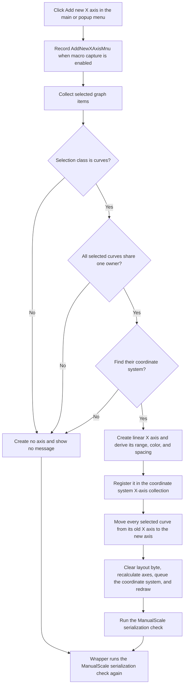

# Add a new X axis for the selected curves

> Analysis status: Evidence-backed source review complete.

## Control

| Property | Recovered value |
| --- | --- |
| Form | DFWindow |
| Component path | DFWindow.DFMainMenu.DFEditMnu.AddXaxisMnu |
| Control class | TMenuItem |
| Caption | Add new X axis |
| Hint | Not present in the recovered resource. |
| Handler name | AddnewXAxisMnuClick |
| Handler address | 01a79260 |
| Graph node | `resource:dfm:DFWindow/DFWindow.DFMainMenu.DFEditMnu.AddXaxisMnu` |
| Handler node | `function:01a79260` |
| Graph layer | UI |

## What happens when clicked

`FUN_01a79260` records the `AddNewXAxisMnu` command for the optional macro recorder, then calls `FUN_01ad78b0` on DFWindow's diagram model at form offset `+0x798`. The helper adds an axis only from a valid selected-curve set. It does not open an axis-configuration dialog or ask for a name, range, or confirmation.

The main-menu item and `DFWindow.DFPopupMnu.AddnewXAxisMnu` use this same handler. Both entry points therefore have the same behavior.

## Selection and creation guards

`FUN_01ad78b0` calls the common selection collector and continues only when the collector reports class value `2`. The later field accesses and reassignments establish that this class contains selected curve objects.

The helper then applies two more guards:

- Every selected curve must have the same owner pointer at curve offset `+0x78`.
- The diagram's coordinate-system list at `+0xd8` must contain a coordinate system whose curve collection at `+0x80` contains the first selected curve.

No axis is created if a guard fails. The helper destroys the temporary selection list and returns without a message. The wrapper still runs the manual-scale serialization check after this no-op result.

The code does not impose a recovered maximum selection count, maximum X-axis count, or duplicate-name check. It does not read an axis caption from the user.

## New-axis defaults and range

On the accepted path, the helper constructs a new axis object and sets its axis-kind byte at `+0xf0` to `0`, while the parallel Y-axis helper sets this byte to `1`. It sets scale-mode byte `+0x70` to `0`. The axis resource lists `Linear` as the first scale mode, so this is the linear default. No explicit caption or custom number format is assigned; those values remain constructor defaults.

The starting data range depends on coordinate-system type bit 0 at offset `+0x58`:

- When the bit is clear, the helper obtains the lower and upper X values from the first selected curve's provider at `+0x80`, using its X data reference at `+0x98`.
- When the bit is set, the helper reads the alternate provider at `+0xc8` and data reference at `+0xe0` for every selected curve. It takes the minimum lower value and maximum upper value across the selection.

It copies this derived range into both the base and current limit fields. It then asks the axis object for default scale parameters and recalculates its divisions. There is no separate numeric validation or user-entered limit on this path.

The helper derives the new axis spacing at `+0x94` from the current plot rectangle: it rounds 15 percent of the width and height, takes the smaller result, and stores 20 percent of that value. It also applies the coordinate system's color at `+0x90` to both axis font objects. It registers the axis through the coordinate system's X-axis collection at `+0x70`.

## Curve reassignment, layout, and redraw

For every selected curve, the helper removes the curve from its old X-axis curve list, compacts that list, changes the curve's X-axis pointer to the new axis, and adds the curve to the new axis's curve list at `+0xf8`. The curve uses either its `+0xe8` or `+0xf8` X-axis pointer according to coordinate-system type bit 0.

The helper clears the diagram's layout byte at `+0x10d`. `FUN_01ad01b0` later treats zero as the equal coordinate-system division branch. Because the wrapper passes refresh flag `1`, the accepted path also recalculates the coordinate-system axes, ensures the coordinate system is in the diagram's redraw list, processes the queued diagram elements, and repaints them.

A repeated click can create another X axis and move the same still-selected curves again. The recovered helper removes the curves from the prior axis but does not delete that axis object. No explicit duplicate or empty-axis cleanup appears in this path.

## Macro, persistence, and undo boundaries

Before it checks the selection, the handler formats an `AddNewXAxisMnu` macro event and sends it to the macro recorder when macro recording is enabled. A rejected click can therefore still be recorded as a command attempt. Macro recording is not an undo operation.

`FUN_01add6f0` checks `TINA.INI` value `Diagram Page Setup / ManualScale`. When this option is false, it does not serialize the diagram. When it is true, it writes the curve, coordinate-system, X-axis, Y-axis, and figure options through the temporary `DiagOpt.tmp` store and copies the result into the associated diagram-data object. The successful creation helper calls this serializer once, and the click wrapper calls it again after the helper returns. A rejected creation still reaches the wrapper's one serialization check, which can rewrite the unchanged manual-scale state.

The recovered click path has no separate document Save command and no recovered undo-stack push. It changes the live diagram immediately. The macro event and manual-scale option serialization are the only proven recording or persistence effects.

## Click flow

## Handler and helper evidence

- Click handler: [FUN_01a79260](../../../DecompiledSources/Tina16/functions/0000000001A79260__FUN_01a79260.c)
- X-axis creation and curve reassignment: [FUN_01ad78b0](../../../DecompiledSources/Tina16/functions/0000000001AD78B0__FUN_01ad78b0.c)
- Selection collector: [FUN_01acff30](../../../DecompiledSources/Tina16/functions/0000000001ACFF30__FUN_01acff30.c)
- Parallel Y-axis helper: [FUN_01ad72b0](../../../DecompiledSources/Tina16/functions/0000000001AD72B0__FUN_01ad72b0.c)
- Coordinate-system axis layout and drawing: [FUN_01ce4cd0](../../../DecompiledSources/Tina16/functions/0000000001CE4CD0__FUN_01ce4cd0.c) and [FUN_01ce3940](../../../DecompiledSources/Tina16/functions/0000000001CE3940__FUN_01ce3940.c)
- Diagram redraw-queue processing: [FUN_01ae5650](../../../DecompiledSources/Tina16/functions/0000000001AE5650__FUN_01ae5650.c)
- Duplicate-safe redraw-list insertion: [FUN_01a8dee0](../../../DecompiledSources/Tina16/functions/0000000001A8DEE0__FUN_01a8dee0.c)
- Manual-scale option serialization: [FUN_01add6f0](../../../DecompiledSources/Tina16/functions/0000000001ADD6F0__FUN_01add6f0.c)
- ManualScale option reader: [FUN_01ada080](../../../DecompiledSources/Tina16/functions/0000000001ADA080__FUN_01ada080.c)
- Temporary diagram-option store: [FUN_01ae9310](../../../DecompiledSources/Tina16/functions/0000000001AE9310__FUN_01ae9310.c)
- Macro-event argument formatter and recorder: [FUN_01aee720](../../../DecompiledSources/Tina16/functions/0000000001AEE720__FUN_01aee720.c) and [FUN_01aed550](../../../DecompiledSources/Tina16/functions/0000000001AED550__FUN_01aed550.c)

## Resource and glyph evidence

- The main-menu caption is `Add new X axis`.
- The popup-menu counterpart has caption `Add new X Axis` and resolves to the same handler address.
- Neither menu item has a hint, image reference, or embedded glyph. The glyph manifest has no extracted image for this control.
- Menu items have no same-parent label candidates. The selected-curve collection, X-axis registration, and curve reassignment in the source prove the command scope.

## Error and evidence limits

- Guard failures are silent no-ops. The wrapper does not receive a success value from the creation helper.
- The handler and creation helper have no local exception handler, rollback, or user-facing error message. An exception after axis registration or during the per-curve loop can leave a partially reassigned selection. A later serialization failure occurs after the live diagram has changed.
- The source proves that the old axis curve list is emptied as curves move, but it does not prove that another owner never removes an empty axis later.
- The constructor's default caption and the user-facing name of layout byte `+0x10d` are not recovered. This article describes those values by their observed data flow.
