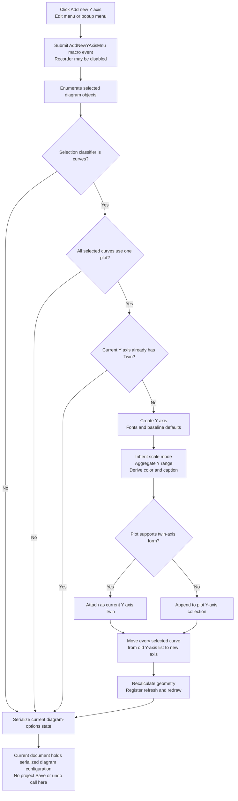

# Add new Y axis

> Analysis status: Recovered main-menu and popup bindings, unique handler, Y-axis constructor and reassignment helper, selection guards, axis defaults, twin and collection insertion, curve transfer, layout and redraw, macro recording, and diagram-state serialization reviewed.

## Control

| Property | Recovered value |
| --- | --- |
| Form | DFWindow |
| Component path | DFWindow.DFMainMenu.DFEditMnu.AddYAxisMnu |
| Control class | TMenuItem |
| Caption | Add new Y axis |
| Hint | Not present in the recovered resource. |
| Handler name | AddnewYAxisMnuClick |
| Handler address | 01a79190 |
| Second binding | DFWindow.DFPopupMnu.AddnewYAxisMnu, caption `Add new Y Axis` |
| Graph node | `resource:dfm:DFWindow/DFWindow.DFMainMenu.DFEditMnu.AddYAxisMnu` |
| Handler node | `function:01a79190` |
| Graph layer | UI |

## What happens when clicked

`TDFWindow.AddnewYAxisMnuClick` does not open an axis dialog. The same handler
serves the Edit-menu item and the diagram popup-menu item. It performs three
operations in order:

1. It constructs the macro action identifier that ends in
   `AddNewYAxisMnu` and submits it to the macro recorder. The recorder writes
   only when macro recording is enabled.
2. It calls the Y-axis creation helper for the current diagram model at form
   offset `+0x798`, with both recovered flags set to `1`.
3. It serializes the resulting complete diagram configuration back into the
   current document's diagram-options state.

Macro recording occurs before selection validation. The diagram-state
serialization also occurs after every call, even when the Y-axis helper makes
no model change.

## Selection and duplicate guards

The Y-axis helper first enumerates the selected diagram objects. It creates an
axis only when the selection classifier is exactly `2`, the recovered class
used by this path for curves. It then applies these guards:

- Every selected curve must belong to the same plot object. A mixed-plot
  selection is a silent no-op.
- The first selected curve must have an existing Y-axis association from which
  defaults can be inherited.
- Because this handler passes the helper's third argument as `1`, the current
  Y axis must not already have a twin-axis pointer at offset `+0x118`. An
  existing twin blocks creation.

An empty selection, a non-curve selection, or a selection rejected by these
tests creates no axis. The handler does not show an error or ask the user to
change the selection.

The helper does not test a numeric maximum Y-axis count. It also does not
reject an axis because another axis has the same caption, color, scale, or
range. The twin-pointer test is the recovered duplicate or capacity guard for
this menu path. Lower-level collections or allocation code can still impose
limits that are not visible here.

## New-axis defaults and derived values

After the guards pass, the helper creates one axis object. Its constructor
supplies these baseline values:

- It creates separate label and number fonts.
- It reads `Axis Setup / UseFixedFonts` from `TINA.INI`. A value of `1` selects
  Tahoma; other values select Arial.
- It initializes the number font with the recovered Italic style bit.
- It initializes a zero-to-one range, two divisions, and the caption
  `Axis label ` before the Y helper applies curve-derived values.

The Y helper then specializes the object:

- It marks the object as a Y axis.
- It copies the scale mode from the first selected curve's current Y axis.
- It calculates the minimum and maximum across the selected curves' Y data and
  uses them as the automatic and working range.
- It copies the first selected curve's display color to the new axis label
  font.
- When a curve label is available, it derives the axis caption from the first
  selected curve. With multiple selected curves, it removes the recovered
  trailing qualifier before it assigns the caption. If no label is available,
  the constructor caption remains.
- It matches both axis-font sizes to the plot's recovered font-size field.
- It calculates axis spacing as 20 percent of the smaller of 15 percent of the
  plot width and 15 percent of the plot height. This is approximately three
  percent of the plot's smaller dimension after integer rounding.
- It normalizes the range, tick count, and tick spacing through the common axis
  range routine with recovered density arguments `4` and `9`.

There is no properties dialog, default confirmation, or cancel path in this
click. The user can use a separate axis Properties command after creation.

## Collection insertion and curve reassignment

The common plot model supports two insertion forms:

- If the plot reports twin-axis support, the helper stores the new axis in the
  first selected curve's current Y axis `Twin` field. It also changes the new
  axis's recovered standalone-layout flag to false.
- Otherwise, it appends the new object to the plot's ordered Y-axis collection.

The helper finalizes the new axis, then processes every selected curve. For
each curve it:

1. Removes the curve from its old Y axis's curve list.
2. Updates that curve's Y-axis pointer to the new axis.
3. Adds the curve to the new axis's curve list.

The source does not delete an old axis when the transfer leaves it empty. It
also does not change the curve's X-axis assignment or sample data.

## Layout, redraw, persistence, and undo boundaries

The handler passes the creation helper's layout flag as `1`. After a successful
creation, the helper recalculates plot and axis geometry, registers the plot in
the diagram refresh list, and runs the common figure and diagram redraw path.
The new axis and reassigned curves therefore become visible immediately.

The final `FUN_01add6f0` call is not only a repaint. It serializes the full
diagram model, including curve sets, X and Y axes, axis orientation, scale,
caption, color, ranges, fonts, curve memberships, and figures. It uses a
`DiagOpt.tmp`-backed INI object as an intermediate representation, then copies
the resulting data into the current document's diagram-options object.

This updates document-owned diagram configuration in memory. The handler does
not call the project Save command, so it does not prove that the project file
is written to disk at click time. Later document saving can persist the updated
diagram options.

The macro event is not an undo record. No recovered call in this handler or the
Y helper pushes an undo command, creates an inverse curve transfer, or exposes
a rollback transaction. Undo behavior outside this path is not proven.

## No-op and error behavior

- Rejected selections and an existing twin-axis link are silent no-axis paths.
- The handler ignores the Y helper's return value and always serializes the
  current diagram state afterward.
- There is no maximum-count message, duplicate warning, confirmation dialog,
  retry loop, or local error return.
- There is no partial-mutation rollback in the recovered helper. Allocation or
  indirect collection failures are not handled locally.
- Macro recording is conditional, but it is independent of whether creation
  later succeeds.

## Click flow

## Handler and call-path evidence

- Menu handler: [FUN_01a79190](../../../DecompiledSources/Tina16/functions/0000000001A79190__FUN_01a79190.c)
- Y-axis creation and curve-reassignment helper: [FUN_01ad72b0](../../../DecompiledSources/Tina16/functions/0000000001AD72B0__FUN_01ad72b0.c)
- Axis constructor and baseline defaults: [FUN_01ccd700](../../../DecompiledSources/Tina16/functions/0000000001CCD700__FUN_01ccd700.c)
- Common axis range normalization: [FUN_01cd43b0](../../../DecompiledSources/Tina16/functions/0000000001CD43B0__FUN_01cd43b0.c)
- Plot layout recalculation: [FUN_01ce4cd0](../../../DecompiledSources/Tina16/functions/0000000001CE4CD0__FUN_01ce4cd0.c)
- Diagram refresh: [FUN_01ae5650](../../../DecompiledSources/Tina16/functions/0000000001AE5650__FUN_01ae5650.c)
- Diagram-options serializer: [FUN_01add6f0](../../../DecompiledSources/Tina16/functions/0000000001ADD6F0__FUN_01add6f0.c)
- Macro action builder: [FUN_01aee720](../../../DecompiledSources/Tina16/functions/0000000001AEE720__FUN_01aee720.c)
- Conditional macro recorder: [FUN_01aed550](../../../DecompiledSources/Tina16/functions/0000000001AED550__FUN_01aed550.c)
- Paired X-axis handler: [FUN_01a79260](../../../DecompiledSources/Tina16/functions/0000000001A79260__FUN_01a79260.c)
- Paired X-axis helper: [FUN_01ad78b0](../../../DecompiledSources/Tina16/functions/0000000001AD78B0__FUN_01ad78b0.c)
- Recovered form evidence: [ui-evidence.json](../../../DecompiledSources/Tina16/resources/dfm/ui-evidence.json)

## Direct calls

- `FUN_01aee720` and `FUN_01aed550` - Build and conditionally record the macro
  event.
- `FUN_01ad72b0` - Validates the selected curves, creates the Y axis, reassigns
  curves, and requests layout and redraw.
- `FUN_01add6f0` - Serializes the complete current diagram configuration into
  document-owned diagram-options state.
- `FUN_00414480` - Finalizes the temporary Delphi UnicodeString.

## Resource evidence

- The main menu contains `Add new Y axis` under Edit.
- The diagram popup menu contains `Add new Y Axis`. Both OnClick events resolve
  to `FUN_01a79190`.
- The related main-menu and popup-menu X-axis items resolve to the distinct
  `FUN_01a79260` handler.
- Neither Y-axis menu item has a recovered hint, shortcut, action, image-list
  reference, glyph, picture, checked state, radio state, or submenu items.
- No nearby label applies to these menu items. The caption and paired menu
  structure provide resource context; the model calls prove the behavior.

## Analysis limits

- Names for several plot and axis fields are not present in recovered symbols.
  This article names them from their list membership, persisted property names,
  and curve reassignment data flow.
- The selected-object classifier's Delphi enum name is not recovered. Value
  `2` is identified as curves from the downstream curve fields and transfer.
- The helper has no explicit numeric maximum-axis check. This does not prove
  that lower-level containers have unlimited capacity.
- Shared macro, serialization, list, layout, and redraw helpers are evidence
  here. Their canonical annotations remain with the coordinated X-axis or
  shared analyses.
