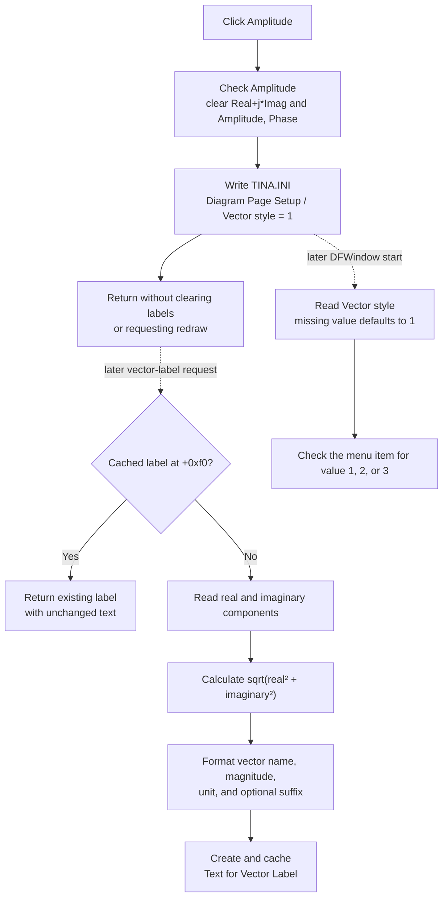

# Amplitude

> Analysis status: Recovered resource, unique handler, three-style mapping, checked-state order, Diagram Page Setup persistence, vector-label formatter and creation callers, cached-label behavior, redraw boundary, and invalid, repeated-click, and error paths reviewed.

## Control

| Property | Recovered value |
| --- | --- |
| Form | DFWindow |
| Component path | DFWindow.DFMainMenu.DFViewMnu.Vectorlabelstyle1.AmplitudeMnu |
| Control class | TMenuItem |
| Caption | Amplitude |
| Hint | Not present in the recovered resource. |
| Handler name | AmplitudeMnuClick |
| Handler address | 01a87c20 |
| Graph node | `resource:dfm:DFWindow/DFWindow.DFMainMenu.DFViewMnu.Vectorlabelstyle1.AmplitudeMnu` |
| Handler node | `function:01a87c20` |
| Graph layer | UI |

## What happens when clicked

`TDFWindow.AmplitudeMnuClick` selects the Amplitude format for diagram vector
labels. It does not branch on `Sender`, a selected vector, or the current
diagram state.

The handler performs these operations in order:

1. Check `AmplitudeMnu`.
2. Clear `RealImagMnu`.
3. Clear `AmplitudePhaseMnu`.
4. Write integer value `1` to `TINA.INI` under
   `[Diagram Page Setup] Vector style`.

The related handlers use the same check-state order and persist values `2` for
`Real+j*Imag` and `3` for `Amplitude, Phase`. The stored value is therefore an
enumerated label style, not a numeric amplitude or curve property.

## Amplitude label format

`FUN_00f15c70` is the shared consumer of the three checked menu items. When it
must create a vector label, it reads the vector's recovered real component at
offset `+0xb8` and imaginary component at `+0xc0`. For the Amplitude choice it
calculates:

`magnitude = sqrt(real * real + imaginary * imaginary)`

It then formats the vector name and magnitude, appends the applicable unit
suffix selected by the vector's byte at `+0x9d`, and appends an optional
recovered suffix from `+0xa0` when present. The numeric formatter can scale the
display value, but it does not change the vector's stored real or imaginary
component.

The Amplitude branch does not append a phase value and does not display the
real and imaginary components separately. By comparison, value `2` formats
`real + j*imaginary` or `real - j*abs(imaginary)`, and value `3` formats
magnitude plus phase in degrees. These three formatter branches confirm the
menu-to-value mapping.

## Affected labels and creation paths

The formatter creates a diagram text object and registers it with the owning
collection as `Text for Vector Label`. Recovered callers use it in these
contexts:

- an interactive diagram operation requests a label for a hit vector object;
- `DFAutoCurveLabelsBtn` enumerates eligible vector objects and requests their
  labels; and
- a diagram object lookup returns or creates the label for a vector at a
  coordinate.

The setting therefore affects the formatted text of vector labels that use
this formatter. The click path does not change vector samples, curve legends,
axis captions, cursor values, or other independent text objects.

## Existing labels and redraw

Each vector stores its created label at offset `+0xf0`. `FUN_00f15c70` checks
that field first. If it is nonzero, it returns the existing label without
recalculating or replacing its text.

The click handler does not clear those cached labels. It also does not
invalidate, repaint, or recalculate the diagram. Existing vector labels and
existing pixels therefore remain unchanged after the click. Amplitude format
is applied when a later operation creates a vector label whose cache field is
empty, or after another path removes and recreates such a label.

## Reload and persistence

During DFWindow initialization, `FUN_01a72620` reads
`[Diagram Page Setup] Vector style` from `TINA.INI` with default value `1`.
It checks `AmplitudeMnu` for `1`, `RealImagMnu` for `2`, or
`AmplitudePhaseMnu` for `3`.

The preference is global Diagram Page Setup state. The click does not call a
diagram serializer, write the current diagram file, or mark that diagram
modified. The INI value is available to a later DFWindow without a diagram
Save operation.

## Empty, invalid, repeated-click, and error behavior

- The click requires no selected vector. It can set the global preference when
  no vector or diagram content exists.
- A zero vector is valid. The formatter calculates magnitude zero and formats
  it; it does not reject the label or divide by the magnitude.
- A missing INI value loads the Amplitude default, value `1`.
- If the INI reader produces a value outside `1` through `3`, the initializer
  does not check any style item. With no style checked, the formatter has no
  numeric base branch and can produce only the applicable unit or optional
  suffix. Clicking Amplitude repairs the menu state and persists value `1`.
- Repeated clicks keep the same three checked states. The VCL checked-state
  setter treats unchanged requests as no-ops, but the handler still rewrites
  the INI value.
- The handler has no local error message, retry, status result, or rollback.
- Check states change before the INI writer runs. If persistence raises an
  error, the current menu can show Amplitude while a later process still reads
  the earlier value. The handler contains no recovery for this partial state.
- A failure during one of the earlier menu updates can leave a partial set of
  check marks and prevents the later INI call. No local exception handler
  repairs the group.

## Click and later-label flow

## Handler and call-path evidence

- Amplitude click handler: [FUN_01a87c20](../../../DecompiledSources/Tina16/functions/0000000001A87C20__FUN_01a87c20.c)
- Shared vector-label formatter and cache: [FUN_00f15c70](../../../DecompiledSources/Tina16/functions/0000000000F15C70__FUN_00f15c70.c)
- Magnitude square-root helper: [FUN_0040c760](../../../DecompiledSources/Tina16/functions/000000000040C760__FUN_0040c760.c)
- Numeric display formatter: [FUN_00f05e70](../../../DecompiledSources/Tina16/functions/0000000000F05E70__FUN_00f05e70.c)
- Real plus imaginary comparison handler: [FUN_01a87ca0](../../../DecompiledSources/Tina16/functions/0000000001A87CA0__FUN_01a87ca0.c)
- Amplitude plus phase comparison handler: [FUN_01a87d20](../../../DecompiledSources/Tina16/functions/0000000001A87D20__FUN_01a87d20.c)
- Interactive vector-label caller: [FUN_010f7fb0](../../../DecompiledSources/Tina16/functions/00000000010F7FB0__FUN_010f7fb0.c)
- Automatic vector-label caller: [FUN_01a7bdc0](../../../DecompiledSources/Tina16/functions/0000000001A7BDC0__FUN_01a7bdc0.c)
- Coordinate-based vector-label lookup: [FUN_01ae39d0](../../../DecompiledSources/Tina16/functions/0000000001AE39D0__FUN_01ae39d0.c)
- DFWindow initialization and style reload: [FUN_01a72620](../../../DecompiledSources/Tina16/functions/0000000001A72620__FUN_01a72620.c)
- Diagram Page Setup integer writer: [FUN_00f069f0](../../../DecompiledSources/Tina16/functions/0000000000F069F0__FUN_00f069f0.c)
- Diagram Page Setup integer reader: [FUN_00f06b50](../../../DecompiledSources/Tina16/functions/0000000000F06B50__FUN_00f06b50.c)
- Canonical VCL checked-state setter: [FUN_007e2d20](../../../DecompiledSources/Tina16/functions/00000000007E2D20__FUN_007e2d20.c)
- Recovered form evidence: [ui-evidence.json](../../../DecompiledSources/Tina16/resources/dfm/ui-evidence.json)

## Direct calls

- `FUN_007e2d20` - Applies the three requested checked states and publishes
  changed items to the native menu.
- `FUN_00f069f0` - Writes integer `1` for key `Vector style` in the Diagram
  Page Setup section of `TINA.INI`.

## Resource evidence

- The parent menu caption is `Vector label style`.
- The three child captions are `Amplitude`, `Real+j*Imag`, and
  `Amplitude, Phase`.
- The resource has no hint, action, initial checked-state property, image-list
  entry, embedded glyph, or picture.
- Runtime initialization selects the saved choice. The DFM itself does not
  define the initial check mark.
- No nearby label applies to this menu item.

## Analysis limits

- Recovered names for the vector record, its unit selector, and its optional
  suffix field are unavailable. Their roles follow from the formatter's data
  flow and string assembly.
- Several unit suffixes remain anonymous data references in the decompilation.
  One recovered literal is styled `W`; this article does not assign unsupported
  unit names to the other selector values.
- The click does not call the formatter directly. Its effect is communicated
  through the three checked menu items and the persisted style value.
- This analysis owns the canonical `FUN_00f15c70` formatter annotation. The
  `Amplitude, Phase` and `Real+j*Imag` analyses cite it but own only their
  unique handlers. Generic VCL and INI helpers keep their existing ownership.
