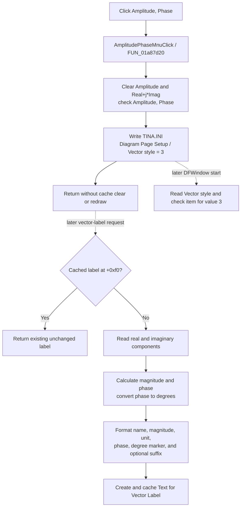

# Amplitude, Phase

> Analysis status: Complete from recovered resource, handler, checked-state, INI, initialization, and vector-label formatter evidence.

## Control

| Property | Recovered value |
| --- | --- |
| Form | DFWindow |
| Component path | DFWindow.DFMainMenu.DFViewMnu.Vectorlabelstyle1.AmplitudePhaseMnu |
| Control class | TMenuItem |
| Parent menu | Vector label style |
| Caption | Amplitude, Phase |
| Handler name | AmplitudePhaseMnuClick |
| Handler address | 01a87d20 |
| Graph node | `resource:dfm:DFWindow/DFWindow.DFMainMenu.DFViewMnu.Vectorlabelstyle1.AmplitudePhaseMnu` |
| Handler node | `function:01a87d20` |

## What happens when clicked

The click selects the **Amplitude, Phase** format for vector labels. The handler does not inspect `Sender`, the current selection, or diagram contents. It performs these operations in order:

1. It clears the check on `AmplitudeMnu`.
2. It clears the check on `RealImagMnu`.
3. It checks `AmplitudePhaseMnu`.
4. It writes integer `3` to `TINA.INI`, section `Diagram Page Setup`, key `Vector style`.

The three related handlers persist style values `1`, `2`, and `3` for `Amplitude`, `Real+j*Imag`, and `Amplitude, Phase`. Value `3` is therefore a style identifier. It is not a phase value or a curve sample.

The recovered DFM has no initial checked-state or radio-group property for these items. The handlers and form initialization set their exclusive state at run time.

## Amplitude and phase label text

The shared vector-label formatter reads the checked items when it creates label text. With `AmplitudePhaseMnu` checked, it reads the vector's real and imaginary components and calculates:

- magnitude as `sqrt(real * real + imaginary * imaginary)`;
- phase as the complex argument, equivalent to `atan2(imaginary, real)`; and
- displayed phase in degrees by multiplying the radian result by `57.29577951308232`.

It formats the vector name and magnitude, appends the unit selected by the vector, and then appends the phase and degree marker. It can also append an optional vector suffix. The formatter does not change the stored real or imaginary components.

Recovered callers request this text for an interactive vector-label operation, automatic curve labels, and coordinate-based vector-label lookup. The setting does not directly change curve legends, axes, cursor values, or unrelated measurement readouts.

## Existing labels and redraw

The formatter caches each created label at vector field offset `+0xf0`. If that field is already nonzero, it returns the existing label without rebuilding its text.

This handler does not clear the cache, traverse vector objects, mark the diagram as modified, or request a redraw. Existing vector labels and existing diagram pixels remain unchanged. Style `3` applies when a later operation creates a label whose cache is empty, or when another path removes and recreates that label.

## Persistence and reload

The choice is a global Diagram Page Setup preference, not document content. DFWindow initialization reads `Vector style` from `TINA.INI` with default value `1`. It checks the Amplitude item for `1`, Real+j*Imag for `2`, or Amplitude, Phase for `3`.

The current diagram does not need to be saved for the preference to be available to a later DFWindow. This click does not call the diagram serializer or set the diagram's modified state.

## Empty, invalid, repeated-click, and error behavior

- No vector selection is required. An empty diagram still gets the menu and INI preference change.
- A zero vector is valid for the later formatter. It produces magnitude zero and phase zero; it does not divide by the magnitude.
- A missing INI key loads default style `1`.
- If the INI reader returns a value outside `1` through `3`, initialization does not check any style item. Clicking this command restores a valid exclusive state and persists `3`.
- On a repeated click, unchanged menu-state requests are no-ops inside the VCL setter, but the handler still writes the INI value again.
- The handler has no validation, cancel branch, status result, retry, local exception handler, or error message.
- Menu-state calls occur before the INI write. The source has no rollback if persistence fails after the checks change.

## Click and later-label flow

## Evidence

- [AmplitudePhaseMnuClick](../../../DecompiledSources/Tina16/functions/0000000001A87D20__FUN_01a87d20.c) clears fields `+0x9f8` and `+0xa00`, checks `+0xa08`, writes `Vector style = 3`, and returns.
- [AmplitudeMnuClick](../../../DecompiledSources/Tina16/functions/0000000001A87C20__FUN_01a87c20.c) uses the same three fields and writes style `1`; [RealImagMnuClick](../../../DecompiledSources/Tina16/functions/0000000001A87CA0__FUN_01a87ca0.c) writes style `2`.
- [The shared vector-label formatter](../../../DecompiledSources/Tina16/functions/0000000000F15C70__FUN_00f15c70.c) reads the checked states, computes magnitude and complex argument, converts the phase to degrees, assembles the label, and returns an existing cached label without rebuilding it.
- [The complex-argument helper](../../../DecompiledSources/Tina16/functions/0000000000C445D0__FUN_00c445d0.c) implements the real/imaginary quadrant cases and returns zero for a zero vector.
- [DFWindow initialization](../../../DecompiledSources/Tina16/functions/0000000001A72620__FUN_01a72620.c) reads style `1` by default and checks the item for values `1`, `2`, or `3`.
- [The INI writer](../../../DecompiledSources/Tina16/functions/0000000000F069F0__FUN_00f069f0.c) stores the integer in `TINA.INI` under `Diagram Page Setup`.
- [The interactive label caller](../../../DecompiledSources/Tina16/functions/00000000010F7FB0__FUN_010f7fb0.c), [automatic-label caller](../../../DecompiledSources/Tina16/functions/0000000001A7BDC0__FUN_01a7bdc0.c), and [coordinate-based lookup](../../../DecompiledSources/Tina16/functions/0000000001AE39D0__FUN_01ae39d0.c) use the shared formatter.
- The recovered resource identifies the parent caption `Vector label style`, this item caption `Amplitude, Phase`, and handler `AmplitudePhaseMnuClick`. It has no hint, action, glyph, image, or recovered initial check property.

## Limits

- Some unit and separator strings remain anonymous data references, so this article does not invent their exact displayed spelling.
- The click does not call the formatter directly. Later vector-label operations read the checked menu state.
- The shared formatter `FUN_00f15c70` is canonically annotated by `TIARA-diz.6.7.324`; this control owns only its unique handler annotation.
