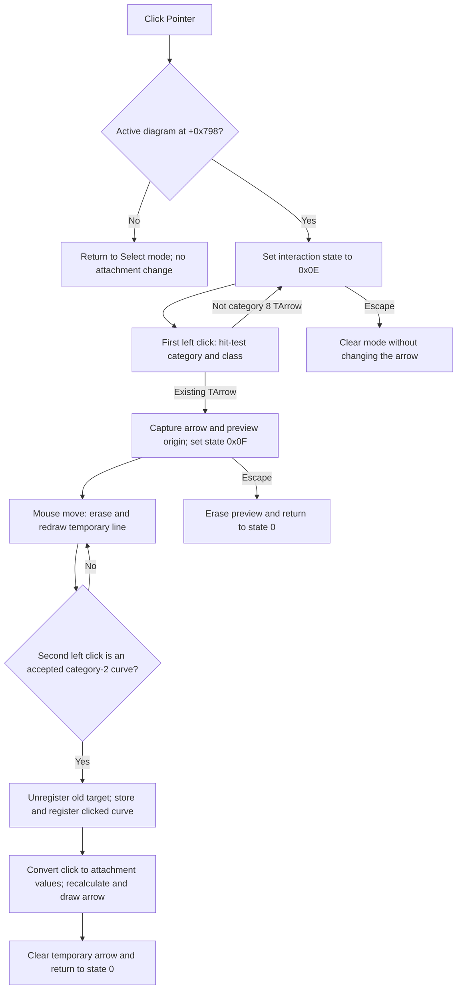

# Pointer

> Analysis status: Reviewed from the recovered click handler, DFWindow mouse and keyboard handlers, `TArrow` class checks, attachment calls, archive reader and writer, DFM resource, and extracted glyph.

## Control

| Property | Recovered value |
| --- | --- |
| Form | DFWindow |
| Component path | DFWindow.DFToolPanel.ToolNoteBook.Diagram.ArrowBtn |
| Control class | TSpeedButton |
| Caption | Not present in the recovered resource. |
| Hint | Pointer |
| Handler name | ArrowBtnClick |
| Handler address | 01a7bc00 |
| Graph node | `resource:dfm:DFWindow/DFWindow.DFToolPanel.ToolNoteBook.Diagram.ArrowBtn` |
| Handler node | `function:01a7bc00` |
| Graph layer | UI |

## What happens when clicked

Despite the component name, this control does not create a new arrow. The recovered hint is `Pointer`, and the code enters a two-click reassignment mode for an existing diagram `TArrow`.

[`FUN_01a7bc00`](../../../DecompiledSources/Tina16/functions/0000000001A7BC00__FUN_01a7bc00.c) first submits the `ArrowBtn` token through the DFWindow macro-event path. It then checks DFWindow field `+0x798`, which the surrounding handlers use as the active diagram. With an active diagram, the handler writes `0x0E` to the interaction-state byte at `+0x7A8`. It does not allocate a `TArrow`, add an object to the diagram collection, select a curve, draw a line, or save the document at this point.

If there is no active diagram, the handler enables the component at `+0xA90` and invokes the normal Select command [`FUN_01a794b0`](../../../DecompiledSources/Tina16/functions/0000000001A794B0__FUN_01a794b0.c). That command sets the interaction state to `0` and does not attach an arrow. No error message is shown.

## First point: choose the existing arrow

The first left-button press is processed by the shared [`FUN_01a730e0`](../../../DecompiledSources/Tina16/functions/0000000001A730E0__FUN_01a730e0.c) `FormMouseDown` handler. In state `0x0E`, it hit-tests the diagram at the pointer position and continues only when both conditions are true:

- the hit-test category is exactly `8`, which the shared selection code uses for diagram figures; and
- item zero is an instance of recovered class `TArrow`.

An empty location, a curve, another figure class, or another category causes no model write and leaves the tool in state `0x0E`, ready for another attempt. [`FUN_01a74a50`](../../../DecompiledSources/Tina16/functions/0000000001A74A50__FUN_01a74a50.c) uses the same category and RTTI tests while the pointer moves and selects one of two cursors. This hover feedback does not change the diagram.

For a valid `TArrow`, `FormMouseDown` stores that existing object in the temporary DFWindow field at `+0xFF0`. It gets the arrow's current point, obtains its rendered width and height, and chooses a preview origin on the arrow bounds relative to the click. It stores that origin and the current pointer position in the DFWindow preview-coordinate fields, draws the temporary line, and advances the interaction state to `0x0F`.

This is not an object insertion. The selected arrow already belongs to the diagram's figure collection.

## Preview and second point: choose the curve

In state `0x0F`, `FormMouseMove` erases the previous temporary line and draws a new one from the captured arrow-side origin to the current pointer position. The draw helper is called once for the old endpoint pair and once for the new pair, which establishes temporary preview behavior; no `TArrow` geometry or attachment field is written by the move path.

The move handler also hit-tests the current position. It treats an exact category `2` object as a candidate curve and calls that object's virtual acceptance method with the arrow's current point. The cursor changes only when this check accepts the candidate. The same two checks are repeated on the second left-button press.

When the second press is valid, `FormMouseDown` performs these operations in order:

1. Erase the temporary preview line.
2. Ask the existing arrow to erase its current drawing.
3. If the arrow already has an object at `+0xA8`, call that object's unregister method.
4. Store the clicked category-2 curve at arrow field `+0xA8`.
5. Call the new curve's register method for the arrow.
6. Ask the curve to convert the clicked pixel position into the two values stored at arrow fields `+0xB0` and `+0xB8`.
7. Recalculate the arrow and draw it again.
8. Clear the temporary arrow field, re-enable the component at `+0xA90`, and return the interaction state to `0`.

Thus, the command replaces the chosen arrow's previous curve association with the curve under the second click. It does not use a previously selected curve, and it does not add a new figure to the diagram.

If the second click is not on an exact category-2 object, or the candidate rejects the arrow point, the source skips all detach and attach calls. State `0x0F` and the preview remain active so the user can try another location.

## Cancel, right-click, and failure boundaries

- Pressing Escape reaches [`FUN_01a7d1a0`](../../../DecompiledSources/Tina16/functions/0000000001A7D1A0__FUN_01a7d1a0.c). In state `0x0E`, it clears temporary creation fields, restores the normal interaction state, and refreshes selection feedback. In state `0x0F`, it first erases the preview line, then restores state `0`. Neither branch changes the arrow's existing `+0xA8` association.
- A right-button press does not run the `0x0E` or `0x0F` left-click attachment branches. It follows DFWindow's generic hit-selection and context-menu path. That path does not reset these two states, so the recovered source does not establish right-click as Cancel.
- `FormMouseUp` has no `0x0E` or `0x0F` finalization branch. The association commits on the second valid left-button press, not on button release.
- The recovered path has no local exception handler, rollback transaction, or application error message. The detach, field assignment, registration, coordinate conversion, recalculation, and draw calls occur in sequence. If a later virtual call fails after an earlier mutation, this source does not prove atomic recovery.

## Persistence boundary

The button and mouse handlers contain no file write, Save call, archive call, or explicit document-dirty setter. They change the live `TArrow` object only.

The later `TArrow` archive path proves that the association is part of serialized diagram state:

- [`FUN_01a61fe0`](../../../DecompiledSources/Tina16/functions/0000000001A61FE0__FUN_01a61fe0.c) writes the owning diagram identifier, the attached object's identifier from `+0xA8` or `0xFFFF` when there is no attachment, the `+0xB0` and `+0xB8` values, and the arrow's other geometry and style fields.
- [`FUN_01a61410`](../../../DecompiledSources/Tina16/functions/0000000001A61410__FUN_01a61410.c) reads that identifier, resolves the referenced object, restores it to `+0xA8`, and calls the target's register method when resolution succeeds.

Persistence is therefore deferred until the diagram is saved through its archive writer. This control does not itself save the document.

## Click flow

## Resource and glyph evidence

- The DFM identifies `ArrowBtn` as a `TSpeedButton`, supplies the hint `Pointer`, and binds `OnClick` to `ArrowBtnClick` at `01A7BC00`.
- The extracted [20-by-20 glyph](../../../glyph/0099_DFWindow_DFWindow_DFToolPanel_ToolNoteBook_Diagram_ArrowBtn_Glyph_Data.png) depicts a hand-shaped pointer and a short line. It supports the recovered pointer intent but is not used alone to infer the target or implementation.
- No caption, action, image-list reference, checked state, button kind, or nearby same-parent label is present.

## Evidence limits

- The recovered enum names for interaction states `0x0E` and `0x0F` are not available. This article keeps the numeric values.
- The exact Delphi method names for the curve acceptance, registration, unregister, and coordinate-conversion virtual methods are not recovered. Their roles are established from their call order, object fields, and matching archive read path.
- Redraw and macro-event calls are not proof of immediate document persistence.
