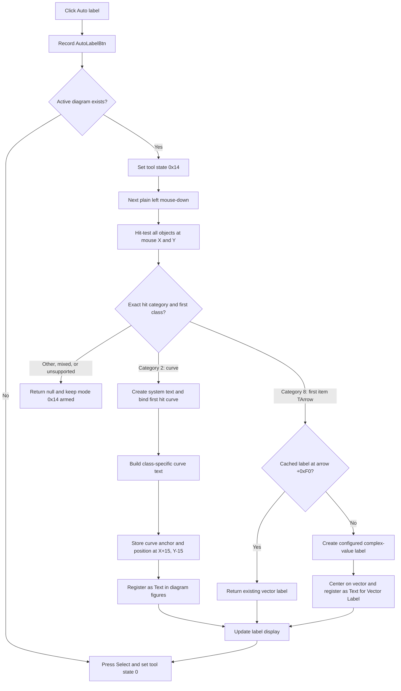

# Auto label

> Analysis status: Reviewed from the recovered button handler, DFWindow mouse-down state machine, coordinate hit test, curve-label and vector-label generators, text-object insertion and draw paths, serialization evidence, DFM resource, and extracted glyph.

## Control

| Property | Recovered value |
| --- | --- |
| Form | DFWindow |
| Component path | DFWindow.DFToolPanel.ToolNoteBook.Diagram.AutoLabelBtn |
| Control class | TSpeedButton |
| Caption | Not present in the recovered resource. |
| Hint | Auto label |
| Text | Not present in the recovered resource. |
| Group index | `1` |
| Handler name | AutoLabelBtnClick |
| Handler address | 01a7bce0 |
| Graph node | `resource:dfm:DFWindow/DFWindow.DFToolPanel.ToolNoteBook.Diagram.AutoLabelBtn` |
| Handler node | `function:01a7bce0` |
| Graph layer | UI |

## What happens when clicked

[`FUN_01a7bce0`](../../../DecompiledSources/Tina16/functions/0000000001A7BCE0__FUN_01a7bce0.c) records the command name `AutoLabelBtn`. If DFWindow field `+0x798` contains an active diagram, the handler writes `0x14` to the tool-state byte at `+0x7A8` and returns. The button click itself does not inspect a selection, create text, change a diagram object, or request a redraw.

If there is no active diagram, the handler presses the normal Select speed button at `+0xA90` and calls [`FUN_01a794b0`](../../../DecompiledSources/Tina16/functions/0000000001A794B0__FUN_01a794b0.c). That handler sets tool state `0`. No label mode remains active.

## Target of the next canvas click

[`DFWindow.FormMouseDown`](../../../DecompiledSources/Tina16/functions/0000000001A730E0__FUN_01a730e0.c) consumes tool state `0x14` only on its plain left-button path. Its earlier Shift-modified path bypasses the auto-label branch. The auto-label branch passes the current mouse coordinates to [`FUN_01ae39d0`](../../../DecompiledSources/Tina16/functions/0000000001AE39D0__FUN_01ae39d0.c).

This is a coordinate hit test, not the current-selection collector. [`FUN_01ace420`](../../../DecompiledSources/Tina16/functions/0000000001ACE420__FUN_01ace420.c) first requires the point to be inside the diagram, collects every object hit at that point, and combines their category bits. The helper accepts only:

- exact category `2`, which other DFWindow paths establish as curves; or
- exact category `8` when hit-list item zero is the recovered `TArrow` class.

For an exact curve result, the helper uses hit-list item zero. Several curves under one coordinate can still produce category `2`, so collection order decides the target. An overlapping object from another category produces a mixed mask and is rejected. For category `8`, a non-arrow item zero is rejected even if another arrow is later in the hit list. Pre-existing selected flags do not choose the target.

## Curve label creation

For an accepted curve hit, `FUN_01ae39d0` creates a new system-text object and links it to the first hit curve. It asks that curve for the anchor values at the clicked coordinate and stores them in the text object's curve-anchor fields. It then builds the label through [`FUN_01ae7d50`](../../../DecompiledSources/Tina16/functions/0000000001AE7D50__FUN_01ae7d50.c).

The recovered curve-label generator has three class-specific text paths:

- one path asks the hit curve for its value at the pointer coordinate and formats that value as engineering-number text;
- one path uses the curve's recovered display name, substitutes string resource `0x824` when that name is empty, and appends a nonempty secondary descriptor from the curve model; and
- one path uses the alternate recovered curve-name formatter.

The three Delphi class names are not recovered in this source. The helper also normalizes one anonymous string pattern. This article does not invent the unknown resource text, separator, or replacement text. There is no nonempty-text check before the new object is finalized.

The new label copies its text size setting from the coordinate system that contains the clicked point. Its initial screen position is exactly `(mouse X + 15, mouse Y - 15)`. The helper assigns the active diagram as owner, finalizes the text geometry, and inserts the object into the diagram figure collection under the name `Text` before it returns.

## Arrow vector-label path

For an exact category-8 hit whose first item is `TArrow`, `FUN_01ae39d0` calls the shared [`FUN_00f15c70`](../../../DecompiledSources/Tina16/functions/0000000000F15C70__FUN_00f15c70.c). It returns the arrow's cached label at offset `+0xF0`, or creates one when the cache is empty.

A new vector label contains the vector name and one of the configured representations: magnitude, signed real and imaginary components, or magnitude and phase in degrees. It also appends the recovered unit and optional suffix. The formatter places the label at the center of the vector object's rectangle and registers it as `Text for Vector Label`. The [Amplitude vector-label article](amplitudemnu-f826c64b04.md) documents the formatter and its three style states. Its canonical annotation belongs to `TIARA-diz.6.7.324`.

## Commit, redraw, and return to Select

When `FUN_01ae39d0` returns a text object, `FormMouseDown` immediately invokes that object's display-update method, presses the Select speed button, and resets the tool state to `0`. There is no placement dialog, preview stage, OK, Cancel, or second placement click. The clicked coordinate is both the curve anchor input and the basis for the new curve label's initial screen position.

If the helper returns null, `FormMouseDown` does not press Select and does not clear state `0x14`. The Auto label tool stays armed for another canvas click. The handler shows no error message.

This behavior differs from the adjacent [Legend button](dfautolabelsbtn-d16f42266c.md), which processes all vector objects or builds one multi-line legend for later placement. Auto label targets one object under the pointer.

## Click flow

## Repeat, no-op, and error behavior

- Clicking the button repeatedly before a canvas hit only writes state `0x14` again. It does not create duplicate model objects by itself.
- Repeating the complete curve-label action at the same point creates another system-text object. The curve path has no duplicate search or cache.
- Repeating the action on the same arrow reuses its cached label at `+0xF0`; it does not create a second cached vector label, but it calls the display-update method again.
- A click outside the diagram, a mixed hit, an unsupported category, or a category-8 item zero that is not `TArrow` creates nothing and leaves the tool armed.
- A Shift-modified left mouse-down uses the earlier common Shift path and does not consume auto-label mode.
- The recovered handler, mouse branch, and label helper have no visible application-level catch, rollback, or user-facing error path. An allocation or model-update failure can propagate after earlier writes.

## Model and persistence boundary

An accepted curve label is already in the in-memory diagram figure collection when the helper returns. The arrow formatter also registers a newly created vector label in that collection. The caller updates the label display but does not request a full-diagram redraw.

The system-text class is registered with persistence type `0x408`. A later diagram serialization enumerates figure objects and dispatches system text to [`FUN_01a5f630`](../../../DecompiledSources/Tina16/functions/0000000001A5F630__FUN_01a5f630.c), which writes its content, font, display fields, curve link, and anchor fields. This proves that a later save can preserve the curve label and its curve anchor. The recovered path does not prove how the arrow's separate cached-label pointer is rebuilt after load.

The Auto label button, mouse consumer, and label-creation helper do not call the serializer, a file writer, an undo recorder, or a recovered document-dirty setter. Their proven effects are the in-memory insertion and local display update.

## Resource evidence

- The DFM identifies a `TSpeedButton` with hint `Auto label`, group index `1`, and `OnClick` handler `AutoLabelBtnClick` at `01a7bce0`.
- The extracted 20 by 20 bitmap shows a plotted line with a small leader or annotation mark. This supports the one-object label intent, but the handler and mouse consumer establish the actual behavior.
- Extracted glyph: [`0100_DFWindow_DFWindow_DFToolPanel_ToolNoteBook_Diagram_AutoLabelBtn_Glyph_Data.png`](../../../glyph/0100_DFWindow_DFWindow_DFToolPanel_ToolNoteBook_Diagram_AutoLabelBtn_Glyph_Data.png)
- Caption, text, action, checked state, modal result, and image-list reference are not present in the recovered resource.

## Analysis limits

- The curve-category value and three accepted curve class tests are recovered, but their Delphi enum and class names are not.
- Anonymous string constants prevent an exact rendering of all curve-label punctuation and the fallback resource text.
- The vector-label formatter is canonically annotated by `TIARA-diz.6.7.324`; the mouse, hit-test, curve-text, and serialization helpers are evidence-only here. This control owns only its unique click-handler annotation.
